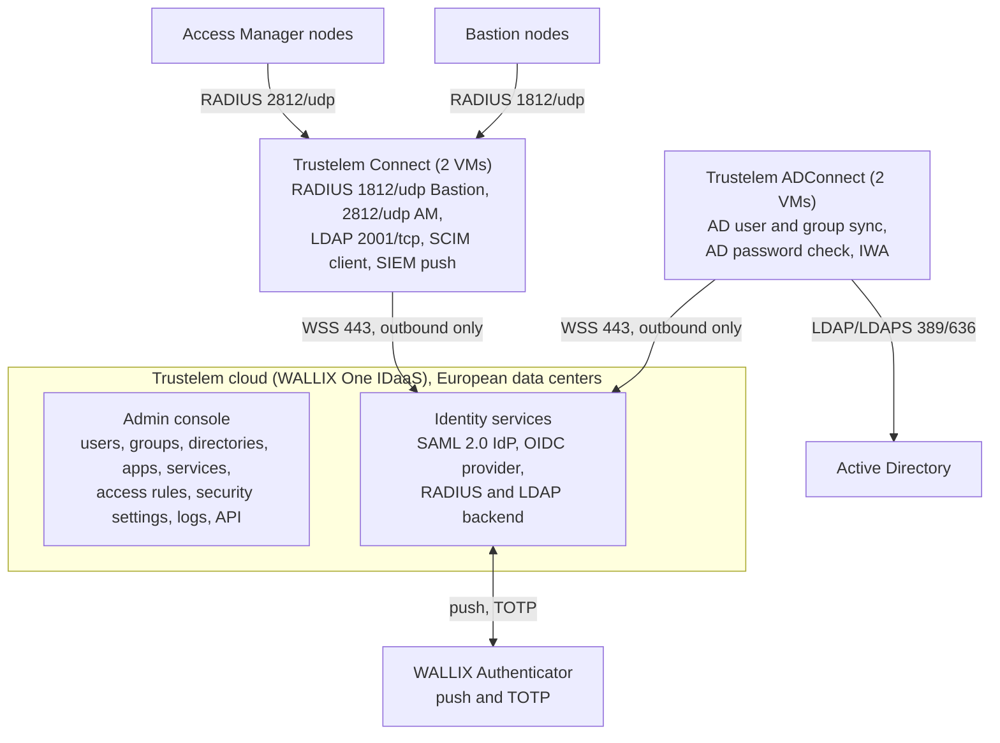

# WALLIX Trustelem MFA for WALLIX Bastion and Access Manager

How to set up **WALLIX Trustelem** (sold today as **WALLIX One IDaaS**), configure its MFA and
access rules, and integrate it with a **WALLIX Bastion** cluster and a **WALLIX Access Manager**
cluster, so that every privileged login, on the web portal and on native RDP and SSH clients,
carries a second factor.

Every page quotes the vendor documentation and links to it, field by field. Facts deduced from
the sources are marked *inference*; what the sources do not answer is a *gap* with a row in the
[gaps register](docs/reference/open-questions-and-gaps.md).

**Last updated 2026-09-24.** Target versions: Bastion 12.4.3 and Access Manager 6.0.5, both above
the July 2026 advisory minimums. Versions, sources read and certifications are in the
[architecture overview](docs/architecture/01-overview.md).

## Start here

| I am | I want to | Read |
|------|-----------|------|
| PAM architect | see the design, its decisions, clusters, ports and sizing | [architecture set](docs/architecture/README.md) |
| Trustelem administrator | set up the tenant, ADConnect, Trustelem Connect, factors and rules | [Trustelem chapters 01 to 06](docs/trustelem/README.md) |
| Bastion or Access Manager engineer | add MFA to the Bastion and federate Access Manager | [04 Bastion](docs/trustelem/04-bastion-integration.md), [05 Access Manager](docs/trustelem/05-access-manager-integration.md) |
| Operator | build and run the clusters | [Bastion HA runbook](docs/runbooks/bastion-ha-replication.md), [Access Manager farm runbook](docs/runbooks/access-manager-farm.md), [07 Operations](docs/trustelem/07-operations.md) |
| Operator on call | fix a failing login | [08 Troubleshooting](docs/trustelem/08-troubleshooting.md) |
| Project lead | validate the deployment and roll it out | [10 Test plan](docs/trustelem/10-test-plan.md), [deployment and rollout](docs/architecture/06-deployment-and-rollout.md) |
| Help desk | brief users and handle lost phones | [11 User and help-desk guide](docs/trustelem/11-user-and-helpdesk-guide.md) |
| Security and compliance | map the design to NIS2, DORA, ISO 27001, ANSSI and send logs to the SIEM | [standards](docs/reference/standards-and-compliance.md), [logging and SIEM](docs/reference/logging-and-siem.md) |
| Anyone meeting WALLIX | ask the open questions | [vendor meeting script](docs/reference/vendor-meeting-script.md) |

The complete index is [docs/README.md](docs/README.md). A fully filled-in sample organisation is
the [worked example](docs/trustelem/09-worked-example.md).

## What Trustelem provides and where it plugs in



| Trustelem service | Consumed by | Path protected | Chapter |
|-------------------|-------------|----------------|---------|
| SAML 2.0 identity provider | Access Manager portal; Bastion web UI through the same domain | HTML5 RDP and SSH sessions, password checkout, approvals | [05](docs/trustelem/05-access-manager-integration.md), [04 scenario D](docs/trustelem/04-bastion-integration.md) |
| RADIUS through Trustelem Connect | Bastion as secondary authentication of the AD domain; Access Manager as factor 2 | native `mstsc` and SSH clients, Bastion web UI, Access Manager fallback | [04](docs/trustelem/04-bastion-integration.md), [05](docs/trustelem/05-access-manager-integration.md) |
| LDAP through Trustelem Connect | Bastion as an AD-type directory | Trustelem-only users (partners, contractors) | [04 scenario C](docs/trustelem/04-bastion-integration.md) |
| ADConnect | the tenant | AD password validation without storing passwords | [02](docs/trustelem/02-directory-sync-adconnect.md) |
| WALLIX Authenticator, TOTP, passkeys | users | push and TOTP on every path, passkeys on the web path only | [06](docs/trustelem/06-mfa-and-access-rules.md) |
| Access rules | the tenant | who presents one or two factors, by zone or protocol | [06](docs/trustelem/06-mfa-and-access-rules.md) |
| SIEM push, API, certificates | operations | audit, automation, rotation | [07](docs/trustelem/07-operations.md) |

## The design in one paragraph

Active Directory stays the source of truth; ADConnect imports users and groups and validates AD
passwords. Web users open Access Manager, are redirected to Trustelem over SAML, complete the
second factor there, and launch Bastion sessions without a second prompt, because both products
share the same domain name and login attribute. Native RDP and SSH clients connect to the Bastion
proxies, where the AD bind is the first factor and a RADIUS challenge to Trustelem Connect, push
or TOTP, is the second. Two ADConnect and two Trustelem Connect VMs give agent failover; a
two-node Bastion HA Database Replication pair and a two-node Access Manager farm give appliance
failover. The [architecture set](docs/architecture/README.md) has the full design.

## Facts you must not miss

Each point is sourced on the page it links to.

- **Only "SAML Generic" on the Bastion works with Access Manager, and it disables direct SAML
  login to the Bastion web UI.** Administrators keep AD plus RADIUS on the Bastion
  ([04 Bastion integration](docs/trustelem/04-bastion-integration.md)).
- **On native RDP and SSH clients RADIUS is the transparent push and TOTP path**: SAML and OIDC
  are "not fully integrated" there, passkeys never work over RADIUS or LDAP, and SSH can also use
  FIDO2 hardware keys ([caveats](docs/architecture/08-caveats-and-questions.md)).
- **"Use mobile device for 2FA" on the Bastion RADIUS entry is ON for AD users and OFF for
  RADIUS-only local users** ([04 Bastion integration](docs/trustelem/04-bastion-integration.md)).
- **Trustelem users are invisible to the Bastion until an access rule exists**
  ([06 MFA and access rules](docs/trustelem/06-mfa-and-access-rules.md)).
- **New Trustelem IP addresses come into service on 2026-09-29**; add them to the egress rules
  and exclude the Trustelem destinations from TLS inspection
  ([01 Tenant setup](docs/trustelem/01-tenant-setup.md)).
- **No cloud, no MFA**: Trustelem Connect only relays to the tenant; keep a local, IP-restricted
  Bastion administrator as break-glass ([architecture overview](docs/architecture/01-overview.md)).
- **Patch levels**: two July 2026 advisories set the minimum versions
  ([architecture overview](docs/architecture/01-overview.md)).
- **RADIUS between the Bastion and Trustelem Connect is plain UDP**; keep that hop inside the
  administration network ([standards reference](docs/reference/standards-and-compliance.md)).

## Repository layout

```
.
+-- README.md                     this page
+-- CONTRIBUTING.md               writing rules, header block, one home per fact, checks
+-- CHANGELOG.md
+-- CLAUDE.md                     short pointer for automated editors
+-- docs/
|   +-- README.md                 documentation index
|   +-- trustelem/                CORE: chapters 01 to 12 (setup, integration, operations)
|   +-- architecture/             design set: overview, components, flows, clusters and DR,
|   |                             low-level design, deployment and rollout, operations, caveats
|   +-- runbooks/                 Bastion HA replication, Access Manager farm
|   +-- reference/                gaps register, meeting script, SAML naming, logging and SIEM,
|   |                             standards, Terraform, API export, glossary, sources
|   +-- archive/research-notes/   first working notes, superseded by the chapters
+-- .github/workflows/            docs-check.yml (push and PR), link-check.yml (Mondays)
+-- tools/
    +-- diagrams/*.mmd            Mermaid source of every diagram, embedded verbatim in the docs
    +-- check_docs.py             structure, header blocks, links and anchors, diagrams
    +-- check_mermaid.mjs         parses every diagram with the Mermaid library
    +-- check_links.py            fetches every external URL (weekly)
```

## Status

- [x] Trustelem chapters 01 to 12, runbooks, references and the architecture set
- [x] Verified against the Bastion 12.4.3 and Access Manager 6.0.5 customer guides
- [x] Checks in CI: structure, header blocks, anchors, diagrams, weekly external links
- [ ] Vendor answers to the open questions, collected with the [meeting script](docs/reference/vendor-meeting-script.md)
- [ ] Bastion 12.4 and Access Manager 6.0 release notes (change lists, end-of-support dates)

## Getting a local copy

```bash
git clone https://github.com/morandeirachema/Trustelem-.git
cd Trustelem-
python3 tools/check_docs.py                      # structure, headers, links, diagrams
python3 tools/check_links.py                     # external links, needs Internet access
npm install --no-save mermaid@11 jsdom@24        # optional, for the diagram parser
node tools/check_mermaid.mjs
```

The repository holds only Markdown, Mermaid sources, three check scripts and two GitHub Actions
workflows. Vendor PDFs, public or behind the customer login, are never committed; the
[sources list](docs/reference/sources.md) says where each one is. Writing rules are in
[CONTRIBUTING.md](CONTRIBUTING.md).
