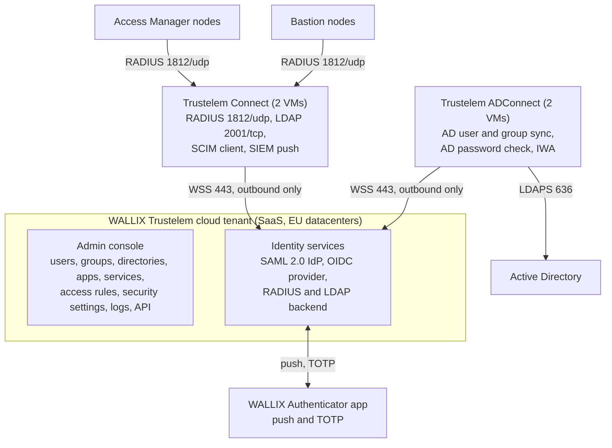

# WALLIX Trustelem: setup, configuration and integration with Bastion and Access Manager

How to set up **WALLIX Trustelem** (sold today as **WALLIX One IDaaS**), configure its MFA
and access rules, and integrate it with a **WALLIX Bastion** cluster and a **WALLIX Access
Manager** cluster so that every privileged login, on the web portal and on native RDP/SSH
clients, carries a second factor.

Every chapter quotes the vendor documentation verbatim and links to it, field by field, with
worksheets, verification steps and the vendor's own debug guidance. The Bastion and Access
Manager material exists to make the Trustelem integration precise.

Last updated: 2026-09-23. Verified against the Trustelem documentation portal as read on
2026-09-23, WALLIX Bastion 12.3.2 and WALLIX Access Manager 5.2.4.0 (public guides dated
2026-03-12). Minimum versions assumed because of the July 2026 advisories: Bastion 12.3.7 or
12.4.1, Access Manager 5.2.7 or 6.0.4.

## Start here

| I want to | Read |
|-----------|------|
| understand what Trustelem is made of and prepare the tenant | [01 Tenant setup](docs/trustelem/01-tenant-setup.md) |
| import Active Directory users and validate AD passwords | [02 ADConnect](docs/trustelem/02-directory-sync-adconnect.md) |
| give the Bastion and Access Manager a RADIUS or LDAP endpoint | [03 Trustelem Connect](docs/trustelem/03-trustelem-connect.md) |
| add MFA to the Bastion (web UI and native RDP/SSH clients) | [04 Bastion integration](docs/trustelem/04-bastion-integration.md) |
| federate the Access Manager portal with SAML, or chain RADIUS | [05 Access Manager integration](docs/trustelem/05-access-manager-integration.md) |
| choose factors, run enrollment, write access rules | [06 MFA and access rules](docs/trustelem/06-mfa-and-access-rules.md) |
| run it: logs, SIEM, API, certificates, outages | [07 Operations](docs/trustelem/07-operations.md) |
| fix a failing login | [08 Troubleshooting](docs/trustelem/08-troubleshooting.md) |
| see every field filled in for a sample organisation | [09 Worked example](docs/trustelem/09-worked-example.md) |
| validate the deployment or a change | [10 Test plan](docs/trustelem/10-test-plan.md) |
| brief the help desk and the users | [11 User and help-desk guide](docs/trustelem/11-user-and-helpdesk-guide.md) |
| decide whether to provision Trustelem users into the Bastion over SCIM | [12 SCIM provisioning](docs/trustelem/12-scim-provisioning.md) |
| see the whole design, clusters, ports, sizing, rollout | [Architecture report](docs/trustelem-bastion-access-manager-architecture.md) |
| know what is still unverified and who can answer it | [Open questions and gaps](docs/reference/open-questions-and-gaps.md) |
| prepare a meeting with WALLIX | [Vendor meeting script](docs/reference/vendor-meeting-script.md) |

Reading order for a new deployment: 01, 02, 06 (enrollment), 03, 04, 05, 06 (rules), 07.
The full index is in [docs/README.md](docs/README.md).

## What Trustelem provides and where it plugs in



| Trustelem service | Consumed by | Path protected | Chapter |
|-------------------|-------------|----------------|---------|
| SAML 2.0 identity provider (Access Manager template, generic SAML2 for the Bastion) | Access Manager portal; Bastion web UI through the same domain | HTML5 RDP/SSH sessions, password checkout, approvals | 05, 04 scenario D |
| RADIUS through Trustelem Connect (PAP, Access-Challenge, push-wait, MFA session) | Bastion as secondary authentication of the AD domain; Access Manager as factor 2 | native `mstsc` and SSH clients, Bastion web UI, Access Manager fallback | 04 scenarios A and B, 05 sections 5 and 6 |
| LDAP through Trustelem Connect (AD-like tree, port 2001) | Bastion as an AD-type directory | Trustelem-only users (partners, contractors) | 04 scenario C |
| ADConnect | the tenant itself | AD password validation without storing passwords; group-based import | 02 |
| WALLIX Authenticator app, TOTP, passkeys, SMS, e-mail OTP | users | push on every path; passkeys on the web path only | 06 |
| Access rules per application, user and group | the tenant | who must present one or two factors, by zone or protocol | 06 |
| SIEM push, API and scripts, application certificates | operations | audit, automation, rotation | 07 |

## The design in one paragraph

Active Directory stays the source of truth; ADConnect imports users and groups and validates
AD passwords. Web users open Access Manager, are redirected to Trustelem (SAML), complete the
second factor there, and launch Bastion sessions without a second prompt because both
products share the same authentication domain name and login attribute. Native RDP and SSH
clients connect to the Bastion proxies, where the AD bind is the first factor and a RADIUS
challenge to Trustelem Connect (push or TOTP) is the second. Two ADConnect and two Trustelem
Connect VMs give agent failover; a two-node Bastion HA Database Replication pair and a two-node
Access Manager farm give appliance failover. Full detail, flows and diagrams are in the
[architecture report](docs/trustelem-bastion-access-manager-architecture.md).

## Facts you must not miss

- **Only "SAML Generic" on the Bastion works with Access Manager, and once configured, direct
  SAML login to the Bastion web UI is impossible.** Administrators therefore keep AD plus
  RADIUS on the Bastion ([Bastion Admin Guide 7.3.1](https://pam.wallix.one/documentation/admin-doc/bastion_en_administration_guide.pdf)).
- **SAML and OIDC are "not fully integrated" for native RDP/SSH clients**; RADIUS is the only
  transparent push/TOTP path there, and passkeys never apply over RADIUS or LDAP
  ([Bastion 7.1.1](https://pam.wallix.one/documentation/admin-doc/bastion_en_administration_guide.pdf),
  [Trustelem MFA](https://trustelem-doc.wallix.com/books/trustelem-administration/page/multi-factors-authentication)).
- **"Use mobile device for 2FA" on the Bastion RADIUS entry must be ON for AD users and OFF for
  RADIUS-only local users**; the vendor explains it "skip[s] the login + password step ... by
  automatically sending the login and an empty password" ([Trustelem Bastion page](https://trustelem-doc.wallix.com/books/trustelem-applications/page/wallix-bastion)).
- **Trustelem users are invisible to the Bastion until an access rule exists** ("Trustelem
  users will not be found by the Bastion before having an access rule (1 or 2 factors)").
- **New Trustelem IPs 185.4.44.114 and 185.4.44.117 come into service on 2026-09-29**; add them
  to egress rules now, keep the existing ones, and exclude `*.trustelem.com` from TLS
  inspection ([network flows](https://trustelem-doc.wallix.com/books/trustelem-administration/page/connectors-network-flows)).
- **No cloud, no MFA**: Trustelem Connect only relays to the tenant. Keep a local, IP-restricted
  Bastion administrator as break-glass.
- **Patch levels**: WSA-2026-07-0001 (Bastion 12.3.0 to 12.3.6 and 12.4.0, CVSS 10) and
  WSA-2026-07-0002 (Access Manager SAML bypass before 5.1.10, 5.2.7, 6.0.4)
  ([advisories](https://www.wallix.com/support-services/alerts/)).
- **RADIUS between the Bastion and Trustelem Connect is plain UDP**; Message-Authenticator and
  RadSec are undocumented, so keep that hop inside the administration network
  ([standards reference](docs/reference/standards-and-compliance.md)).

## Repository layout

```
.
+-- README.md
+-- CLAUDE.md                     conventions for maintaining the documents
+-- docs/
|   +-- README.md                 documentation index
|   +-- trustelem/                CORE: setup, configuration and integration (chapters 01 to 12)
|   +-- trustelem-bastion-access-manager-architecture.md   design report with diagrams
|   +-- runbooks/                 Bastion HA replication, Access Manager farm
|   +-- reference/                Terraform for the Bastion side, logging and SIEM,
|   |                             SAML assertion and naming, Trustelem API export,
|   |                             standards and compliance, open questions and gaps
|   +-- archive/research-notes/   archived working notes (superseded by the chapters)
+-- CHANGELOG.md
+-- tools/
    +-- diagrams/*.mmd            Mermaid source of every diagram, embedded verbatim in the docs
    +-- check_docs.py             structural checks, also run by GitHub Actions
    +-- check_mermaid.mjs         parses every diagram with the Mermaid library (CI)
```

## Primary sources

- Trustelem documentation portal: <https://trustelem-doc.wallix.com/> (books: Trustelem
  administration, Trustelem applications, WALLIX Authenticator, Trustelem news)
- Trustelem application pages used most: [WALLIX Bastion](https://trustelem-doc.wallix.com/books/trustelem-applications/page/wallix-bastion),
  [WALLIX Bastion SAML](https://trustelem-doc.wallix.com/books/trustelem-applications/page/wallix-bastion-saml),
  [WALLIX Access Manager](https://trustelem-doc.wallix.com/books/trustelem-applications/page/wallix-access-manager),
  [LDAP-Radius Trustelem Connect](https://trustelem-doc.wallix.com/books/trustelem-administration/page/ldap-radius-trustelem-connect),
  [ADConnect](https://trustelem-doc.wallix.com/books/trustelem-administration/page/active-directory-users-trustelem-adconnect),
  [Access rules](https://trustelem-doc.wallix.com/books/trustelem-administration/page/access-rules)
- WALLIX One IDaaS product page: <https://www.wallix.com/products/idaas/>
- WALLIX Bastion 12.3.2 Functional Administration Guide: <https://pam.wallix.one/documentation/admin-doc/bastion_en_administration_guide.pdf>
- WALLIX Bastion 12.0.2 Deployment Guide: <https://marketplace-wallix.s3.amazonaws.com/bastion_12.0.2_en_deployment_guide.pdf>
- WALLIX Access Manager 5.2.4.0 Administration Guide: <https://pam.wallix.one/documentation/admin-doc/am-admin-guide_en.pdf>
- Release notes: [Bastion](https://pam.wallix.one/documentation/release-notes/bastion-rn-en.html),
  [Access Manager](https://pam.wallix.one/documentation/release-notes/am-rn-en.html)
- WALLIX security advisories: <https://www.wallix.com/support-services/alerts/>

The WALLIX HTML documentation site at <https://doc.wallix.com/> sits behind a Trustelem SAML
login, itself a live example of the IdP in this design; the PDF guides above are public.

## Working on the documents

- Every technical claim links to its source; verified facts, inferences and gaps are marked.
- Diagrams are Mermaid. Each has one source file in `tools/diagrams/` embedded verbatim as a fenced
  `mermaid` code block; edit the source and re-paste it, and the check script verifies the match.
- To re-verify a chapter, download the PDF into a scratch folder and extract it with
  `pdftotext -layout`; the Trustelem books export as HTML at `.../books/<book>/export/html`.
- The "last updated" date and the verified product versions are refreshed whenever a claim is
  re-checked against a newer release; `CHANGELOG.md` records what changed.
- `python3 tools/check_docs.py` runs the structural checks locally and `node tools/check_mermaid.mjs`
  parses the diagrams (after `npm install --no-save mermaid@11 jsdom@24`); GitHub Actions runs both
  on every push.

## Status

- [x] Trustelem chapters 01 to 12 (setup, ADConnect, Connect, Bastion and Access Manager
      integration, MFA and rules, operations, troubleshooting, worked example, test plan,
      user and help-desk guide, SCIM assessment)
- [x] Docs check script and CI workflow; research notes archived
- [x] Architecture report with flows, clusters, DR, ports, sizing, hardening, rollout plan
- [x] Runbooks (Bastion HA replication, Access Manager farm) and references (Terraform,
      logging and SIEM, standards and compliance)
- [ ] Vendor answers to the open questions (RADIUS Message-Authenticator, SAML clock skew,
      PKCE, push number matching, hosting assurances, SLA, SCIM to Bastion)
- [ ] Validation against the Bastion 12.4 and Access Manager 6.0 release notes (vendor login)
