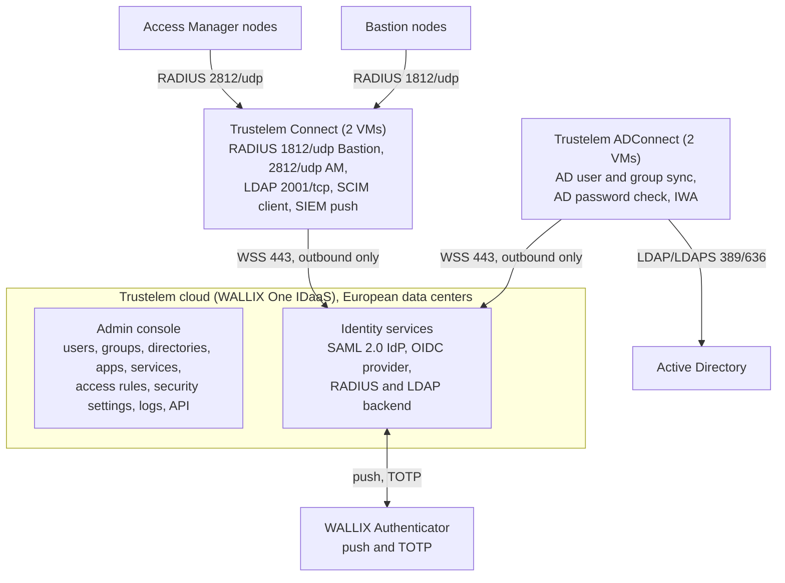

# Component architecture

> - **Purpose:** what each product component does, which protocols and factors it offers, and how Access Manager reaches the Bastion.
> - **Audience:** PAM architect, Trustelem administrator, Bastion and Access Manager operators.
> - **Verified:** 2026-09-24 against the public Bastion 12.3.2 and Access Manager 5.2.4.0 guides, the Bastion 12.4.3 and Access Manager 6.0.5 customer guides and the Trustelem documentation books.
> - **Sources:** [Trustelem administration book](https://trustelem-doc.wallix.com/books/trustelem-administration/export/html), [Trustelem applications book](https://trustelem-doc.wallix.com/books/trustelem-applications/export/html), [Bastion Administration Guide 12.3.2](https://pam.wallix.one/documentation/admin-doc/bastion_en_administration_guide.pdf), [Access Manager Administration Guide 5.2.4.0](https://pam.wallix.one/documentation/admin-doc/am-admin-guide_en.pdf), Bastion 12.4.3 customer guides on [doc.wallix.com](https://doc.wallix.com/) (login), Access Manager 6.0.5 customer guides on [doc.wallix.com](https://doc.wallix.com/) (login).

## 1. Trustelem / WALLIX One IDaaS

**Cloud tenant.** Each customer receives `https://<tenant>.trustelem.com` (user dashboard) and
`https://admin-<tenant>.trustelem.com` (admin console). The console holds Users, Groups,
Directories, Apps, Services, Access rules, Security settings (authentication factors, passkey
policy, application certificates, internal network zones), API scripts, Logs, Alerts and
Sessions. Sources: [Trustelem summary](https://trustelem-doc.wallix.com/books/trustelem-administration/page/summary),
[access rules](https://trustelem-doc.wallix.com/books/trustelem-administration/page/access-rules),
[MFA](https://trustelem-doc.wallix.com/books/trustelem-administration/page/multi-factors-authentication),
[certificate renewal](https://trustelem-doc.wallix.com/books/trustelem-administration/page/certificate-renewal),
[API](https://trustelem-doc.wallix.com/books/trustelem-administration/page/api). Data centers: "Hosted in European Data
Centers" ([product page](https://www.wallix.com/products/idaas/)).

**Trustelem ADConnect.** A Windows service or Linux daemon on a customer VM that "opens a
websocket to admin.trustelem.com using port 443 ... encrypted by TLS protocol and with an
additional symmetric encryption". The cloud sends search and authentication requests down that
socket; the agent queries AD over LDAP or LDAPS with a read-only account. "Trustelem does not
store any password for Active Directory users." At least two VMs are recommended, listed in
priority order; upgrades are rolling. Source: [ADConnect](https://trustelem-doc.wallix.com/books/trustelem-administration/page/active-directory-users-trustelem-adconnect).

**Trustelem Connect.** A local LDAP server (TCP 2001) and RADIUS server (UDP 1812, or 2812)
that forwards LDAP search/bind and RADIUS Access-Request and Challenge to the cloud over its
own outbound websocket on 443. It emulates an AD-like tree (`CN=<user>,DC=<tenant>,DC=trustelem,DC=com`,
groups under `OU=Groups`), supports LDAPS/StartTLS with a customer certificate, and also carries
outbound SCIM provisioning and SIEM log push. Two VMs recommended.
Sources: [Trustelem Connect](https://trustelem-doc.wallix.com/books/trustelem-administration/page/ldap-radius-trustelem-connect),
[SCIM client](https://trustelem-doc.wallix.com/books/trustelem-administration/page/scim-client),
[on-premise SIEM](https://trustelem-doc.wallix.com/books/trustelem-administration/page/on-premise-siem).

**WALLIX Authenticator app.** iOS, Android and Windows desktop app: push notification when
online, TOTP otherwise; biometric unlock and backup on mobile.
Sources: [MFA methods](https://trustelem-doc.wallix.com/books/trustelem-administration/page/multi-factors-authentication),
[Android listing](https://play.google.com/store/apps/details?id=com.trustelem.auth),
[iOS listing](https://apps.apple.com/us/app/wallix-authenticator/id1122073235).

**Protocols offered.**

| Protocol | Details | Source |
|----------|---------|--------|
| SAML 2.0 IdP | per-app endpoints `/app/<ID>/metadata`, `/app/<ID>/sso`, `/app/<ID>/on_logout`; tenant signing certificates assigned per app; custom attribute scripts | [Applications export](https://trustelem-doc.wallix.com/books/trustelem-applications/export/html) |
| OpenID Connect | issuer `https://<tenant>.trustelem.com/app/<ID>`, discovery, `/auth`, `/token`, `/userinfo`, RS256 JWKS, authorization-code and implicit flows | [OIDC app](https://trustelem-doc.wallix.com/books/trustelem-applications/page/openid-connect) |
| RADIUS (via Connect) | PAP; Access-Challenge for the OTP; push-wait (the reply is withheld until the push is approved); password+code concatenation; "2nd factor only" mode | [Bastion app](https://trustelem-doc.wallix.com/books/trustelem-applications/page/wallix-bastion), [AM app](https://trustelem-doc.wallix.com/books/trustelem-applications/page/wallix-access-manager), [access rules](https://trustelem-doc.wallix.com/books/trustelem-administration/page/access-rules), [MFA](https://trustelem-doc.wallix.com/books/trustelem-administration/page/multi-factors-authentication) |
| LDAP/LDAPS (via Connect) | search and bind, MFA by push-wait or password+TOTP | [Trustelem Connect](https://trustelem-doc.wallix.com/books/trustelem-administration/page/ldap-radius-trustelem-connect) |
| Kerberos / IWA | internal zone, user portal only, needs ADConnect "on a Windows machine" and an HTTP SPN | [IWA](https://trustelem-doc.wallix.com/books/trustelem-administration/page/integrated-windows-authentication) |
| Admin API | TypeScript handlers with IP-restricted bearer keys, enabled by support | [API](https://trustelem-doc.wallix.com/books/trustelem-administration/page/api) |

**MFA factors.** SMS (extra cost), TOTP, WALLIX Authenticator push, second-step passkeys
(FIDO2/WebAuthn including YubiKey, Windows Hello, Touch ID), email OTP (off by default).
Passkeys are checked against a configurable policy backed by the FIDO Alliance metadata
service. Passkeys cannot be used over LDAP or RADIUS. Lost factors are handled with a 24-hour
rescue code released by an administrator.
Sources: [MFA methods](https://trustelem-doc.wallix.com/books/trustelem-administration/page/multi-factors-authentication),
[Loss of a second factor](https://trustelem-doc.wallix.com/books/trustelem-administration/page/loss-of-a-second-factor).

**Access rules.** Per application, per user or group: web apps get *no rule*, *Default*,
*1 factor*, *2 factors* or *Forbidden*, split by internal and external network zone; LDAP gets
*no rule*, *1 factor*, *2 factors* or *Forbidden*; RADIUS gets *no rule*, *Always allow*, *2nd
factor only*, *2 factors* or *Forbidden*. A user rule beats a group rule, then the most restrictive wins.
Source: [Access rules](https://trustelem-doc.wallix.com/books/trustelem-administration/page/access-rules).

## 2. WALLIX Bastion

- **Placement.** "WALLIX Bastion is positioned between a low trust domain and a high trust
  domain"; all target access passes through it.
  Source: [Bastion Admin Guide 5.2](https://pam.wallix.one/documentation/admin-doc/bastion_en_administration_guide.pdf).
- **Services.** SSH/SFTP/SCP/Telnet/rlogin proxy on TCP 22; RDP/VNC proxy on TCP 3389; web UI
  and REST API on 443 (`/ui`, `/api`); SSH administration console on 2242; raw TCP through
  Universal Tunneling (WAMUT client). The proxy ports 22 and 3389 are configurable (Configuration
  options, advanced); 2242 and 443 are "Not configurable"; 80 answers only when "Allow HTTP
  connection" is enabled. *Inference:* no HTML5 gateway inside Bastion (none is documented); HTML5 comes from Access
  Manager. Sources: [Bastion 12.4.3 Deployment Guide](https://doc.wallix.com/) 2.2,
  [Deployment Guide 12.0.2, 2.2](https://marketplace-wallix.s3.amazonaws.com/bastion_12.0.2_en_deployment_guide.pdf),
  [Admin Guide 12.1 and 12.16.4](https://pam.wallix.one/documentation/admin-doc/bastion_en_administration_guide.pdf).
- **Authorization model.** Users belong to user groups, target accounts to target groups, and
  an authorization joins one user group to one target group with protocols and actions,
  recording, session invite, criticality and approval workflow. Time frames are set on the user
  group ("Select one or more time frames that apply to this new group"), and the approval
  workflow is checked against them. Permission profiles gate administration.
  Source: [Admin Guide 5.3, 6.2.1, 12.6 and 13](https://pam.wallix.one/documentation/admin-doc/bastion_en_administration_guide.pdf)
  (12.3.2 and 12.4.3).
- **Authentication matrix.** Login and password (LDAP/AD bind, local, RADIUS, TACACS+), Kerberos
  ticket, OIDC, SAML, PingID and X.509 are available on HTTPS; SSH key and SSH CA are "reserved
  to SSH connections" (7.1.4). On SSH and RDP,
  OIDC and SAML are "supported, but the workflow is not fully integrated": the user copies a
  link into a browser, retrieves a token and adds it to the client. X.509 on the proxies
  requires a prior HTTPS login. A one-time password (default 30 s) embedded in downloaded
  session files lets an authenticated web user open a native client.
  Source: [Admin Guide 7.1.1, 7.1.4 and 12.5](https://pam.wallix.one/documentation/admin-doc/bastion_en_administration_guide.pdf).
- **MFA model.** "you can setup a single-factor authentication (SFA) and a two-factor
  authentication (2FA). However, it is not possible to directly configure a multifactor
  authentication (MFA)." A primary authentication is set on the authentication domain and a
  *secondary authentication* (RADIUS, TACACS+, PingID, or the deprecated Kerberos-Password, 7.1.4
  and 7.2.5.x) is attached to it.
  WALLIX recommends putting richer MFA in the IdP.
  Source: [Admin Guide 7.1.3](https://pam.wallix.one/documentation/admin-doc/bastion_en_administration_guide.pdf).
- **RADIUS client.** RFC 2865 and RFC 8044, challenge-response supported, standard attributes
  only: User-Name, User-Password, State, NAS-Identifier (always `WAB`), Framed-IP-Address (the
  client IP). Default port 1812, default timeout 5 s.
  Source: [Admin Guide 7.2.5.4](https://pam.wallix.one/documentation/admin-doc/bastion_en_administration_guide.pdf).
- **Federation.** SAML 2.0 as SP with IdP- and SP-initiated flows, SP metadata download, SP
  entity ID changeable to a load balancer FQDN ("SAML dynamic flow"), NameID must be an e-mail
  whose domain equals the authentication domain name; OIDC Authorization Code Flow with
  discovery, cluster-aware ("allowing authentication via any FQDN assigned to any Bastion
  within the cluster"). Sources: [Admin Guide 7.3.1 and 7.3.2](https://pam.wallix.one/documentation/admin-doc/bastion_en_administration_guide.pdf).

## 3. WALLIX Access Manager

- **Role.** "provides connection services between web browsers and targets ... Target accesses
  are performed through Wallix Bastion appliances. The connections are done using HTML5
  clients; no browser plug-in is required." Multi-tenant through Organizations.
  Sources: [AM Admin Guide chapters 3 and 8](https://pam.wallix.one/documentation/admin-doc/am-admin-guide_en.pdf),
  [Access Manager 6.0.5 Administration Guide](https://doc.wallix.com/) 1.1 and 3.1.
- **Stack.** Access Manager 6.0.5 is delivered as an appliance only ("WALLIX Access Manager
  cannot be installed on third-party hardware"). The web application is the systemd service
  `wabam` on a web server that is "typically Jetty", behind the Proxyma proxy
  (`/etc/proxyma/config.toml`); configuration lives in `/etc/wabam/wabam.properties`; the
  database is the embedded MariaDB or an external one ("Only MySQL is supported", with an Azure
  option); session audit data sits in an embedded audit session repository. The guides do not
  state the Debian or Java version.
  Sources: [Access Manager 6.0.5 Deployment Guide](https://doc.wallix.com/) 3.1 and 5.1, [Access Manager 6.0.5 Administration Guide](https://doc.wallix.com/) 8.2, 8.3,
  8.5.2 and 9.3.
  *Access Manager 5.2:* Java 17 on Jetty 11, FreeRDP 3 and xterm.js for HTML5, MariaDB 10.5
  embedded (or external MySQL, Oracle, Azure), Elasticsearch 8.18 for session audit, Debian 10
  appliance with the application in the Docker container `access-manager_access_manager_1`
  behind Apache, configuration in `/var/wab/etc/wabam/wabam.properties`.
  Sources: [AM release notes](https://pam.wallix.one/documentation/release-notes/am-rn-en.html),
  [AM Admin Guide chapters 15 to 21](https://pam.wallix.one/documentation/admin-doc/am-admin-guide_en.pdf).
- **Link to Bastion.** Each Bastion object holds the user-interface IP, a Bastion REST API key
  (profile `wallix_access_manager_session_audit`; profile-based keys from Bastion 12.1 per AM 13, 12.2 per release notes WAB-11577), pinned
  TLS certificate and SSH/RDP fingerprints, cluster membership, Strip Domain, and per-Bastion
  ports (SSH 22, RDP 3389, REST 443).
  Sources: [AM Admin Guide 10.4.3 and 13](https://pam.wallix.one/documentation/admin-doc/am-admin-guide_en.pdf),
  [Access Manager 6.0.5 Administration Guide](https://doc.wallix.com/) 3.2.1, 3.2.2 and 3.2.4, [Access Manager 6.0.5 Deployment Guide](https://doc.wallix.com/) 2.2.
- **Traffic path.** Access Manager opens 22, 3389 and 443 towards the Bastion; the Bastion sees
  the Access Manager IP as the client. *Inference:* the HTML5 gateway therefore runs on Access
  Manager and session traffic does not bypass it.
  Sources: [AM Install Guide 2.4](https://marketplace-wallix.s3.amazonaws.com/am-install_en.pdf),
  [Access Manager 6.0.5 Deployment Guide](https://doc.wallix.com/) 2.2 (table 3),
  [Bastion Admin Guide, Universal Tunneling auditing](https://pam.wallix.one/documentation/admin-doc/bastion_en_administration_guide.pdf).
- **Authentication domains.** Local, LDAP/AD, SAML, BASTION and OIDC domains; RADIUS servers
  attach as *authenticators* in an ordered factor chain with priority-based failover. There is
  no built-in TOTP; MFA is delegated to RADIUS or to the IdP. Kerberos is absent.
  Sources: [AM Admin Guide chapters 10 and 11](https://pam.wallix.one/documentation/admin-doc/am-admin-guide_en.pdf),
  [Access Manager 6.0.5 Administration Guide](https://doc.wallix.com/) 4.3 and 4.4.
