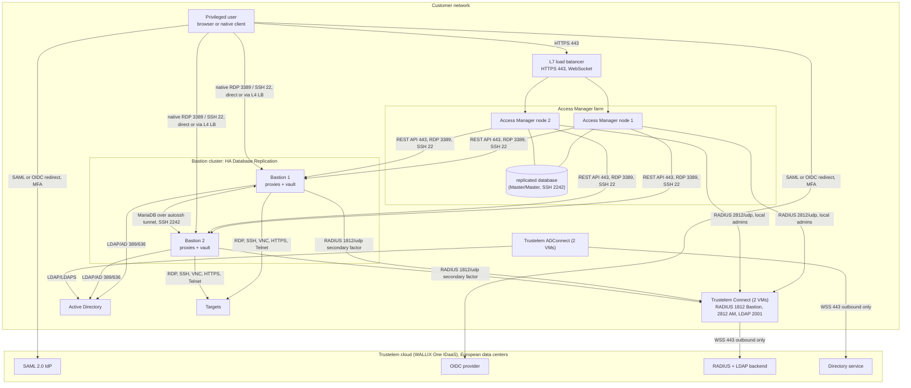
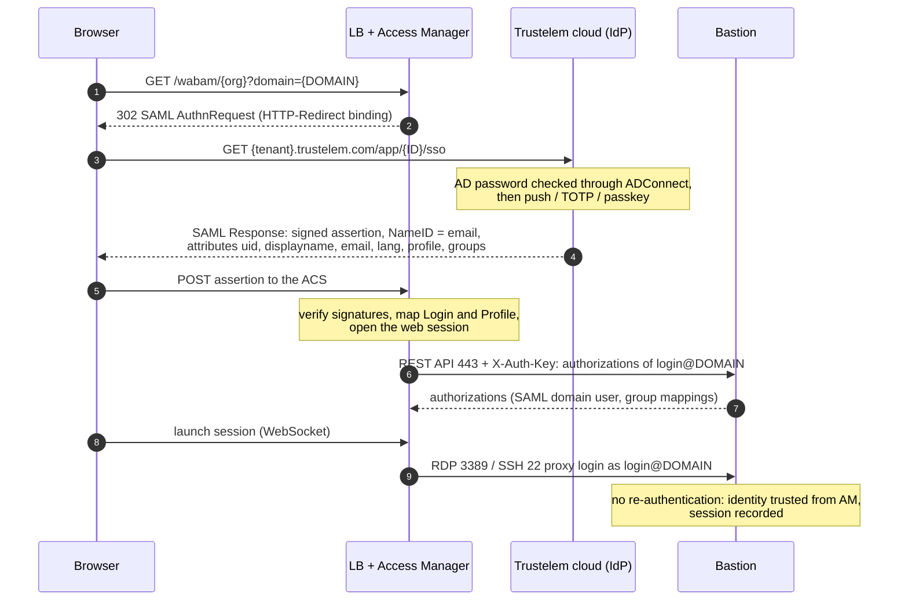
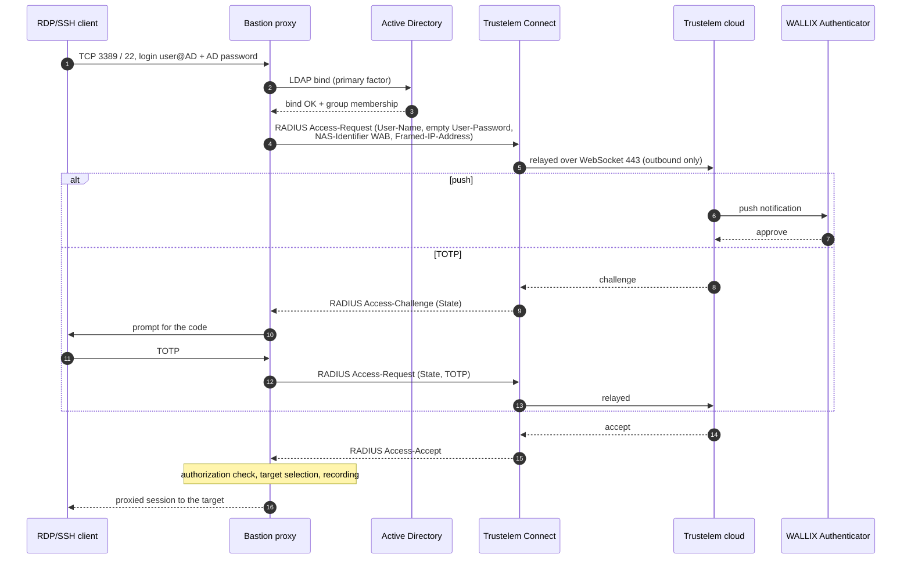

# High-level design and identity flows

> - **Purpose:** the design decisions, the web (SAML) and native-client (RADIUS) identity flows, the alternatives, which factor protects each access path, and how administrators log in.
> - **Audience:** PAM architect, security officer, Trustelem administrator.
> - **Verified:** 2026-09-24 against the public Bastion 12.3.2 and Access Manager 5.2.4.0 guides, the Bastion 12.4.3 and Access Manager 6.0.5 customer guides and the Trustelem documentation books.
> - **Sources:** [Trustelem applications book](https://trustelem-doc.wallix.com/books/trustelem-applications/export/html), [Trustelem administration book](https://trustelem-doc.wallix.com/books/trustelem-administration/export/html), [Bastion Administration Guide 12.3.2](https://pam.wallix.one/documentation/admin-doc/bastion_en_administration_guide.pdf), [Access Manager Administration Guide 5.2.4.0](https://pam.wallix.one/documentation/admin-doc/am-admin-guide_en.pdf), Bastion 12.4.3 customer guides on [doc.wallix.com](https://doc.wallix.com/) (login), Access Manager 6.0.5 customer guides on [doc.wallix.com](https://doc.wallix.com/) (login).

The high-level design: every component, the two access paths and the flows between them.

## 1. Design decisions

| Decision | Choice | Reason and source |
|----------|--------|-------------------|
| Identity source | Active Directory synced by ADConnect; Trustelem local users only for partners and backup admins | Vendor decision tree: AD users import via ADConnect, then RADIUS as 2nd factor on the Bastion AD domain; for people outside AD "it's best to go through local Trustelem users, and not local Bastion users". [Setup instructions](https://trustelem-doc.wallix.com/books/wallix-authenticator/page/setup-instructions), [Local users](https://trustelem-doc.wallix.com/books/trustelem-administration/page/trustelem-local-users) |
| Web protocol | SAML 2.0 from Trustelem to Access Manager, generic SAML on Bastion | "Access Manager is compatible with SAML (recommanded), LDAP and Radius" [sic]. Dedicated Access Manager template exists in Trustelem. The Bastion lists "WALLIX IDaaS (ex Trustelem)" among its supported SAML identity providers ([Bastion 12.4.3 Deployment Guide](https://doc.wallix.com/) 8.1). [WALLIX Authenticator](https://trustelem-doc.wallix.com/books/wallix-authenticator/page/presentation), [AM app](https://trustelem-doc.wallix.com/books/trustelem-applications/page/wallix-access-manager) |
| Why not OIDC | OIDC is supported on both products (Bastion 12.2; Access Manager 5.2.x, listed as WAB-10840 in the 5.2.4.0 notes while 5.2.1 and 5.2.3 notes already mention OIDC), but Trustelem publishes no WALLIX OIDC template and no groups claim guidance | *gap*; [Bastion 7.3.2](https://pam.wallix.one/documentation/admin-doc/bastion_en_administration_guide.pdf), [AM 10.5](https://pam.wallix.one/documentation/admin-doc/am-admin-guide_en.pdf) |
| Native client MFA | RADIUS to Trustelem Connect as secondary authentication of the Bastion AD domain | Only transparent push/OTP path for RDP and SSH proxies. [Bastion 7.2.5.4](https://pam.wallix.one/documentation/admin-doc/bastion_en_administration_guide.pdf), [Bastion app](https://trustelem-doc.wallix.com/books/trustelem-applications/page/wallix-bastion) |
| Authorization | Bastion group mappings on the AD domain (native path) and on the SAML domain (web path) | RADIUS carries no groups. [Bastion 7.3.1.1.3](https://pam.wallix.one/documentation/admin-doc/bastion_en_administration_guide.pdf) |
| Bastion cluster | Two nodes, HA Database Replication Master/Master | Approvals replicate between both masters in Master/Master; scheduled password rotation runs only on the primary master. [Deployment Guide ch. 5](https://marketplace-wallix.s3.amazonaws.com/bastion_12.0.2_en_deployment_guide.pdf), [Bastion 12.4.3 Deployment Guide](https://doc.wallix.com/) 5 |
| Access Manager cluster | Two nodes behind an L7 load balancer, appliance MariaDB replication | [AM 20.1](https://pam.wallix.one/documentation/admin-doc/am-admin-guide_en.pdf) |
| Agents | Two ADConnect and two Trustelem Connect VMs, on separate hosts from the Bastions | "The recommendation is 2 VM at least, to have a failover system". [Trustelem Connect](https://trustelem-doc.wallix.com/books/trustelem-administration/page/ldap-radius-trustelem-connect) |

## 2. Identity flow, web path

Key rules, all from the vendor guides:

- The Access Manager SAML domain name must equal the Bastion "Domain server name": "If SAML
  authentication is also configured in WALLIX Bastion, the domain name must match the name
  Domain server name used in WALLIX Bastion (in Configuration > Authentication domains > SAML)"
  (AM 6.0.5 AG 4.3.3.1; the 5.2 guide, AM 10.3.2, says the same); the Bastion guide says the
  same and recommends the same value for the Authentication domain name (Bastion 7.3.1). The
  Trustelem Bastion SAML page names the Authentication domain name instead, so set both fields
  to the same value. The Access Manager Login attribute must equal the Bastion Username claim.
  Sources: [Access Manager 6.0.5 Administration Guide](https://doc.wallix.com/) 4.3.3.1, [AM 10.3.2](https://pam.wallix.one/documentation/admin-doc/am-admin-guide_en.pdf),
  [Bastion 7.3.1.1](https://pam.wallix.one/documentation/admin-doc/bastion_en_administration_guide.pdf).
- "Disable encryption when configuring SAML to authenticate to WALLIX Bastion through WALLIX
  Access Manager." Signed Response and Signed Assertion must stay enabled: "Disabling the Signed
  Response and Signed Assertion options allows any user to connect to WALLIX Access Manager as
  an administrator."
  Sources: [Access Manager 6.0.5 Administration Guide](https://doc.wallix.com/) 4.3.3.2.1, [AM 10.3.2](https://pam.wallix.one/documentation/admin-doc/am-admin-guide_en.pdf).
- Disable Strip Domain on the Bastion object in Access Manager: "This keeps the login format as
  user@domain, which is required for proper user mapping and authorization."
  Sources: [Access Manager 6.0.5 Administration Guide](https://doc.wallix.com/) 4.3.3.2, [AM 10.3.2](https://pam.wallix.one/documentation/admin-doc/am-admin-guide_en.pdf).
- The Bastion side must use the "SAML > Other IdPs" domain type; the Entra ID (Graph API)
  variant "is not compatible with WALLIX Access Manager".
  Source: [Bastion 7.3.1.2](https://pam.wallix.one/documentation/admin-doc/bastion_en_administration_guide.pdf).
- Trustelem sends `uid` (AD users) or `email` (local users) as Login, plus `displayname`,
  `email`, `lang` and an optional `profile` attribute computed by script.
  Source: [AM app in Trustelem](https://trustelem-doc.wallix.com/books/trustelem-applications/page/wallix-access-manager).

## 3. Identity flow, native client path

- On the Bastion, the RADIUS external authentication is linked as *Secondary authentication*
  of the AD authentication domain. With "Use mobile device for two-factor authentication
  (2FA)" enabled, the login page tells the user a push notification is coming; Trustelem
  describes this as skipping the password step by "automatically sending the login and an
  empty password". "Use primary domain name for two-factor authentication (2FA)" sends `user@domain` in the second step.
  Sources: [Bastion 7.2.5.4](https://pam.wallix.one/documentation/admin-doc/bastion_en_administration_guide.pdf),
  [Bastion app in Trustelem](https://trustelem-doc.wallix.com/books/trustelem-applications/page/wallix-bastion).
- The Trustelem access rule for the Bastion RADIUS application is *2nd factor only* for AD
  users (the password was already checked by the Bastion against AD).
  Source: [Bastion app in Trustelem](https://trustelem-doc.wallix.com/books/trustelem-applications/page/wallix-bastion).
- The RADIUS timeout must cover push latency. The defaults, the vendor advice and the value of
  this design are in the [timeouts table](05-low-level-design.md#4-timeouts-to-align).
- Trustelem can suppress repeated prompts "for the duration defined on Trustelem and as long as
  he remains on the same network". The Bastion guide describes the matching RADIUS input:
  "RADIUS servers can use the Framed-IP-Address attribute in their configuration. For example,
  to allow users to reconnect from the same IP address without re-entering their credentials if
  they authenticated recently." *Inference:* that attribute is what Trustelem evaluates. Behind
  a load balancer the Bastion may not see the user's address: "when a load balancer sits in
  front of WALLIX Bastion, the address displayed is not the user's own" (12.16.1.6).
  *Inference:* if the balancer rewrites the source address, Framed-IP-Address carries the
  balancer's address and the "same network" test no longer separates users' networks; keep the
  client address on the balancer or test the MFA session through it.
  Sources: [Trustelem new features](https://trustelem-doc.wallix.com/books/trustelem-news/page/new-features),
  [Bastion 7.2.5.4](https://pam.wallix.one/documentation/admin-doc/bastion_en_administration_guide.pdf)
  (12.3.2 and 12.4.3), [Bastion 12.4.3 Administration Guide](https://doc.wallix.com/) 12.16.1.6.
- SSH clients receive the challenge as keyboard-interactive prompts; this breaks automation
  such as VS Code Remote-SSH. RDP clients see the Bastion RDP proxy login screen. When Kerberos
  is enabled on the RDP proxy, users of other methods (for example SAML, OTP or RADIUS) without
  Bastion connection files must enable NLA and set `enablecredsspsupport:i:0` and
  `authentication level:i:2` in the `.rdp` file (or `/sec:tls` with FreeRDP).
  Sources: [VS Code issue](https://github.com/microsoft/vscode-remote-release/issues/11461),
  [Bastion Users Guide](https://pam.wallix.one/documentation/user-doc/bastion_en_user_guide.pdf).

## 4. Alternative flows

- **Access Manager with RADIUS MFA instead of SAML.** Useful when Access Manager account
  mapping needs the user's AD password: the AD domain is factor 1 and Trustelem Connect
  (Protocol PAP as Trustelem recommends, although Access Manager also offers AUTO and CHAP;
  port 1812 or 2812, Login type "simple login", NAS Identifier empty) is factor
  2, with "Factor Used for Account Mapping" set to the AD factor. In the Trustelem Access
  Manager app the root URL, organization identifier and domain stay empty when only RADIUS is
  used. The user experience is a second prompt: "first provide the AD login and password then
  provide the Trustelem TOTP code, even if the name of the input is Password again". Push
  approval is documented for the Bastion RADIUS path, not for this one.
  Sources: [AM 10.1, 10.2.1 and 11](https://pam.wallix.one/documentation/admin-doc/am-admin-guide_en.pdf),
  [Access Manager 6.0.5 Administration Guide](https://doc.wallix.com/) 4.3.6 and 4.4.1,
  [AM app in Trustelem](https://trustelem-doc.wallix.com/books/trustelem-applications/page/wallix-access-manager).
- **Trustelem local users on the Bastion.** Bastion LDAP domain pointing at Trustelem Connect
  (port 2001, bind user `trustelem`, login attribute `mail`, group DN
  `CN=<Group>,OU=Groups,DC=<tenant>,DC=trustelem,DC=com`) with RADIUS as secondary
  authentication and access rule *2nd factor only*. The LDAP access rule is *1 factor* "if it
  will be conbined [sic] with a Radius authentication"; without it the Bastion cannot even
  enumerate users.
  Source: [Bastion app in Trustelem](https://trustelem-doc.wallix.com/books/trustelem-applications/page/wallix-bastion).
- **Bastion local users with RADIUS only.** User authentication set to RADIUS
  alone, user name recognisable by Trustelem (e-mail), access rule *2 factors*, and "Use
  mobile device" left off. These users have no local password fallback.
  Source: [Bastion app in Trustelem](https://trustelem-doc.wallix.com/books/trustelem-applications/page/wallix-bastion).

## 5. Access path coverage

Every way into the platform, and which factor protects it. "Push/TOTP" means the RADIUS
secondary authentication against Trustelem Connect; "SAML" means the full Trustelem factor set
including passkeys.

| Access path | Primary factor | Second factor | Notes and source |
|-------------|---------------|---------------|------------------|
| Access Manager portal (HTML5 RDP, SSH, WAMUT tunnels, password checkout, approvals) | Trustelem SAML (AD password via ADConnect) | Trustelem: push, TOTP, passkey | "complete SAML workflow ... using the same SAML Identity Provider on both" products; the portal opens Bastion sessions without a second login ([AM release notes WAB-3405](https://pam.wallix.one/documentation/release-notes/am-rn-en.html)) |
| Bastion web UI opened directly (administrators, auditors, approvers) | AD bind on the Bastion AD domain | Push/TOTP | SAML button is unusable once SAML is bound to Access Manager ([Bastion 7.3.1](https://pam.wallix.one/documentation/admin-doc/bastion_en_administration_guide.pdf)) |
| Native RDP client to the Bastion proxy | AD bind | Push/TOTP on the RDP proxy login screen | With Kerberos enabled on the proxy, users of other methods need `enablecredsspsupport:i:0` and `authentication level:i:2`, or `/sec:tls` for FreeRDP, with NLA enabled ([Users Guide 9.3](https://pam.wallix.one/documentation/user-doc/bastion_en_user_guide.pdf), [Admin Guide 7.2.5.2](https://pam.wallix.one/documentation/admin-doc/bastion_en_administration_guide.pdf)) |
| Native SSH, SFTP, SCP to the Bastion proxy | AD bind (or SSH key / SSH CA, including a FIDO2 hardware key) | Push/TOTP via keyboard-interactive | Keyboard-interactive prompts break non-interactive clients (an open user report for a browser-OTP flow: [VS Code issue](https://github.com/microsoft/vscode-remote-release/issues/11461)); *inference:* scripted transfers use a dedicated account without RADIUS. FIDO2 keys ("SK ED25519 (FIDO2)", "SK ECDSA NIST p256 (FIDO2)") give a phishing-resistant native SSH login ([Bastion 12.4.3 Administration Guide](https://doc.wallix.com/) 2.5 and 7.2.5.6); whether the RADIUS secondary authentication still runs after a key login is gap B10 |
| Universal Tunneling with WAMUT or WALLIX-PuTTY | same as SSH | same as SSH | The tunnel is an SSH session to the proxy; through Access Manager it inherits SAML ([Users Guide 8.6](https://pam.wallix.one/documentation/user-doc/bastion_en_user_guide.pdf)) |
| One-time-password session files ("instant access") | already authenticated in the web UI or Access Manager | inherited | Token valid 30 s by default ([Bastion 12.5](https://pam.wallix.one/documentation/admin-doc/bastion_en_administration_guide.pdf)) |
| Kerberos ticket SSO on the SSH proxy and on the RDP proxy (RDP since 12.3.1, WAB-208) | Windows logon ticket | none from WALLIX | Single factor unless the workstation logon itself is MFA (smart card, Windows Hello for Business); *inference:* keep it for PAW-class workstations only ([Bastion 7.2.5.2](https://pam.wallix.one/documentation/admin-doc/bastion_en_administration_guide.pdf)) |
| Bastion REST API with API keys | API key bound to a Read-only type profile; IP limitations "are inherited from the profile of the authenticated user", and each key also carries its own list of allowed IP addresses ("Subnet notations, for example 192.0.2.1/24, are not supported"), which "You cannot change" after creation | none | Treat keys as secrets; restrict to Access Manager, IAM and automation hosts ([Bastion 6.1 and 6.1.2](https://pam.wallix.one/documentation/admin-doc/bastion_en_administration_guide.pdf), [Bastion 12.4.3 System Operations Guide](https://doc.wallix.com/) 12.1 and 12.2) |
| Access Manager local and global administrators | local password (or Bastion domain) | RADIUS factor 2 on a local domain, or none | See the [administrator access model](#6-administrator-access-model) ([AM 10.1 and 12.2](https://pam.wallix.one/documentation/admin-doc/am-admin-guide_en.pdf)) |
| Bastion SSH administration console (2242) | `wabadmin` password or SSH key (Deployment Guide 4.2) | none documented (*inference*) | Firewall to the admin network, the jump host and the peer Bastion node (replication tunnel) only ([Deployment Guide 2.1 and 4.2](https://marketplace-wallix.s3.amazonaws.com/bastion_12.0.2_en_deployment_guide.pdf), [Bastion 12.4.3 Deployment Guide](https://doc.wallix.com/) 2.2) |
| Session Invite guest | time-limited link issued by the host | none | Guest has no account; host is already MFA-authenticated ([AM 14.6](https://pam.wallix.one/documentation/admin-doc/am-admin-guide_en.pdf)) |
| Web Session Manager (isolated browser for web targets) | launched from an authenticated Bastion or AM session | inherited | Separate server linked by JWS/JWE keys ([Bastion 12.2](https://pam.wallix.one/documentation/admin-doc/bastion_en_administration_guide.pdf)) |

## 6. Administrator access model

| Population | Where they log in | Authentication | Break-glass |
|------------|-------------------|----------------|-------------|
| Bastion product and operation administrators | Bastion web UI on the admin interface | AD domain user mapped to `product_administrator` or `operation_administrator`, RADIUS push as secondary factor, source IP restricted to the admin network | one local administrator with a local password, IP-restricted, password in a sealed envelope or offline vault; the default `admin` account deleted ([Bastion 6.1, 7.4](https://pam.wallix.one/documentation/admin-doc/bastion_en_administration_guide.pdf)) |
| Bastion auditors and approvers | Bastion web UI or Access Manager | same as users (SAML through AM, or AD plus RADIUS on the Bastion) | none needed |
| Bastion appliance operators | SSH console 2242 (`wabadmin`, `wabsuper`) and hypervisor console | passwords changed at initialisation, no MFA available | `wabbootadmin` GRUB user and hypervisor console; restrict 2242 to a jump host ([Deployment Guide 2.1](https://marketplace-wallix.s3.amazonaws.com/bastion_12.0.2_en_deployment_guide.pdf)) |
| Access Manager global organization administrator | `https://<am>/wabam/global?domain=local` | local password, optionally RADIUS chained as factor 2 on the local domain (Access Manager 5.2: X.509 is "not possible on the administration interface", AM 10.2.4; the 6.0.5 guides drop that sentence, AG 4.3.5.1 and 8.5.4.5); restricted source IPs per user | `wabam-restore-admin` command-line reset of the global administrator password ([AM 8, 10.1, 12.2, 22.1](https://pam.wallix.one/documentation/admin-doc/am-admin-guide_en.pdf), [Access Manager 6.0.5 Administration Guide](https://doc.wallix.com/) 4.2.2, 4.8.1 and 8.4.6) |
| Access Manager organization administrators | organization URL | SAML domain with a `profile` attribute naming an administrator profile (AM 10.3.1 Profile Attribute), or a Bastion domain (*design choice*) | global administrator |
| Trustelem administrators | `https://admin-<tenant>.trustelem.com` | admin console access level set to 2 factors; delegated administrators through `groupManager` | one local Trustelem administrator not linked to AD; rescue codes ([Local users](https://trustelem-doc.wallix.com/books/trustelem-administration/page/trustelem-local-users), [Delegated administration](https://trustelem-doc.wallix.com/books/trustelem-administration/page/delegated-administration)) |
| Trustelem Connect and ADConnect hosts | OS administration | OS controls (not WALLIX) | *inference:* manage these VMs through the Bastion itself once it is live |

The Bastion administrators deliberately do not use the SAML path: binding SAML to Access
Manager removes direct SAML login to the Bastion, and an administrator must be able to reach the
Bastion when the Access Manager farm is down.
Source: [Bastion 7.3.1](https://pam.wallix.one/documentation/admin-doc/bastion_en_administration_guide.pdf).

## 7. OpenID Connect as the alternative to SAML

Both products accept Trustelem as an OIDC provider, and WALLIX recommends OIDC over SAML for
new applications on Trustelem. The mapping rules mirror SAML; the table gives the values.

| Setting | Trustelem OIDC app | Access Manager (6.0.5) | Bastion (12.2 and later) |
|---------|-------------------|-----------------------------------|--------------------------|
| Issuer / discovery | `https://<tenant>.trustelem.com/app/<ID>` and `/.well-known/openid-configuration` | URL Discovery then "Match" | Discovery URL then "Match" |
| Flow | authorization code (implicit also offered) | Authorization Code Flow only | Authorization Code Flow only |
| Client | `trustelem.oidc.<id>` and secret | Client ID / Client Secret | Client ID / Client Secret |
| Redirect URI | must be declared, plus post-logout URI | "IdP Redirect URL" auto-filled; edit it to the load balancer hostname | Bastion callback; cluster-aware since 12.3.2 |
| Scope | at least `email` | must include `openid`; add `profile`, `email` | claims Username and Group mandatory |
| Signing | RS256 JWKS | verify HTTPS certificate on by default; CA must be in the organization CAs; Timeout (seconds) field (5 s default in 5.2, no default stated in 6.0.5) | |
| Domain rules | | OIDC domain name = Bastion "Domain server name" (AM 6.0.5 AG 4.3.4.1, AM 5.2 10.5.2), Authentication domain name set identical; Login attribute = Bastion Username claim; Strip Domain off | Authentication domains > OIDC; group mappings |

Sources: [Trustelem OIDC](https://trustelem-doc.wallix.com/books/trustelem-applications/page/openid-connect),
[AM 10.5](https://pam.wallix.one/documentation/admin-doc/am-admin-guide_en.pdf), [Access Manager 6.0.5 Administration Guide](https://doc.wallix.com/) 4.3.4, [Bastion 7.3.2](https://pam.wallix.one/documentation/admin-doc/bastion_en_administration_guide.pdf).
Gap: Trustelem publishes no WALLIX-specific OIDC template and no example of a `groups` claim,
so the SAML path remains the documented one.
