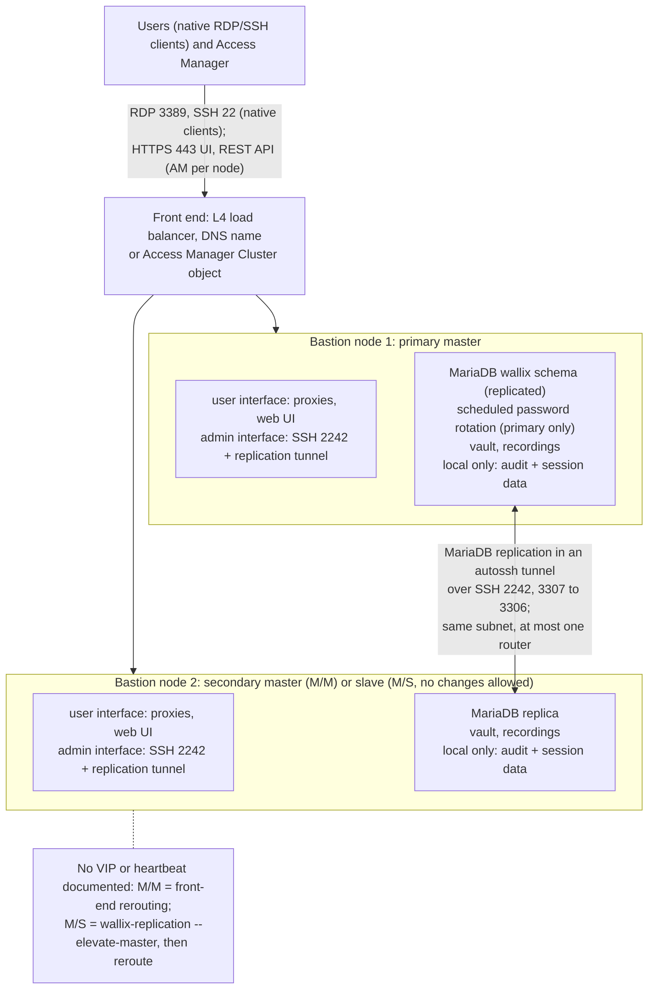
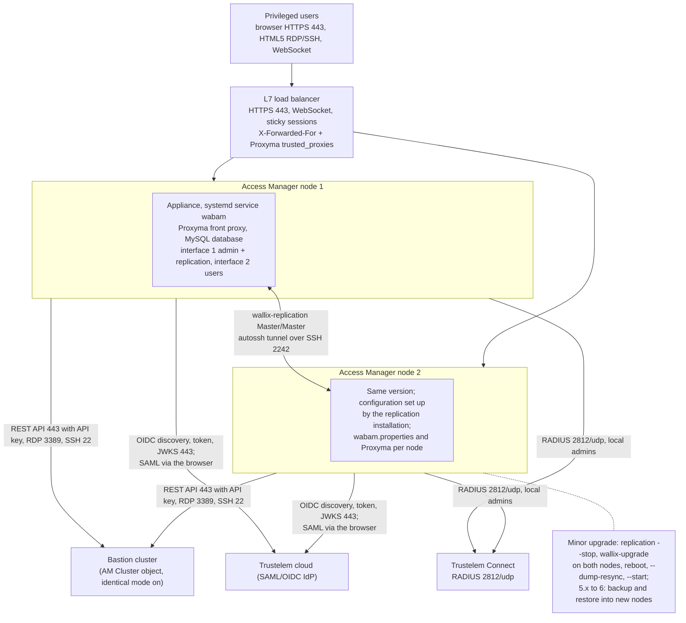
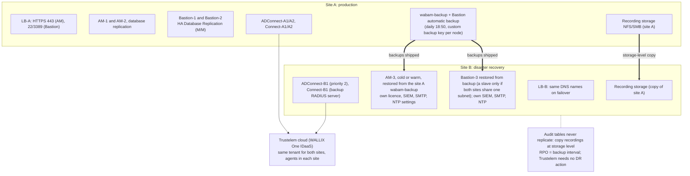

# Cluster design and disaster recovery

> - **Purpose:** how the Bastion pair and the Access Manager farm replicate and fail over, what each failure does, and how a second site recovers.
> - **Audience:** PAM architect, Bastion and Access Manager operators.
> - **Verified:** 2026-09-24 against the Bastion 12.4.3 and Access Manager 6.0.5 customer guides, the public Bastion 12.0.2 Deployment Guide, the public Bastion 12.3.2 and Access Manager 5.2.4.0 guides and the Trustelem documentation books.
> - **Sources:** Bastion 12.4.3 customer guides on [doc.wallix.com](https://doc.wallix.com/) (login) (Deployment and System Operations guides), Access Manager 6.0.5 customer guides on [doc.wallix.com](https://doc.wallix.com/) (login) (Deployment and Administration guides), [Bastion 12.0.2 Deployment Guide](https://marketplace-wallix.s3.amazonaws.com/bastion_12.0.2_en_deployment_guide.pdf), [Access Manager Administration Guide 5.2.4.0](https://pam.wallix.one/documentation/admin-doc/am-admin-guide_en.pdf).

## 1. Bastion cluster

Facts from the [Bastion 12.4.3 Deployment Guide](https://doc.wallix.com/) chapter 5 and the [Bastion 12.4.3 System Operations Guide](https://doc.wallix.com/) chapter 11 (the
public [12.0.2 Deployment Guide](https://marketplace-wallix.s3.amazonaws.com/bastion_12.0.2_en_deployment_guide.pdf)
chapter 5 has the same content with the older command names), and the
[12.3.2 release notes](https://pam.wallix.one/documentation/release-notes/bastion-rn-en.html):

- "WALLIX Bastion 12 removed the High-Availability File System Replication (DRBD) feature";
  the 12.3.2 notes remove the "legacy DRDB code" [sic] and eth1 is now a standard interface.
- HA Database Replication is MariaDB replication carried inside an SSH tunnel maintained by
  autossh; slaves pull from local 3307 to the master's 3306, so the database port is never
  exposed on the network ("The port forwarding allows the databases to communicate without
  having to open a remote access to the database"). The tunnel runs over the administration
  port: "HA Database Replication relies on this port being open" (Deployment Guide 2.2, row
  2242/TCP).
- Modes: Master/Slave(s) (one writable node) and Master/Master (two nodes, primary and
  secondary master; "In Master/Master mode, changes can be made on both nodes"). In
  Master/Master "approvals are replicated between both Bastions"; in Master/Slaves they "must be
  requested and validated only on the Master"; password operations run only from the primary
  master; simultaneous API provisioning on both masters is unsupported.
- Scheduled rotation: "Password rotation crons are not automatically replicated between nodes,
  so only the primary Bastion runs scheduled rotations. As a result, if the primary Bastion
  becomes unavailable, password changes will not run until it is available again."
- Requirements (Deployment Guide 5.1): "All Bastion nodes are on the same subnet and connected
  directly or through only one router."; "All Bastion nodes run the same WALLIX Bastion
  version."; "All Bastion nodes have encryption initialized."; "All Bastion nodes are
  synchronized via NTP to the same timezone" ("Replication across multiple time zones is not
  supported"); "All Bastion nodes have an interface with administration features" ("Allows
  establishing an SSH tunnel between nodes"). Also IPv4 only, never clone a configured VM, and
  "an SMTP server must be configured on each node of the Database Replication".
- Not replicated: audit and session tables, recording options, configuration options,
  connection messages, audit logs, network, time, SNMP, SMTP, service control, SIEM integration,
  GPG fingerprints, device certificates. Each node must therefore receive its own SIEM, SMTP,
  NTP, recording-storage and configuration-option settings. The 12.4.3 list no longer names the
  licence (the 12.0.2 list did) and does not say it replicates; this design plans one licence per
  node until WALLIX confirms (*inference*).
- The replicated data is the `wallix` database (`'Binlog_Do_DB': 'wallix'` in the status output,
  System Operations Guide 11.3); "all Bastion nodes in a cluster share the same encryption key,
  even in master/master mode", but "sessions can only be viewed on the Bastion of origin through
  its GUI" (System Operations Guide 6.5.3).
- Operations use `wallix-replication` (`--prerequisite-check`, `--install`, `--status`,
  `--resync`, `--dump-resync`, `--add-slave`, `--elevate-master`, `--stop`, `--start`,
  `--uninstall`; `bastion-replication` in the 12.0.x guides) and mail templates
  ha_master_fault, ha_master_up and ha_slave_missing (Admin Guide 8.2.2). "There is a 10-day
  buffer on the master where data is automatically replicated when the faulty node comes back
  online" (System Operations Guide 11.3). Details in the
  [HA runbook](../runbooks/bastion-ha-replication.md).
- *Inference from absence:* neither 12.4.3 guide mentions a VIP or a heartbeat. In Master/Master
  the front end reroutes to the surviving master; in Master/Slaves `wallix-replication
  --elevate-master` promotes the slave first, then the front end is rerouted. The step-by-step
  `--elevate-master` procedure is not documented (gap B2).
  *Inference:* proxy sessions on a failed node drop because the proxies terminate TCP locally.

Front-end options, from the [Bastion Admin Guide](https://pam.wallix.one/documentation/admin-doc/bastion_en_administration_guide.pdf)
and the [AM Admin Guide 13 and 20.2](https://pam.wallix.one/documentation/admin-doc/am-admin-guide_en.pdf):

- Declare both nodes in an Access Manager "Cluster": each launch goes to the Bastion with the
  fewest open sessions; enable `bastion.cluster.identical.mode` when both nodes share proxy
  certificates and authorizations; keep `bastion.connection.timeout` low. Clusters are
  incompatible with password display in Access Manager (an external vault is fine).
- For native clients, publish a DNS name or L4 load balancer on 22 and 3389, and set the SAML
  SP Entity ID to the load balancer FQDN. OIDC already accepts any cluster FQDN. Keep the
  client source address on the balancer (no source NAT): the Bastion sends it to Trustelem as
  Framed-IP-Address, and with a load balancer in front "the address displayed is not the user's
  own" ([Bastion 12.4.3 Administration Guide](https://doc.wallix.com/) 12.16.1.6); see the
  [native client path](03-design-and-flows.md#3-identity-flow-native-client-path).
- On each node, add the load balancer FQDN and DNS aliases to "Trusted hostnames for HTTP_HOST
  header" (additional names "must" be added manually, "typically required when connecting
  through SSH tunnels, DNS aliases, or reverse proxies"), and, behind Access Manager or a load
  balancer, "Deactivate the Limit the number of parallel connections per IP option". Both
  settings sit in pages excluded from replication.
  Source: [Bastion 12.4.3 System Operations Guide](https://doc.wallix.com/) 7.1.2 and 7.2.

## 2. Access Manager cluster (farm)

Facts from the [Access Manager 6.0.5 Deployment Guide](https://doc.wallix.com/) and the [Access Manager 6.0.5 Administration Guide](https://doc.wallix.com/); the procedure is in the
[Access Manager farm runbook](../runbooks/access-manager-farm.md):

- Replication: "Replication is configured in Master/Master mode, supporting two servers (nodes)
  that synchronize data bidirectionally. Both nodes communicate using outbound port 3307 and
  inbound port 3306", carried by "an SSH tunnel with port forwarding" that autossh maintains
  over SSH 2242 on the administration interface. Commands: `wallix-replication
  --prerequisite-check`, `--create-conf-file`, `--install`, `--monitoring`. Maximum two nodes,
  IPv4 only ("FQDN and IPv6 are not supported in the HA feature configuration"), same subnet
  with at most one router, and "Replication across multiple time zones is not supported".
  `wabam.properties`, appliance configuration and server certificates are not replicated, so
  what is stored there (`rdp.clientName`, some application settings, log levels, the Proxyma
  file, the TLS certificate) is set on each node. Without replication, node 2 copies
  `crypto.install.key`, `db.connections*` and `user.admin*` from node 1.
  Sources: [Access Manager 6.0.5 Deployment Guide](https://doc.wallix.com/) 5.1, 6, 6.1 and 6.2, [Access Manager 6.0.5 Administration Guide](https://doc.wallix.com/) 7.7.2.
- Interfaces: at least two, Administration mandatory on the first and User Access optional on
  the second; replication uses the administration interface.
  Source: [Access Manager 6.0.5 Deployment Guide](https://doc.wallix.com/) 1.2, 4.3 and 6.
- Load balancer: "it requires stateful load balancing ... session affinity (sticky sessions)";
  Layer 7 is recommended except for X.509 ("X.509 authentication is not compatible with Layer 7
  load balancers (cookie-based mechanism)"). Proxyma `trusted_proxies` lists the load balancer so
  that client addresses are taken from `X-Forwarded-For` (`prefer_forwarded_header` switches to
  `Forwarded`). "Use TLS passthrough when possible"; with termination, the internal hostname
  must be in the certificate SAN or the client SNI forwarded, because the strict SNI check
  answers "HTTP ERROR 400 Invalid SNI". Behind a load balancer, deactivate "Limit the number of
  parallel connections per IP". Any proxy in front must support WebSocket. *Inference:* Layer 7
  cookie affinity needs TLS termination on the load balancer, so this design terminates TLS
  there and forwards the client SNI.
  Sources: [Access Manager 6.0.5 Deployment Guide](https://doc.wallix.com/) 5 and 10.1, [Access Manager 6.0.5 Administration Guide](https://doc.wallix.com/) 8.2, 8.2.1,
  8.4.5.1 and 8.5.2.
- Health check: a HEALTH_VIEW right "Allows access to the API endpoint that provides the health
  check and status of the WALLIX Access Manager"; the endpoint path is not published (gap A3).
  *Inference:* until WALLIX gives it, probe an HTTPS GET of `/wabam/` with the portal FQDN as SNI,
  since a probe by IP address fails the SNI check. Set per-node `rdp.clientName` if targets must
  distinguish the nodes. Sources: [Access Manager 6.0.5 Administration Guide](https://doc.wallix.com/) ch. 1, 7.7.2 and 8.2.1.
- Sizing: [low-level design, sizing](05-low-level-design.md#5-sizing).
- *Access Manager 5.2:* replication script from 5.0.0 over a dedicated HA interface with
  `/root/sqlreplication/servers_list`; "Before upgrading an Access Manager cluster to version
  5.2.3, replication must be uninstalled."; `purge.audit.active` on one node only;
  `web.proxy.activated=true`, `web.proxy.trusted-proxies` and RFC 7239 headers; Citrix ADC
  cookie persistence incompatible with Universal Tunneling for clusters, hence source-IP
  affinity; session audit in Elasticsearch (repository 9300, service status 9200); at least
  4 GB RAM and 50 GB disk, and a legacy table of 1 CPU/2 GB for 100 users and 10 sessions,
  3 CPU/3 GB for 500/50 and 6 CPU/4 GB for 1000/100.
  Sources: [AM Admin Guide 20.1 and 21](https://pam.wallix.one/documentation/admin-doc/am-admin-guide_en.pdf),
  [AM release notes](https://pam.wallix.one/documentation/release-notes/am-rn-en.html),
  [AM Install Guide 2.1.3, 2.4 and 3.2](https://marketplace-wallix.s3.amazonaws.com/am-install_en.pdf).

## 3. Failure modes

| Failure | Effect | Mitigation |
|---------|--------|------------|
| Trustelem cloud unreachable | SAML/OIDC logins and RADIUS/LDAP through Connect fail; existing Bastion sessions continue | Local IP-restricted Bastion admin; Access Manager BASTION domain for local users; *gap:* no documented offline mode |
| One Trustelem Connect VM down | Bastion retries the backup RADIUS server; Access Manager uses next priority | Two RADIUS external authentications on Bastion, both listed under the user's or domain's servers ([TrustBuilder guide](https://docs.trustbuilder.com/mfa/wallix-bastion-radius-configuration)); Priority on AM authenticators |
| One ADConnect VM down | Cloud switches to the next connector in priority | Two connectors ([ADConnect](https://trustelem-doc.wallix.com/books/trustelem-administration/page/active-directory-users-trustelem-adconnect)) |
| Bastion master down | Web and native logins to that node fail; replication stops; if it is the primary, scheduled password rotations stop until it returns | Master/Master: reroute the front end to the surviving master and disable the node in AM; Master/Slaves: `wallix-replication --elevate-master` on the slave first (*inference*, procedure undocumented), then reroute; on return within the 10-day buffer the node catches up, otherwise `--dump-resync` ([Bastion 12.4.3 Deployment Guide](https://doc.wallix.com/) 5, [Bastion 12.4.3 System Operations Guide](https://doc.wallix.com/) 11.3, [AM WAB-17043](https://pam.wallix.one/documentation/release-notes/am-rn-en.html)) |
| One Access Manager node down | *Inference:* sessions on that node drop and new sessions go to the other node | Load balancer health check (endpoint behind the HEALTH_VIEW right, path not published, gap A3; [Access Manager 6.0.5 Administration Guide](https://doc.wallix.com/) ch. 1); users re-login through the IdP session (no new MFA if the IdP SSO session is valid) |
| SAML signing certificate expires | All web logins fail | Operations-calendar reminder before expiry (the Trustelem e-mail arrives only at expiry, [chapter 07](../trustelem/07-operations.md)); rotation runbook in [operations](07-operations.md#2-rotation-and-lifecycle) ([Certificate renewal](https://trustelem-doc.wallix.com/books/trustelem-administration/page/certificate-renewal)) |

## 4. Disaster recovery and multi-site

- "These servers can be physical appliances located in the same environment or hosted on
  virtual machines". No latency bound is given, but the nodes must be "on the same subnet and
  connected directly or through only one router", and "Replication across multiple time zones is
  not supported". *Inference:* a replicated node in site B (a slave in Master/Slaves mode) is
  only within the documented requirements when both sites share one subnet with at most one
  router; otherwise the DR Bastion is restored from backup.
  Source: [Bastion 12.4.3 Deployment Guide](https://doc.wallix.com/) 5 and 5.1.
- A DR Bastion fed by a scheduled database dump from the master, "not in real time" but once
  a day or more, is the pattern in a WALLIX OT architecture note (2023, hosted by a partner);
  recovery point equals the dump interval. The Deployment Guide 6.4 names a DRP Bastion with a
  "DRP configuration script": "WALLIX recommends to upgrade the DRP WALLIX Bastion last, after
  all other Bastions", and "When upgrading the main WALLIX Bastion, the DRP configuration script
  is erased. You must redeploy it after upgrading the DRP Bastion to the same version"; the
  script itself is not documented. The automatic configuration backup runs "every day at 6:50
  p.m." into `/var/wab/backups`; set a custom backup key on each node (System Operations Guide
  14.2.3). Recordings go to remote storage ("SMB/CIFS, NFS, or Amazon EFS"); audit and session
  tables are excluded from replication.
  Sources: [WALLIX OT architecture note](https://www.varnostne-resitve.si/wp-content/uploads/2025/03/TECHDOC360_Classic-WALLIX-Bastion-Architecture-OT.pdf), [Bastion 12.4.3 Deployment Guide](https://doc.wallix.com/) 5 and 6.4, [Bastion 12.4.3 System Operations Guide](https://doc.wallix.com/) 14.2.3.
- Access Manager: `wabam-backup -d -n -p` produces an encrypted archive with the database,
  key store and `wabam.properties`; "The database restore operation can only be performed on a
  WALLIX Access Manager instance whose database schema version is the same", and a restore on a
  replicated master pauses the replication and resynchronises all nodes afterwards. A DR Access
  Manager is upgraded last: "Update the WALLIX Access Manager dedicated to the DRP last", then its
  DRP configuration script is redeployed.
  Sources: [Access Manager 6.0.5 Administration Guide](https://doc.wallix.com/) 8.3.3.2 and 8.3.3.4, [Access Manager 6.0.5 Deployment Guide](https://doc.wallix.com/) 7.3,
  [AM 15.3](https://pam.wallix.one/documentation/admin-doc/am-admin-guide_en.pdf).
- Trustelem: nothing to fail over; deploy at least one ADConnect and one Trustelem Connect in
  the DR site with lower priority so the tenant keeps a path to AD and the RADIUS listeners
  exist locally. Sources: [ADConnect](https://trustelem-doc.wallix.com/books/trustelem-administration/page/active-directory-users-trustelem-adconnect),
  [Trustelem Connect](https://trustelem-doc.wallix.com/books/trustelem-administration/page/ldap-radius-trustelem-connect).
- SIEM, SMTP, NTP, SNMP, network and configuration-option settings are per node and must be
  pre-staged on the DR node, as must its licence (*inference*: the 12.4.3 exclusion list no
  longer names the licence, but a licence context file "cannot be reused").
  Sources: [Bastion 12.4.3 Deployment Guide](https://doc.wallix.com/) 5 exclusion list, [Bastion 12.4.3 System Operations Guide](https://doc.wallix.com/) 5.1.
- *Inference:* the site B load balancer answers the same DNS names, repointed at failover, so
  that the Trustelem application URLs and the SAML metadata stay valid; WALLIX documents no DNS
  procedure.
