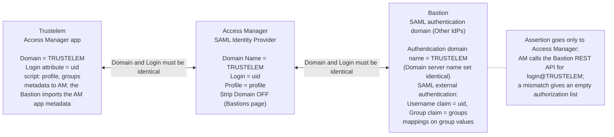

# SAML assertion and naming consistency

Date: 2026-09-23. The Trustelem to Access Manager to Bastion federation works only when three
names line up and the assertion carries the expected attributes. This reference shows the
alignment and an illustrative assertion. The assertion XML is a schematic built from the
attribute names documented on the vendor pages
([Access Manager app](https://trustelem-doc.wallix.com/books/trustelem-applications/page/wallix-access-manager),
[Bastion SAML](https://trustelem-doc.wallix.com/books/trustelem-applications/page/wallix-bastion-saml),
[generic SAML 2](https://trustelem-doc.wallix.com/books/trustelem-applications/page/saml-2)) and the
OASIS SAML 2.0 core schema; it is not a capture from a live tenant.

## 1. Names that must match



| Value | Trustelem | Access Manager | Bastion |
|-------|-----------|----------------|---------|
| Federated domain | Access Manager app > Domain | SAML Identity Provider > Domain tab > Domain Name | Authentication domain > Authentication domain name (Domain server name set identical; it has "no impact on the setup") |
| Login attribute | sends `uid` (AD users) or `email` (local users) | Domain tab > Login = `uid` or `email` | SAML external authentication > claim Username = same attribute |
| Groups | script `msg.addAttr("groups", g)` on the Access Manager app (and on a Bastion SAML app only in the standalone design; behind Access Manager the Bastion imports the Access Manager app metadata and no Bastion app is created) | not consumed (profiles come from `profile`) | claim Group = `groups`; mappings match the values |
| Profile | script `msg.setAttr("profile", ...)` | Domain tab > Profile Attribute = `profile`, matched by name to AM profiles | not consumed |
| SP identity | EntityID `WALLIX-AM` (AM template); for the Bastion generic app, the Bastion SP entity ID and ACS | WALLIX-AM Entity ID = `WALLIX-AM` | SP entity ID and ACS shown after Apply |
| Signing | application certificate | Signed Response and Signed Assertion ON; Encrypt OFF | IdP metadata imported |
| Logout | `/app/<ID>/on_logout` | Redirect Logout Uri = SSO URI with `sso` replaced by `on_logout` | `sp_single_logout_service` in SP metadata |
| Strip Domain | | Bastions page > Strip Domain OFF | keeps `login@DOMAIN` |

Which Bastion domain the Access Manager domain name must match is stated differently on two
vendor pages: the Access Manager app page names the Active Directory authentication domain, the
Bastion SAML page names the SAML authentication domain. This design follows the Bastion SAML
page and binds `TRUSTELEM` to a separate SAML *Other IdPs* domain, so that SAML users and their
group mappings live in one object; gap B7 in the
[register](open-questions-and-gaps.md) records the question for WALLIX.

## 2. Illustrative assertion sent by Trustelem to Access Manager

```xml
<saml2p:Response xmlns:saml2p="urn:oasis:names:tc:SAML:2.0:protocol"
    Destination="https://pam.acme.example/wabam/acme/saml/acs"
    InResponseTo="_request-id" IssueInstant="2026-09-23T09:15:02Z">
  <saml2:Issuer xmlns:saml2="urn:oasis:names:tc:SAML:2.0:assertion">
    https://acme.trustelem.com/app/123456
  </saml2:Issuer>
  <ds:Signature xmlns:ds="http://www.w3.org/2000/09/xmldsig#">...Response signature...</ds:Signature>
  <saml2p:Status><saml2p:StatusCode Value="urn:oasis:names:tc:SAML:2.0:status:Success"/></saml2p:Status>
  <saml2:Assertion xmlns:saml2="urn:oasis:names:tc:SAML:2.0:assertion" ID="_assertion-id"
      IssueInstant="2026-09-23T09:15:02Z" Version="2.0">
    <saml2:Issuer>https://acme.trustelem.com/app/123456</saml2:Issuer>
    <ds:Signature xmlns:ds="http://www.w3.org/2000/09/xmldsig#">...Assertion signature (acme-saml-2026)...</ds:Signature>
    <saml2:Subject>
      <saml2:NameID Format="urn:oasis:names:tc:SAML:1.1:nameid-format:emailAddress">jdoe@acme.example</saml2:NameID>
      <saml2:SubjectConfirmation Method="urn:oasis:names:tc:SAML:2.0:cm:bearer">
        <saml2:SubjectConfirmationData NotOnOrAfter="2026-09-23T09:20:02Z"
            Recipient="https://pam.acme.example/wabam/acme/saml/acs" InResponseTo="_request-id"/>
      </saml2:SubjectConfirmation>
    </saml2:Subject>
    <saml2:Conditions NotBefore="2026-09-23T09:14:32Z" NotOnOrAfter="2026-09-23T09:20:02Z">
      <saml2:AudienceRestriction><saml2:Audience>WALLIX-AM</saml2:Audience></saml2:AudienceRestriction>
    </saml2:Conditions>
    <saml2:AuthnStatement AuthnInstant="2026-09-23T09:15:01Z" SessionIndex="_session-id">
      <saml2:AuthnContext>
        <saml2:AuthnContextClassRef>urn:oasis:names:tc:SAML:2.0:ac:classes:PasswordProtectedTransport</saml2:AuthnContextClassRef>
      </saml2:AuthnContext>
    </saml2:AuthnStatement>
    <saml2:AttributeStatement>
      <saml2:Attribute Name="uid"><saml2:AttributeValue>jdoe</saml2:AttributeValue></saml2:Attribute>
      <saml2:Attribute Name="displayname"><saml2:AttributeValue>Jane Doe</saml2:AttributeValue></saml2:Attribute>
      <saml2:Attribute Name="email"><saml2:AttributeValue>jdoe@acme.example</saml2:AttributeValue></saml2:Attribute>
      <saml2:Attribute Name="lang"><saml2:AttributeValue>en</saml2:AttributeValue></saml2:Attribute>
      <saml2:Attribute Name="profile"><saml2:AttributeValue>User</saml2:AttributeValue></saml2:Attribute>
      <saml2:Attribute Name="groups">
        <saml2:AttributeValue>PAM-Operators</saml2:AttributeValue>
        <saml2:AttributeValue>PAM-Auditors</saml2:AttributeValue>
      </saml2:Attribute>
    </saml2:AttributeStatement>
  </saml2:Assertion>
</saml2p:Response>
```

Points to verify in a SAML tracer capture:

- Both signatures present and made with the current Trustelem application certificate.
- `NotBefore` and `NotOnOrAfter` bracket the Access Manager clock; the window shown here is
  illustrative, Trustelem does not publish its validity period.
- Attribute names exactly `uid` (or `email`), `displayname`, `email`, `lang`, `profile`,
  `groups`; multiple `groups` values are separate `AttributeValue` elements, one per group,
  which is what the Bastion expects for its one-value-per-mapping rule.
- `Audience` equals the Access Manager Entity ID.
- The NameID format is e-mail when the Bastion consumes the assertion directly; the Bastion
  guide requires the e-mail domain to equal the authentication domain name unless the
  Default domain option strips it.

## 3. Access Manager to Bastion: no second assertion

The Bastion never receives the assertion. Access Manager calls the Bastion REST API with its
API key for the user `jdoe@TRUSTELEM`; the Bastion finds the user in the `TRUSTELEM` SAML
domain (declared in external authentication mode) and applies the group mappings. That is why
the domain name and the login attribute must match on all three sides and why Strip Domain
must be off ([AM Admin Guide 10.3.2](https://pam.wallix.one/documentation/admin-doc/am-admin-guide_en.pdf)).
A mismatch does not fail the login: the portal opens with an empty authorization list (test
A-10 in the [test plan](../trustelem/10-test-plan.md)).
