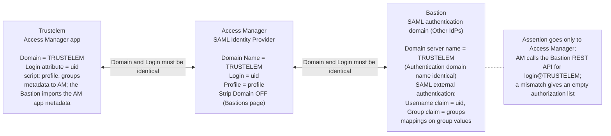

# SAML assertion and naming consistency

> - **Purpose:** the names that must be identical in Trustelem, Access Manager and the Bastion,
>   and the assertion attributes that carry them, so that a federated login lands on the right
>   authorizations.
> - **Audience:** Trustelem administrators, Access Manager and Bastion administrators, and anyone
>   troubleshooting an empty authorization list after a SAML login.
> - **Verified:** 2026-09-24; Bastion naming rules checked in the Bastion 12.3.2 Administration
>   Guide and unchanged in the Bastion 12.4.3 customer guides (Functional Administration,
>   Deployment, System Operations); Access Manager rules in the Access Manager 6.0.5
>   Administration Guide.
> - **Sources:** [Trustelem Access Manager app](https://trustelem-doc.wallix.com/books/trustelem-applications/page/wallix-access-manager),
>   [Trustelem Bastion SAML](https://trustelem-doc.wallix.com/books/trustelem-applications/page/wallix-bastion-saml),
>   [Trustelem generic SAML 2](https://trustelem-doc.wallix.com/books/trustelem-applications/page/saml-2),
>   [Bastion 12.3.2 Administration Guide](https://pam.wallix.one/documentation/admin-doc/bastion_en_administration_guide.pdf) 7.3.1,
>   [AM Admin Guide 10.3.2](https://pam.wallix.one/documentation/admin-doc/am-admin-guide_en.pdf),
>   [Access Manager 6.0.5 Administration Guide](https://doc.wallix.com/) 4.3.3,
>   OASIS SAML 2.0 core schema.

The Trustelem to Access Manager to Bastion federation works only when three names line up and
the assertion carries the expected attributes. The Bastion 12.4.3 customer guides are behind the
[doc.wallix.com](https://doc.wallix.com/) login. The Bastion guides list Trustelem, as WALLIX
IDaaS, among the supported SAML identity providers
([architecture overview, section 2](../architecture/01-overview.md#2-product-naming-and-versions)).

## 1. Names that must match

The federated domain, the login attribute and the group values must be identical on all three
sides. In this design the domain is `TRUSTELEM`, the login attribute is `uid` and the groups
travel in the `groups` attribute.



| Value | Trustelem | Access Manager | Bastion |
|-------|-----------|----------------|---------|
| Federated domain | **Access Manager app > Domain** | **SAML Identity Provider > Domain tab > Domain Name** | **Authentication domain > Domain server name** (AM 10.3.2 and Bastion 7.3.1); Authentication domain name set identical, as WALLIX recommends and as the Trustelem page expects |
| Login attribute | sends `uid` (AD users) or `email` (local users) | **Domain tab > Login** = `uid` or `email` | **SAML external authentication** > claim **Username** = same attribute |
| Groups | script `msg.addAttr("groups", g)` on the Access Manager app (and on a Bastion SAML app only in the standalone design; behind Access Manager the Bastion imports the Access Manager app metadata, and no Bastion app is created: *inference* from the flow, as in [chapter 04](../trustelem/04-bastion-integration.md#behind-access-manager)) | not consumed (profiles come from `profile`) | claim **Group** = `groups`; mappings match the values |
| Profile | script `msg.setAttr("profile", ...)` | **Domain tab > Profile Attribute** = `profile`, matched by name to AM profiles | not consumed |
| SP identity | EntityID `WALLIX-AM` (AM template); for the Bastion generic app, the Bastion SP entity ID and ACS | WALLIX-AM Entity ID = `WALLIX-AM` | SP entity ID and ACS shown after Apply |
| Signing | application certificate | Signed Response and Signed Assertion ON; Encrypt OFF | IdP metadata imported |
| Logout | `/app/<ID>/on_logout` | **Redirect Logout Uri** = SSO URI with `sso` replaced by `on_logout` | `sp_single_logout_service` in SP metadata |
| Strip Domain | | **Bastions** page > **Strip Domain** OFF | keeps `login@DOMAIN` |

### 1.1 Which Bastion field carries the domain name

Both product guides name the same field, and this design sets it and its neighbour to the same
value:

- Access Manager: "If SAML authentication is also configured in WALLIX Bastion, the domain name
  must match the name Domain server name used in WALLIX Bastion (in Configuration >
  Authentication domains > SAML)."
  ([Access Manager 6.0.5 Administration Guide](https://doc.wallix.com/) 4.3.3.1; the same rule for
  OIDC and LDAP domains in 4.3.4.1 and 4.3.5.1). The 5.2 guide names the same field
  ([AM Admin Guide 10.3.2](https://pam.wallix.one/documentation/admin-doc/am-admin-guide_en.pdf)).
- Bastion: the guide (7.3.1) names the *Domain server name* of the SAML authentication domain
  and recommends the same value for the Authentication domain name.
- Trustelem: the Bastion SAML page names the Authentication domain name and the login in two
  rules, "AM Domain Name = Bastion Authentication domain name" and "AM Login = Bastion Username"
  ([Trustelem Bastion SAML](https://trustelem-doc.wallix.com/books/trustelem-applications/page/wallix-bastion-saml)).
  The Access Manager app page names "the Authentication domain name of your Active Directory
  Authentication domain".

This design uses a separate SAML *Other IdPs* domain with both fields set to `TRUSTELEM`. That
satisfies every wording at once. Gap B7 in the [register](open-questions-and-gaps.md), which
asked whether the Active Directory reading applies, is closed on that basis.

### 1.2 Strip Domain

Strip Domain stays OFF on the Access Manager **Bastions** page. Access Manager must "disable the
Strip Domain option in the Bastion configuration window. This keeps the login format as
user@domain, which is required for proper user mapping and authorization."
([Access Manager 6.0.5 Administration Guide](https://doc.wallix.com/) 4.3.3.2).

## 2. Illustrative assertion sent by Trustelem to Access Manager

The XML below is a schematic, not a capture from a live tenant. It is built from the attribute
names documented on the Trustelem application pages listed in the header and from the OASIS
SAML 2.0 core schema.

```xml
<saml2p:Response xmlns:saml2p="urn:oasis:names:tc:SAML:2.0:protocol"
    Destination="https://pam.acme.example/wabam/acme/saml/acs"
    InResponseTo="_request-id" IssueInstant="2026-09-23T09:15:02Z">
  <saml2:Issuer xmlns:saml2="urn:oasis:names:tc:SAML:2.0:assertion">
    https://acme.trustelem.com/app/123456
  </saml2:Issuer>
  <ds:Signature xmlns:ds="http://www.w3.org/2000/09/xmldsig#">...Response signature...</ds:Signature>
  <saml2p:Status><saml2p:StatusCode Value="urn:oasis:names:tc:SAML:2.0:status:Success"/></saml2p:Status>
  <saml2:Assertion xmlns:saml2="urn:oasis:names:tc:SAML:2.0:assertion" ID="_assertion-id"
      IssueInstant="2026-09-23T09:15:02Z" Version="2.0">
    <saml2:Issuer>https://acme.trustelem.com/app/123456</saml2:Issuer>
    <ds:Signature xmlns:ds="http://www.w3.org/2000/09/xmldsig#">...Assertion signature (acme-saml-2026)...</ds:Signature>
    <saml2:Subject>
      <saml2:NameID Format="urn:oasis:names:tc:SAML:1.1:nameid-format:emailAddress">jdoe@acme.example</saml2:NameID>
      <saml2:SubjectConfirmation Method="urn:oasis:names:tc:SAML:2.0:cm:bearer">
        <saml2:SubjectConfirmationData NotOnOrAfter="2026-09-23T09:20:02Z"
            Recipient="https://pam.acme.example/wabam/acme/saml/acs" InResponseTo="_request-id"/>
      </saml2:SubjectConfirmation>
    </saml2:Subject>
    <saml2:Conditions NotBefore="2026-09-23T09:14:32Z" NotOnOrAfter="2026-09-23T09:20:02Z">
      <saml2:AudienceRestriction><saml2:Audience>WALLIX-AM</saml2:Audience></saml2:AudienceRestriction>
    </saml2:Conditions>
    <saml2:AuthnStatement AuthnInstant="2026-09-23T09:15:01Z" SessionIndex="_session-id">
      <saml2:AuthnContext>
        <saml2:AuthnContextClassRef>urn:oasis:names:tc:SAML:2.0:ac:classes:PasswordProtectedTransport</saml2:AuthnContextClassRef>
      </saml2:AuthnContext>
    </saml2:AuthnStatement>
    <saml2:AttributeStatement>
      <saml2:Attribute Name="uid"><saml2:AttributeValue>jdoe</saml2:AttributeValue></saml2:Attribute>
      <saml2:Attribute Name="displayname"><saml2:AttributeValue>Jane Doe</saml2:AttributeValue></saml2:Attribute>
      <saml2:Attribute Name="email"><saml2:AttributeValue>jdoe@acme.example</saml2:AttributeValue></saml2:Attribute>
      <saml2:Attribute Name="lang"><saml2:AttributeValue>en</saml2:AttributeValue></saml2:Attribute>
      <saml2:Attribute Name="profile"><saml2:AttributeValue>User</saml2:AttributeValue></saml2:Attribute>
      <saml2:Attribute Name="groups">
        <saml2:AttributeValue>PAM-Operators</saml2:AttributeValue>
        <saml2:AttributeValue>PAM-Auditors</saml2:AttributeValue>
      </saml2:Attribute>
    </saml2:AttributeStatement>
  </saml2:Assertion>
</saml2p:Response>
```

Points to verify in a SAML tracer capture:

- Both signatures are present and made with the current Trustelem application certificate.
- `NotBefore` and `NotOnOrAfter` bracket the Access Manager clock. The window shown here is
  illustrative: Trustelem does not publish its validity period.
- Attribute names are exactly `uid` (or `email`), `displayname`, `email`, `lang`, `profile` and
  `groups`. Multiple `groups` values are separate `AttributeValue` elements, one per group. That
  is what the Bastion expects for its one-value-per-mapping rule.
- `Audience` equals the Access Manager Entity ID.
- The NameID format is e-mail when the Bastion consumes the assertion directly. The Bastion
  guide says: "in the Name ID format field, select email address. The domain of the e-mail
  address must be the same as the authentication domain name" (Admin Guide 7.3.1.1.2, 12.3.2
  and 12.4.3). Its Default domain option only "strips the domain part (that is @domain) from
  the user login"; the guide does not say that it relaxes the NameID rule. *Inference:* with
  Default domain on, a mismatched e-mail domain may still work; test it rather than rely on it.

## 3. Access Manager to Bastion: no second assertion

The Bastion never receives the assertion. Access Manager calls the Bastion REST API with its
API key for the user `jdoe@TRUSTELEM`. The Bastion finds the user in the `TRUSTELEM` SAML domain
(declared in external authentication mode) and applies the group mappings. That is why the
domain name and the login attribute must match on all three sides, and why Strip Domain must be
off ([AM Admin Guide 10.3.2](https://pam.wallix.one/documentation/admin-doc/am-admin-guide_en.pdf)).
A mismatch does not fail the login: the portal opens with an empty authorization list (test
A-10 in the [test plan](../trustelem/10-test-plan.md)).
