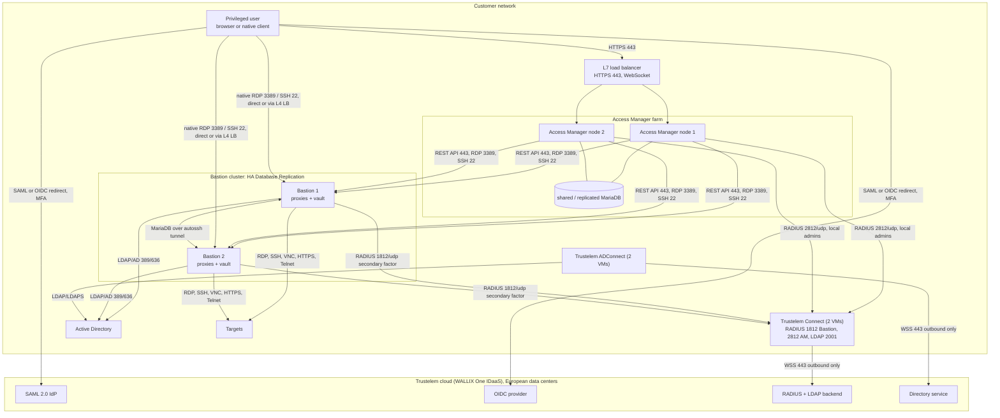

# Vendor meeting script: questions for WALLIX

Date: 2026-09-24. Design under discussion: WALLIX Trustelem (WALLIX One IDaaS) as MFA/SSO for a
WALLIX Bastion cluster (verified against 12.3.2) and a WALLIX Access Manager cluster (verified
against 5.2.4.0). Each block gives the facts already established from the public documentation,
so the meeting time goes on what the documentation does not answer. Gap IDs (T, B, A, S, C) refer to the
[open questions and gaps register](open-questions-and-gaps.md). Write the answers in the last
column and copy them into the register after the meeting.

## How to run the meeting

1. The platform brief below is the one-page background; blocks 1 to 4 are the decision blocks (deployment model, licensing, effort, support). Do them
   first; they decide whether the rest matters.
2. Blocks 5 to 8 are technical; hand a copy to the pre-sales engineer if the account manager
   cannot answer.
3. Ask for a written follow-up for anything answered "yes, that works" without a document
   reference. Verbal answers do not close a gap in the register.

## Platform brief: what is being bought and how it fits together

Bring this to the meeting so the vendor's answers can be checked against the design on the spot.
Verified facts carry a source; the timeline is the repo's own estimate and is labelled as such.

### Components and how they integrate

Source: [architecture report section 4](../trustelem-bastion-access-manager-architecture.md).

| Component | Role in the design | Talks to | Source |
|-----------|--------------------|----------|--------|
| Trustelem (WALLIX One IDaaS) | SaaS identity provider: SAML 2.0 / OIDC for the web path, RADIUS and LDAP through Trustelem Connect for native clients; MFA by push, TOTP, passkey | browsers, the two agents | [Trustelem summary](https://trustelem-doc.wallix.com/books/trustelem-administration/page/summary) |
| ADConnect (two VMs) | syncs AD users and groups into the tenant and validates AD passwords; outbound 443 only | domain controllers, Trustelem | [ADConnect](https://trustelem-doc.wallix.com/books/trustelem-administration/page/active-directory-users-trustelem-adconnect) |
| Trustelem Connect (two VMs) | on-premise RADIUS listeners (1812 for the Bastion app, 2812 for the Access Manager app) and LDAP 2001 listener; SIEM push; SCIM; outbound 443 only | Bastion, Access Manager, Trustelem | [Trustelem Connect](https://trustelem-doc.wallix.com/books/trustelem-administration/page/ldap-radius-trustelem-connect) |
| Bastion cluster (two appliances) | session proxies (RDP, SSH, VNC, HTTPS, Telnet), vault, recordings; HA Database Replication over an autossh SSH tunnel (port not stated in the guide, 2242 assumed); no VIP or heartbeat documented; Master/Master fails over by front-end rerouting, Master/Slaves by `--elevate-master` | AD, Trustelem Connect (RADIUS secondary factor), targets | [Bastion Deployment Guide ch. 5](https://marketplace-wallix.s3.amazonaws.com/bastion_12.0.2_en_deployment_guide.pdf) |
| Access Manager farm (two appliances) | HTML5 web portal in front of one or more Bastions; SAML SP toward Trustelem; RADIUS factor chain for local admins; shared or replicated MariaDB; needs a WebSocket-capable L7 load balancer | users, Bastion REST API 443 and proxies, Trustelem | [AM Install Guide 2.4](https://marketplace-wallix.s3.amazonaws.com/am-install_en.pdf) |

Integration order, from the [setup runbook](../trustelem-bastion-access-manager-architecture.md)
section 7: "directory first, then agents, then Bastion cluster, then Access Manager farm, then
federation, then MFA enforcement. Test after each block."

1. Trustelem tenant: AD directory with connector, install ADConnect on two hosts, sync a pilot
   group. [Chapters 01 and 02](../trustelem/01-tenant-setup.md).
2. Trustelem Connect on two hosts with one RADIUS listener per application (Bastion, Access
   Manager). [Chapter 03](../trustelem/03-trustelem-connect.md).
3. Bastion cluster: two nodes at the same version, encryption, licences, HA Database Replication,
   then the AD authentication domain with RADIUS as *secondary authentication*.
   [Chapter 04](../trustelem/04-bastion-integration.md), [HA runbook](../runbooks/bastion-ha-replication.md).
4. Access Manager farm: two nodes, database replication, load balancer, Bastion cluster object,
   then the SAML domain pointed at the Trustelem app template and the RADIUS factor for local
   admins. [Chapter 05](../trustelem/05-access-manager-integration.md), [farm runbook](../runbooks/access-manager-farm.md).
5. MFA enforcement by Trustelem access rules per group, enrollment campaign, rescue codes.
   [Chapter 06](../trustelem/06-mfa-and-access-rules.md).
6. Acceptance tests and SIEM. [Test plan](../trustelem/10-test-plan.md), [logging reference](logging-and-siem.md).

### Hardware and platform requirements

| Item | Requirement | Source |
|------|-------------|--------|
| Bastion, per node, minimum | 4 GB RAM, 50 GB disk, IPv4; vSphere: one socket, CPU and memory reservation, because "The number of concurrent sessions can only be guaranteed if the appropriate numbers of CPU Mhz and the appropriate memory size are reserved" | [Quick Start 3.3](https://marketplace-wallix.s3.amazonaws.com/Bastion-quickstart-en.pdf), [Deployment Guide 3.2.2](https://marketplace-wallix.s3.amazonaws.com/bastion_12.0.2_en_deployment_guide.pdf) |
| Bastion, per node, by load | 25 RDP / 110 SSH sessions: 4 vCPU, 8 GB. 40 / 240: 8 vCPU, 16 GB. 50 / 480: 8 vCPU, 32 GB. 75 / 480: 16 vCPU, 32 GB | [Quick Start 3.3](https://marketplace-wallix.s3.amazonaws.com/Bastion-quickstart-en.pdf) |
| Bastion recordings | extend the disk or use remote storage (NFS/CIFS); recordings and audit data are local to each node and are not replicated | [Deployment Guide ch. 5](https://marketplace-wallix.s3.amazonaws.com/bastion_12.0.2_en_deployment_guide.pdf) |
| Access Manager, per node | 2 vCPU, 4 GB RAM, 50 GB disk (40 GB in the 4.0.6.1 install guide), one required interface (administration tied to the first interface since 5.2) plus an HA interface (three in the install guide); legacy table 6 vCPU / 4 GB for 1000 registered users and 100 concurrent sessions; raise the Java heap above the 2373 MB default for more than a few hundred users | [AM Install Guide 2.1.3 and 3.2](https://marketplace-wallix.s3.amazonaws.com/am-install_en.pdf) |
| Load balancer for Access Manager | L7, WebSocket support, source-IP affinity (Citrix ADC cookie persistence is incompatible with Universal Tunneling) | [AM release notes](https://pam.wallix.one/documentation/release-notes/am-rn-en.html) |
| ADConnect and Trustelem Connect | four small VMs, Windows Server or Linux, outbound TCP 443 to the Trustelem relay FQDNs and IPs, no TLS inspection, HTTP CONNECT proxy allowed | [Connectors network flows](https://trustelem-doc.wallix.com/books/trustelem-administration/page/connectors-network-flows) |
| Versions to order | Bastion 12.3.7 or 12.4.1 and later, Access Manager 5.2.7 or 6.0.4 and later (security advisories) | [WALLIX advisories](https://www.wallix.com/support-services/alerts/) |
| Not published | Bastion 12.x sizing article (support login), Access Manager replication port, Access Manager health-check URL | gaps B1, A2, A3 |

Full port matrix: [architecture report section 6.3](../trustelem-bastion-access-manager-architecture.md).

### Indicative timeline

*Inference.* WALLIX publishes no deployment durations; the figures below are the repo's estimate
for a two-site, two-node-per-product design with one AD forest, to be confirmed in block 3.
The two-week pilot exit criterion is also the repo's own (report section 7.6).

| Phase | Content | Estimate | Depends on |
|-------|---------|----------|------------|
| 0. Prerequisites | VMs, licences, AD service account, firewall rules, certificates, load balancer | 1 to 2 weeks, mostly waiting on other teams | procurement, network |
| 1. Tenant and agents | tenant, ADConnect, Trustelem Connect, pilot group synced | 2 to 3 days | phase 0 |
| 2. Bastion cluster | install, replication, AD domain, RADIUS secondary factor, first targets | 3 to 5 days | phase 0 |
| 3. Access Manager farm | install, replication, load balancer, Bastion link, SAML, RADIUS factor | 3 to 5 days | phase 2 |
| 4. Pilot | one administrator group on MFA, acceptance tests, SIEM dashboards | 2 weeks (repo exit criterion, report 7.6) | phases 1 to 3 |
| 5. Native clients and everyone | RADIUS on all groups, web path *2 factors*, enrollment campaign | 2 to 4 weeks, driven by enrollment | phase 4 |
| 6. Hardening and handover | default accounts, passkey policy, runbooks, help-desk training | 1 week | phase 5 |

Total elapsed time in the order of 8 to 12 weeks, of which about 15 working days are hands-on
engineering. Rollout phases and rollback steps: [architecture report section 7.6](../trustelem-bastion-access-manager-architecture.md).

## 1. Deployment model: cloud only, or on-premise with TOTP

What is already known:

- Trustelem is a SaaS service "Hosted in European Data Centers" ([product page](https://www.wallix.com/products/idaas/)); there is no on-premise edition of the
  identity provider in the public documentation. The only on-premise components are the agents
  ADConnect (directory sync) and Trustelem Connect (LDAP/RADIUS listener, SIEM push, SCIM).
  Sources: [connectors network flows](https://trustelem-doc.wallix.com/books/trustelem-administration/page/connectors-network-flows),
  [architecture report section 2](../trustelem-bastion-access-manager-architecture.md).
- Bastion has no built-in TOTP. Its model is a primary authentication plus one *secondary
  authentication* (RADIUS, TACACS+, PingID, Kerberos-Password); WALLIX states "it is not
  possible to directly configure a multifactor authentication (MFA)" and recommends putting
  richer MFA in the IdP. Source: [Bastion Admin Guide 7.1.3](https://pam.wallix.one/documentation/admin-doc/bastion_en_administration_guide.pdf).
- Access Manager also has no built-in TOTP; MFA is delegated to RADIUS authenticators or to the
  IdP. Source: [AM Admin Guide chapters 10 and 11](https://pam.wallix.one/documentation/admin-doc/am-admin-guide_en.pdf).
- Over RADIUS and LDAP the only factors are push and TOTP; passkeys need the web path.
  Source: [MFA methods](https://trustelem-doc.wallix.com/books/trustelem-administration/page/multi-factors-authentication).

| # | Question | Why it matters | Answer |
|---|----------|----------------|--------|
| 1.1 | Is there any on-premise or private-cloud edition of Trustelem / WALLIX One IDaaS, or is SaaS the only form? (C3) | Decides whether "fully on-premise" is even an option with WALLIX | |
| 1.2 | If we must stay fully on-premise, what is WALLIX's supported way to get TOTP on Bastion and Access Manager? Do they endorse a third-party RADIUS TOTP server, and which ones have they tested? (C3) | Bastion and Access Manager both delegate MFA to RADIUS; a supported server list avoids an unsupported design | |
| 1.3 | With a third-party RADIUS TOTP server, does WALLIX support still cover the Bastion RADIUS integration, or only the Trustelem path? (C3) | Support boundary | |
| 1.4 | If Trustelem's SaaS is unreachable (Internet outage), what is the recommended break-glass: local Bastion accounts, RADIUS failover to a second server, or an MFA session? (T12) | Outage handling, chapter 07 | |
| 1.5 | Where exactly is the tenant hosted (provider, country), and what are the SecNumCloud, HDS and ISO 27001 scope statements? (gap T9) | Compliance and data-residency review | |
| 1.6 | Can the tenant data (users, factors, rules, logs) be exported or backed up by the customer, and how is a tenant deleted at contract end? (gap T1) | Exit strategy | |

## 2. Licensing and pricing

What is already known:

- The Trustelem licence limited to Bastion and Access Manager is called WALLIX Authenticator and
  "can be extended for the authentication of other apps: with only a license change".
  Source: [Trustelem summary](https://trustelem-doc.wallix.com/books/trustelem-administration/page/summary).
- SMS as a factor is at extra cost. Source: [MFA methods](https://trustelem-doc.wallix.com/books/trustelem-administration/page/multi-factors-authentication).
- Bastion needs one licence file per replicated node; Access Manager installs with a 31-day
  evaluation licence. Sources: [Bastion HA runbook](../runbooks/bastion-ha-replication.md),
  [Access Manager farm runbook](../runbooks/access-manager-farm.md).

| # | Question | Why it matters | Answer |
|---|----------|----------------|--------|
| 2.1 | What is the licensing unit for WALLIX Authenticator: named user, enrolled device, or concurrent session? Are service accounts and break-glass accounts counted? (C1) | Budget | |
| 2.2 | What changes in price and in features when moving from WALLIX Authenticator to full WALLIX One IDaaS (other apps, SCIM, IWA)? (C1) | Future scope | |
| 2.3 | Bastion: is the licence per node, per cluster, or per named/concurrent user, and does a passive replica need a full licence? (C1) | HA cost | |
| 2.4 | Access Manager: is the licence by concurrent users, and how does a farm of N nodes count? (C1) | HA cost | |
| 2.5 | Are ADConnect, Trustelem Connect, the on-premise SIEM push and the API included, or separately priced? (C1) | Hidden costs | |
| 2.6 | SMS and e-mail OTP: per-message cost and whether they can be disabled contractually. (C1) | Avoid surprise billing | |
| 2.7 | Contract term, renewal terms, and what happens to authentication if the licence lapses (grace period, read-only, hard stop). (C1) | Operational risk | |
| 2.8 | Evaluation or pilot tenant: duration, user cap, and can it be converted to production without re-enrolling users? (C1) | Pilot plan | |

## 3. Effort and timeline

What is already known:

- The repo's rollout plan has five phases: build, pilot (one AD group, two weeks without
  incidents), native clients, everyone on the web path, hardening.
  Source: [architecture report section 7.6](../trustelem-bastion-access-manager-architecture.md).
- ADConnect needs a Windows Server (domain-joined only if IWA is wanted) or a Linux host; Trustelem Connect needs an outbound
  443 websocket to the relay and no TLS inspection. Sources: [chapter 02](../trustelem/02-directory-sync-adconnect.md),
  [chapter 03](../trustelem/03-trustelem-connect.md).

| # | Question | Why it matters | Answer |
|---|----------|----------------|--------|
| 3.1 | Typical elapsed time from order to a working tenant with ADConnect and Trustelem Connect for a customer of our size? (C2) | Planning | |
| 3.2 | Person-days WALLIX estimates for the Bastion RADIUS integration, the Access Manager SAML integration, and the Access Manager to Bastion link? (C2) | Staffing | |
| 3.3 | Which of these tasks does WALLIX Professional Services do, which does the partner do, and which are left to us? (C2) | Scope of the offer | |
| 3.4 | Is there a reference project plan or a deployment checklist we can receive now? (C2) | Reuse | |
| 3.5 | What are the prerequisites WALLIX needs from us before day one (AD service account rights, network flows, certificates, test users)? (C2) | Avoid a stalled kick-off | |
| 3.6 | Lead time for the WALLIX Authenticator app rollout: MDM packaging, enrollment campaign tooling, and how long a campaign normally runs. (C2) | User migration | |

## 4. Support, SLA and roadmap

What is already known:

- No public status page; the [unavailability](https://trustelem-doc.wallix.com/books/trustelem-news/page/unavailability)
  and [incidents](https://trustelem-doc.wallix.com/books/trustelem-news/page/incidents) pages are
  the only published record. Contractual SLA is not published (gap T1).
- Bastion 12.4 and Access Manager 6.0 release notes are behind the customer login (gaps B1, A1).

| # | Question | Why it matters | Answer |
|---|----------|----------------|--------|
| 4.1 | Contractual availability SLA for the tenant, planned maintenance windows and how customers are notified of incidents. (T1) | Risk acceptance | |
| 4.2 | Support hours, response times per severity, and whether Trustelem, Bastion and Access Manager are one support contract or three. (C4) | Operations | |
| 4.3 | Can we get customer-portal access now to read the Bastion 12.4 and Access Manager 6.0 release notes and the System Operations Guide? (B1, B2, A1, A6) | Closes several gaps | |
| 4.4 | End-of-support dates for Bastion 12.3 and Access Manager 5.2, and the upgrade path to 12.4 / 6.0 (Debian 12). (B1, A1) | Lifecycle | |
| 4.5 | Roadmap: RadSec, number matching or push rate limiting in WALLIX Authenticator, browser "remember this device", PKCE and exact redirect URI matching on the OIDC clients. (T4, T7, T8, A5) | Design assumptions | |
| 4.6 | Certification coverage: is Bastion 12.3 or 12.4 covered by the BSI certificate held by 12.0.14, and what is the ANSSI qualification plan? (S3) | Compliance | |

## 5. Bastion integration

What is already known:

- RADIUS is attached as *secondary authentication* on the AD authentication domain; push or TOTP
  work for the web UI and for native RDP/SSH clients. SAML and OIDC are complete only in the web
  UI. Configuring SAML on the Bastion for Access Manager makes direct SAML login to the Bastion
  impossible. Sources: [chapter 04](../trustelem/04-bastion-integration.md),
  [Bastion Admin Guide 7.1.1 and 7.3.1](https://pam.wallix.one/documentation/admin-doc/bastion_en_administration_guide.pdf).

| # | Question | Why it matters | Answer |
|---|----------|----------------|--------|
| 5.1 | Does Trustelem Connect answer CHAP or only PAP, which attributes come back in Access-Accept, and is Message-Authenticator enforced (BlastRADIUS, CVE-2024-3596)? (T4) | RADIUS security | |
| 5.2 | What happens to a pending push when the Bastion RADIUS timeout expires first? Recommended timeout values on both sides. (T4) | User experience on native clients | |
| 5.3 | RADIUS MFA session: where is the duration set, allowed values, and is it per source IP or per user? (T2) | Rule design | |
| 5.4 | Automation and service accounts: confirmed pattern is a separate AD domain object without secondary authentication. Any better option? (design confirmation, chapter 04) | Scripted transfers | |
| 5.5 | Sizing of Trustelem Connect and ADConnect for our RADIUS request rate; is a second Connect instance active-active? (T13) | HA of the agents | |
| 5.6 | Latency limit for cross-site Master/Slaves replication and the supported DR failover procedure. (B3, B2) | DR design | |
| 5.7 | SCIM from Trustelem into the Bastion: supported, payload, deprovisioning semantics, cluster behaviour. (T5, B4; full list in [chapter 12 section 6](../trustelem/12-scim-provisioning.md)) | Provisioning | |
| 5.8 | OIDC instead of SAML: is there a WALLIX OIDC app template in Trustelem and guidance for a groups claim, or does WALLIX only support the SAML templates? (T11) | Keeps OIDC as a fallback | |
| 5.9 | Bastion backup key: section 4.3 of the Deployment Guide says at least 16 characters, chapters 6 and 7 exactly 16. Which is right? (B8) | Backup and DR runbook | |

## 6. Access Manager integration

What is already known:

- SAML for AD users through Trustelem, RADIUS as factor 2 for local administrators (TOTP typed in
  the second "Password" prompt, PAP only). Source: [chapter 05](../trustelem/05-access-manager-integration.md).

| # | Question | Why it matters | Answer |
|---|----------|----------------|--------|
| 6.1 | Does push (not only TOTP) work in the Access Manager RADIUS factor chain? (A4) | Admin experience | |
| 6.2 | SAML clock-skew tolerance and replay protection on Access Manager and Bastion; assertion validity Trustelem issues. (A4) | Time sync requirements | |
| 6.3 | Farm: replication port, maximum node count, recommended load-balancer health-check URL, TLS versions and ciphers. (A2, A3) | HA build | |
| 6.4 | Access Manager clusters cannot display target passwords; what is WALLIX's recommended pattern for password checkout? (design confirmation, report 3.3) | Feature gap | |
| 6.5 | Is Access Manager a SCIM target? (T5) | Provisioning | |
| 6.6 | The Access Manager and Bastion guides say the Access Manager domain name must equal the Bastion "Domain server name" of the SAML domain; the Trustelem Access Manager app page says the Authentication domain name of the Active Directory domain. Is a separate SAML "Other IdPs" domain with both fields set to TRUSTELEM the supported design? (B7) | Federation naming, chapter 05 | |

## 7. MFA and user experience

| # | Question | Why it matters | Answer |
|---|----------|----------------|--------|
| 7.1 | Any device-trust or "remember this browser" beyond the internal zone and the RADIUS MFA session? (T8) | Prompt fatigue | |
| 7.2 | Hardware TOTP tokens: which are supported, and how are they seeded and assigned in bulk? (T15) | Users without smartphones | |
| 7.3 | Lost-phone flow: rescue codes, 24-hour help-desk reset, and can the help desk be delegated without full admin rights? (design confirmation, chapters 06, 07 and 11) | Help desk, chapter 11 | |
| 7.4 | Passkey policy: can we require hardware-bound keys for administrators only (policy Strict) while others use synced passkeys? (design confirmation, chapter 06) | Chapter 06 design | |
| 7.5 | Is there a customer-facing status or health API for the tenant and the agents that we can poll from our monitoring? (T1) | Monitoring | |
| 7.6 | Do SMS and e-mail OTP work as the second factor over RADIUS and LDAP, or only push and TOTP? (T16) | Fallback factors for native clients | |

## 8. Logging, API and compliance

| # | Question | Why it matters | Answer |
|---|----------|----------------|--------|
| 8.1 | Log retention: the API returns the 30 previous days; what does the console keep, and is a longer retention available contractually? (T14) | NIS2 / DORA evidence | |
| 8.2 | API rate limits and how *Always allow* and *2nd factor only* are represented in the API. (T6) | Automation | |
| 8.3 | ADConnect synchronisation frequency values and the log file locations of both agents. (T3) | Operations | |
| 8.4 | Statement of applicability for the ISO 27001 certificate and any SOC 2 or pentest summary available under NDA. (T9) | Vendor risk assessment | |
| 8.5 | Access Manager has no native syslog forwarder: which agent or method does WALLIX recommend to ship its log files to a SIEM? (A7) | SIEM coverage | |

## 9. Close of meeting

- Ask who owns each open answer and by when.
- Ask for: customer-portal login, the deployment checklist (3.4), the SLA document (4.1), the
  licence quote broken down per component (block 2).
- After the meeting, update the [gaps register](open-questions-and-gaps.md): move closed rows to the Closed section
  out, add the source WALLIX sends.
