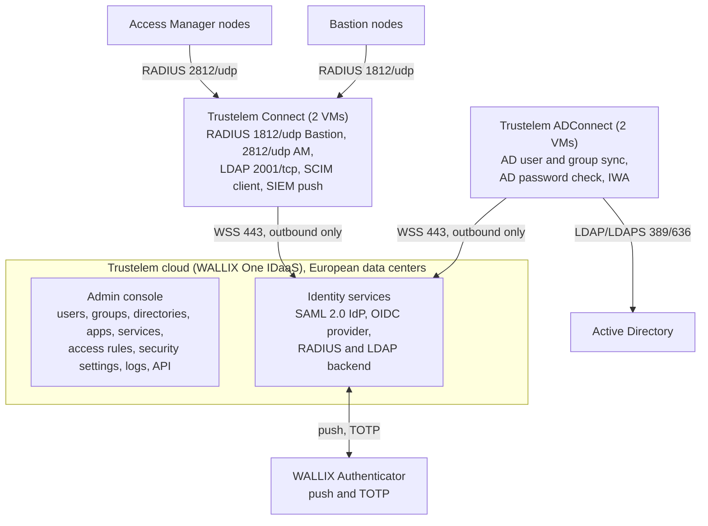
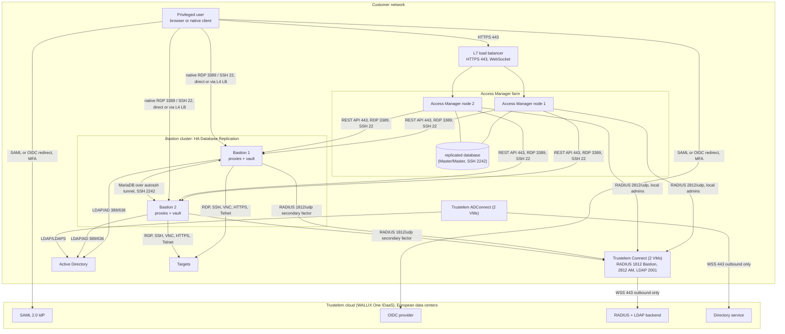
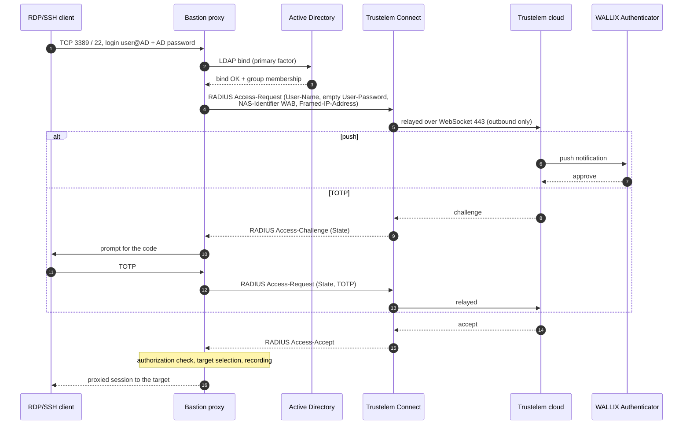
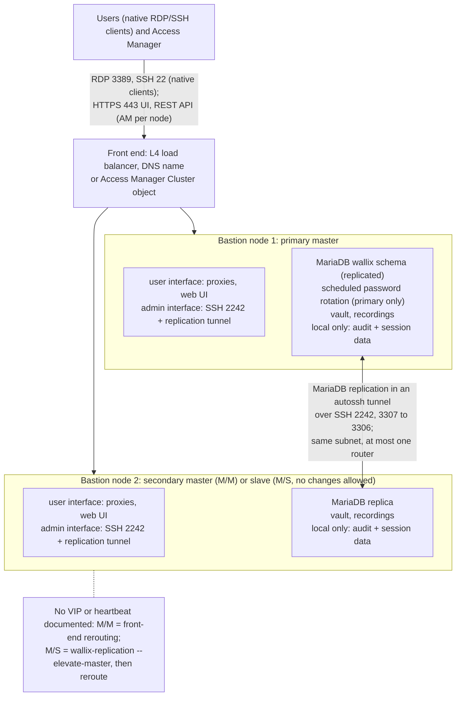
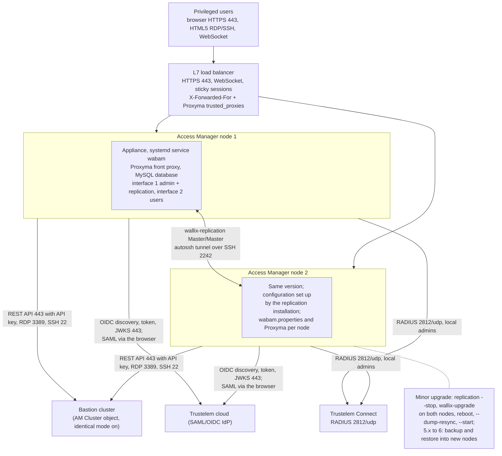
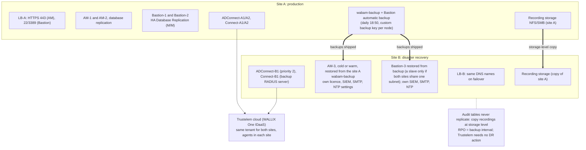

# WALLIX Trustelem MFA for a Bastion cluster and an Access Manager cluster

Architecture report for a PAM architect.
Date: 2026-09-24.
Verified against WALLIX Bastion 12.3.2 (Functional Administration Guide dated 2026-03-12),
WALLIX Access Manager 5.2.4.0 (Administration Guide dated 2026-03-12), the public release
notes of both products, and the WALLIX Trustelem documentation portal as read on the same day.
Newer builds exist (Bastion 12.4.3 as listed on the
[AWS Marketplace](https://aws.amazon.com/marketplace/pp/prodview-up3f6pn7fybfi), Access Manager
5.2.7 and 6.0.4 per the [WALLIX advisories](https://www.wallix.com/support-services/alerts/))
whose release notes sit behind the SSO-protected documentation site; where a newer build matters for security, the
report says so.
Bastion statements were re-checked on 2026-09-24 against the Bastion 12.4.3 customer guides
(Functional Administration, Deployment, System Operations and SIEM Logs guides), which sit behind
the [doc.wallix.com](https://doc.wallix.com/) login; they are cited as, for example,
"[Bastion 12.4.3 Deployment Guide](https://doc.wallix.com/) 5.1". Access Manager statements were re-checked on 2026-09-24 against the Access Manager 6.0.5
customer guides (Administration, Deployment, Users and Approvers, and Sessions Audit guides),
behind the same login and cited as, for example, "[Access Manager 6.0.5 Administration Guide](https://doc.wallix.com/) 4.3.3.1"; facts that
hold only for Access Manager 5.2 are labelled as such. The target versions for the
deployment are Bastion 12.4.3 and Access Manager 6.0.5.

Revision 2 (same day): added access-path coverage, administrator access model, OIDC
alternative, disaster recovery, sizing, hardening, rollout plan, vendor questions and glossary,
and corrected the advisory scope after re-reading the advisories page.

Revision 3 (2026-09-23 and 2026-09-24): quotations re-verified against the vendor texts,
certification facts and RADIUS transport note added, Mermaid labels shortened, cross-references
synchronised with the [gaps register](reference/open-questions-and-gaps.md) and the
[vendor meeting script](reference/vendor-meeting-script.md).

Every factual statement links to its source. Statements marked *inference* are the author's
deduction from the sources; statements marked *gap* could not be confirmed publicly.

## 1. Executive summary

WALLIX sells three products that together give MFA-protected privileged access:

- **WALLIX Trustelem**, now marketed as **WALLIX One IDaaS**, is a French SaaS
  identity provider with SSO (SAML 2.0, OpenID Connect, OAuth 2.0) and MFA, plus two on-premise
  agents: **Trustelem ADConnect** (directory synchronisation and AD password validation) and
  **Trustelem Connect** (a local LDAP and RADIUS server that relays to the cloud).
  Sources: [Trustelem summary](https://trustelem-doc.wallix.com/books/trustelem-administration/page/summary),
  [WALLIX One IDaaS product page](https://www.wallix.com/products/idaas/).
- **WALLIX Bastion** is the PAM appliance (session proxies for RDP, SSH, VNC, Telnet and raw
  TCP, password vault, recording). It runs on Debian 12 ([release notes WAB-17140](https://pam.wallix.one/documentation/release-notes/bastion-rn-en.html): Debian 12.13) with a MariaDB database and clusters
  through **HA Database Replication** (Master/Master or Master/Slaves).
  Sources: [Bastion Admin Guide 12.3.2](https://pam.wallix.one/documentation/admin-doc/bastion_en_administration_guide.pdf),
  [Bastion 12.0.2 Deployment Guide](https://marketplace-wallix.s3.amazonaws.com/bastion_12.0.2_en_deployment_guide.pdf),
  [Bastion 12.4.3 Deployment Guide](https://doc.wallix.com/) 5.
- **WALLIX Access Manager** is the HTML5 web portal in front of one or more Bastions. It scales
  out as an active/active farm behind a load balancer sharing or replicating a MariaDB database.
  Source: [AM Admin Guide 5.2.4.0, chapter 20](https://pam.wallix.one/documentation/admin-doc/am-admin-guide_en.pdf).

The recommended design in this report:

1. **Active Directory stays the source of truth.** Trustelem ADConnect imports AD users and
   groups and validates AD passwords without storing them. Bastion and Access Manager keep
   their own LDAP/AD domains for authorization (group mapping).
2. **Web access goes through Access Manager with SAML 2.0 from Trustelem.** Trustelem enforces
   the second factor (push, TOTP, passkey). Access Manager and Bastion share the same SAML
   domain name and login attribute, so the Bastion trusts the Access Manager session and the
   user is never re-prompted. Only the "SAML Generic" variant of Bastion works with Access
   Manager, and once it is configured the Bastion web UI no longer accepts direct SAML logins.
3. **Native RDP and SSH clients that connect straight to the Bastion proxies get MFA through
   RADIUS** against Trustelem Connect, configured on the Bastion as the *secondary
   authentication* of the AD domain, with the "Use mobile device for two-factor authentication"
   option so the proxy waits for a push approval. SAML and OIDC are not fully integrated in
   the native client path.
4. **Two Trustelem Connect VMs and two ADConnect VMs** provide agent failover; the Bastion lists
   both RADIUS servers as primary and backup.
5. **Clusters:** a two-node Bastion HA Database Replication pair (Master/Master) fronted by a
   load balancer or by the Access Manager "Cluster" object, and a two-node Access Manager farm
   behind a Layer 7 load balancer with WebSocket support and source-IP affinity.

Three things a PAM architect must not miss:

- **Patch levels.** WSA-2026-07-0001, a CVSS 10 unauthenticated privilege escalation in the
  REST API, affects Bastion 12.3.0 to 12.3.6 and 12.4.0 (fixed in 12.3.7 and 12.4.1).
  WSA-2026-07-0002, a CVSS 8.7 unauthenticated bypass of the SAML service provider, affects every
  Access Manager with SAML configured before 5.1.10, 5.2.7 and 6.0.4. Both were published on
  2026-07-20. WSA-2026-02-0001 (passwords written to logs when the "Default" or REST API log level is
  DEBUG, TRACE or ALL and users perform password checkouts; fixed in 5.1.7 and 5.2.4) is the
  reason to keep those log levels off in production.
  Source: [WALLIX security advisories](https://www.wallix.com/support-services/alerts/).
- **No cloud, no MFA.** Trustelem Connect only relays to the cloud, so RADIUS and LDAP through it
  stop working if the tenant is unreachable. Keep a local, IP-restricted Bastion administrator
  with a local password as break-glass. Trustelem publishes its availability history
  (above 99.99 % from 2016 to 2022, 99.94 % in 2023).
  Source: [Trustelem availability](https://trustelem-doc.wallix.com/books/trustelem-news/page/unavailability).
- **New Trustelem IP addresses.** 185.4.44.114 and 185.4.44.117 become active on 2026-09-29 and
  must be allowed on outbound firewalls now, alongside the existing ranges.
  Source: [Connectors network flows](https://trustelem-doc.wallix.com/books/trustelem-administration/page/connectors-network-flows).

## 2. Product naming and versions

| Product | Current public name | Version verified | Newer builds seen | Base |
|---------|--------------------|------------------|-------------------|------|
| Trustelem | WALLIX One IDaaS ("also known as Trustelem", vault documentation quick start in the sources) | SaaS, no version | continuous | SaaS "Hosted in European Data Centers" ([product page](https://www.wallix.com/products/idaas/)); multi-tenancy is an inference |
| Bastion | WALLIX Bastion / WALLIX PAM | 12.3.2 (2026-03-12, public guide) and 12.4.3 (customer guides) | 12.3.7, 12.4.3 | Debian 12, MariaDB |
| Access Manager | WALLIX Access Manager | 5.2.4.0 (2026-03-12, public guide) and 6.0.5 (customer guides) | 5.2.7, 6.0.4 | 5.x: Debian 10, Java 17 / Jetty 11 (release notes); 6.0.5: Debian and Java versions not stated in the guides ("Refer to the Release Notes document"), web server "typically Jetty", systemd service `wabam` behind the Proxyma proxy, embedded MariaDB or external MySQL |
| MFA bundle | WALLIX Authenticator | offer name | | Trustelem licence limited to Bastion and Access Manager |

Assurance: Bastion 12.0.14 holds BSI certificate BSZ-0020-2025 (2025-09-29, valid to
2027-09-28; WALLIX states it is recognised by ANSSI through the CSPN-BSZ mutual recognition agreement,
which is not reflected in the ANSSI catalogue); the older ANSSI CSPN 2019/15 for Bastion 6.0 is listed as no
longer maintained; WALLIX holds ISO/IEC 27001:2022 and states it covers the WALLIX One SaaS platform in scope.
Sources: [BSI BSZ-0020-2025](https://www.bsi.bund.de/SharedDocs/Zertifikate_BSZ/Bestaetigt/BSZ-0020-2025.html),
[ANSSI catalogue](https://messervices.cyber.gouv.fr/visas/catalogue-produits-services-profils-de-protection-sites-certifies-qualifies-agrees-anssi.pdf),
[WALLIX ISO 27001 press release](https://www.wallix.com/wp-content/uploads/2025/01/250901_-WALLIX-ISO270012022_FINAL_VFR.pdf).
The certified 12.0 branch lacks four features this design uses: Generic OpenID Connect, the SAML
dynamic flow (SP entity ID set to a load balancer FQDN), API keys bound to a profile, and
Kerberos on the RDP proxy (12.0.25 customer guides on [doc.wallix.com](https://doc.wallix.com/));
the RADIUS and SAML rules used here read the same in 12.0.25 and 12.4.3. Details in
[chapter 04 section 11](trustelem/04-bastion-integration.md#11-bastion-120-branch-bsi-certified-12014).

Sources: [Enterprise Vault quick start naming note](https://vault-doc.wallix.com/books/enterprise-vault-administration/page/quick-start-guide),
[Bastion release notes](https://pam.wallix.one/documentation/release-notes/bastion-rn-en.html),
[Access Manager release notes](https://pam.wallix.one/documentation/release-notes/am-rn-en.html),
[AWS Marketplace Bastion 12.4](https://aws.amazon.com/marketplace/pp/prodview-up3f6pn7fybfi),
[WALLIX advisories](https://www.wallix.com/support-services/alerts/),
[WALLIX Authenticator presentation](https://trustelem-doc.wallix.com/books/wallix-authenticator/page/presentation).

WALLIX One is the SaaS umbrella launched on 2023-12-14 (One IDaaS, One PAM, One Remote Access,
One Enterprise Vault). WALLIX One PAM bundles Bastion and Access Manager as a service, and the
WALLIX One Console announced in 2026 manages on-premise Bastion and Access Manager appliances
centrally. Nothing public suggests Access Manager is being merged into Bastion.
Sources: [WALLIX One launch](https://www.wallix.com/press/2023/introducing-wallix-one-the-cybersecurity-saas-platform-designed-to-meet-the-digital-and-economic-challenges-of-companies-aiming-to-safeguard-their-access-and-identities/),
[WALLIX One PAM 1.6.0 notes](https://pam.wallix.one/documentation/deployment/release-notes/1.6.0.html),
[WALLIX One Console](https://www.wallix.com/press/wallix-launches-wallix-one-console-to-boost-operational-efficiency-and-simplify-cybersecurity-for-enterprises-and-organizations/).

## 3. Component architecture

### 3.1 Trustelem / WALLIX One IDaaS

**Cloud tenant.** Each customer receives `https://<tenant>.trustelem.com` (user dashboard) and
`https://admin-<tenant>.trustelem.com` (admin console). The console holds Users, Groups,
Directories, Apps, Services, Access rules, Security settings (authentication factors, passkey
policy, application certificates, internal network zones), API scripts, Logs, Alerts and
Sessions. Sources: [Trustelem summary](https://trustelem-doc.wallix.com/books/trustelem-administration/page/summary),
[access rules](https://trustelem-doc.wallix.com/books/trustelem-administration/page/access-rules),
[MFA](https://trustelem-doc.wallix.com/books/trustelem-administration/page/multi-factors-authentication),
[certificate renewal](https://trustelem-doc.wallix.com/books/trustelem-administration/page/certificate-renewal),
[API](https://trustelem-doc.wallix.com/books/trustelem-administration/page/api). Data centers: "Hosted in European Data
Centers" ([product page](https://www.wallix.com/products/idaas/)).

**Trustelem ADConnect.** A Windows service or Linux daemon on a customer VM that "opens a
websocket to admin.trustelem.com using port 443 ... encrypted by TLS protocol and with an
additional symmetric encryption". The cloud sends search and authentication requests down that
socket; the agent queries AD over LDAP or LDAPS with a read-only account. "Trustelem does not
store any password for Active Directory users." At least two VMs are recommended, listed in
priority order; upgrades are rolling. Source: [ADConnect](https://trustelem-doc.wallix.com/books/trustelem-administration/page/active-directory-users-trustelem-adconnect).

**Trustelem Connect.** A local LDAP server (TCP 2001) and RADIUS server (UDP 1812, or 2812)
that forwards LDAP search/bind and RADIUS Access-Request and Challenge to the cloud over its
own outbound websocket on 443. It emulates an AD-like tree (`CN=<user>,DC=<tenant>,DC=trustelem,DC=com`,
groups under `OU=Groups`), supports LDAPS/StartTLS with a customer certificate, and also carries
outbound SCIM provisioning and SIEM log push. Two VMs recommended.
Sources: [Trustelem Connect](https://trustelem-doc.wallix.com/books/trustelem-administration/page/ldap-radius-trustelem-connect),
[SCIM client](https://trustelem-doc.wallix.com/books/trustelem-administration/page/scim-client),
[on-premise SIEM](https://trustelem-doc.wallix.com/books/trustelem-administration/page/on-premise-siem).

**WALLIX Authenticator app.** iOS, Android and Windows desktop app: push notification when
online, TOTP otherwise; biometric unlock and backup on mobile.
Sources: [MFA methods](https://trustelem-doc.wallix.com/books/trustelem-administration/page/multi-factors-authentication),
[Android listing](https://play.google.com/store/apps/details?id=com.trustelem.auth),
[iOS listing](https://apps.apple.com/us/app/wallix-authenticator/id1122073235).

**Protocols offered.**

| Protocol | Details | Source |
|----------|---------|--------|
| SAML 2.0 IdP | per-app endpoints `/app/<ID>/metadata`, `/app/<ID>/sso`, `/app/<ID>/on_logout`; tenant signing certificates assigned per app; custom attribute scripts | [Applications export](https://trustelem-doc.wallix.com/books/trustelem-applications/export/html) |
| OpenID Connect | issuer `https://<tenant>.trustelem.com/app/<ID>`, discovery, `/auth`, `/token`, `/userinfo`, RS256 JWKS, authorization-code and implicit flows | [OIDC app](https://trustelem-doc.wallix.com/books/trustelem-applications/page/openid-connect) |
| RADIUS (via Connect) | PAP; Access-Challenge for the OTP; push-wait (the reply is withheld until the push is approved); password+code concatenation; "2nd factor only" mode | [Bastion app](https://trustelem-doc.wallix.com/books/trustelem-applications/page/wallix-bastion), [AM app](https://trustelem-doc.wallix.com/books/trustelem-applications/page/wallix-access-manager), [access rules](https://trustelem-doc.wallix.com/books/trustelem-administration/page/access-rules), [MFA](https://trustelem-doc.wallix.com/books/trustelem-administration/page/multi-factors-authentication) |
| LDAP/LDAPS (via Connect) | search and bind, MFA by push-wait or password+TOTP | [Trustelem Connect](https://trustelem-doc.wallix.com/books/trustelem-administration/page/ldap-radius-trustelem-connect) |
| Kerberos / IWA | internal zone, user portal only, needs ADConnect "on a Windows machine" and an HTTP SPN | [IWA](https://trustelem-doc.wallix.com/books/trustelem-administration/page/integrated-windows-authentication) |
| Admin API | TypeScript handlers with IP-restricted bearer keys, enabled by support | [API](https://trustelem-doc.wallix.com/books/trustelem-administration/page/api) |

**MFA factors.** SMS (extra cost), TOTP, WALLIX Authenticator push, second-step passkeys
(FIDO2/WebAuthn including YubiKey, Windows Hello, Touch ID), email OTP (off by default).
Passkeys are checked against a configurable policy backed by the FIDO Alliance metadata
service. Passkeys cannot be used over LDAP or RADIUS. Lost factors are handled with a 24-hour
rescue code released by an administrator.
Sources: [MFA methods](https://trustelem-doc.wallix.com/books/trustelem-administration/page/multi-factors-authentication),
[Loss of a second factor](https://trustelem-doc.wallix.com/books/trustelem-administration/page/loss-of-a-second-factor).

**Access rules.** Per application, per user or group: web apps get *no rule*, *Default*,
*1 factor*, *2 factors* or *Forbidden*, split by internal and external network zone; LDAP gets
*no rule*, *1 factor*, *2 factors* or *Forbidden*; RADIUS gets *no rule*, *Always allow*, *2nd
factor only*, *2 factors* or *Forbidden*. A user rule beats a group rule, then the most restrictive wins.
Source: [Access rules](https://trustelem-doc.wallix.com/books/trustelem-administration/page/access-rules).

### 3.2 WALLIX Bastion

- **Placement.** "WALLIX Bastion is positioned between a low trust domain and a high trust
  domain"; all target access passes through it.
  Source: [Bastion Admin Guide 5.2](https://pam.wallix.one/documentation/admin-doc/bastion_en_administration_guide.pdf).
- **Services.** SSH/SFTP/SCP/Telnet/rlogin proxy on TCP 22; RDP/VNC proxy on TCP 3389; web UI
  and REST API on 443 (`/ui`, `/api`); SSH administration console on 2242; raw TCP through
  Universal Tunneling (WAMUT client). The proxy ports 22 and 3389 are configurable (Configuration
  options, advanced); 2242 and 443 are "Not configurable"; 80 answers only when "Allow HTTP
  connection" is enabled. *Inference:* no HTML5 gateway inside Bastion (none is documented); HTML5 comes from Access
  Manager. Sources: [Bastion 12.4.3 Deployment Guide](https://doc.wallix.com/) 2.2,
  [Deployment Guide 12.0.2, 2.2](https://marketplace-wallix.s3.amazonaws.com/bastion_12.0.2_en_deployment_guide.pdf),
  [Admin Guide 12.1 and 12.16.4](https://pam.wallix.one/documentation/admin-doc/bastion_en_administration_guide.pdf).
- **Authorization model.** Users belong to user groups, target accounts to target groups, and
  an authorization joins one user group to one target group with protocols and actions,
  recording, session invite, criticality and approval workflow. Time frames are set on the user
  group ("Select one or more time frames that apply to this new group"), and the approval
  workflow is checked against them. Permission profiles gate administration.
  Source: [Admin Guide 5.3, 6.2.1, 12.6 and 13](https://pam.wallix.one/documentation/admin-doc/bastion_en_administration_guide.pdf)
  (12.3.2 and 12.4.3).
- **Authentication matrix.** Login and password (LDAP/AD bind, local, RADIUS, TACACS+), Kerberos
  ticket, OIDC, SAML, PingID and X.509 are available on HTTPS; SSH key and SSH CA are "reserved
  to SSH connections" (7.1.4). On SSH and RDP,
  OIDC and SAML are "supported, but the workflow is not fully integrated": the user copies a
  link into a browser, retrieves a token and adds it to the client. X.509 on the proxies
  requires a prior HTTPS login. A one-time password (default 30 s) embedded in downloaded
  session files lets an authenticated web user open a native client.
  Source: [Admin Guide 7.1.1, 7.1.4 and 12.5](https://pam.wallix.one/documentation/admin-doc/bastion_en_administration_guide.pdf).
- **MFA model.** "you can setup a single-factor authentication (SFA) and a two-factor
  authentication (2FA). However, it is not possible to directly configure a multifactor
  authentication (MFA)." A primary authentication is set on the authentication domain and a
  *secondary authentication* (RADIUS, TACACS+, PingID, or the deprecated Kerberos-Password, 7.1.4
  and 7.2.5.x) is attached to it.
  WALLIX recommends putting richer MFA in the IdP.
  Source: [Admin Guide 7.1.3](https://pam.wallix.one/documentation/admin-doc/bastion_en_administration_guide.pdf).
- **RADIUS client.** RFC 2865 and RFC 8044, challenge-response supported, standard attributes
  only: User-Name, User-Password, State, NAS-Identifier (always `WAB`), Framed-IP-Address (the
  client IP). Default port 1812, default timeout 5 s.
  Source: [Admin Guide 7.2.5.4](https://pam.wallix.one/documentation/admin-doc/bastion_en_administration_guide.pdf).
- **Federation.** SAML 2.0 as SP with IdP- and SP-initiated flows, SP metadata download, SP
  entity ID changeable to a load balancer FQDN ("SAML dynamic flow"), NameID must be an e-mail
  whose domain equals the authentication domain name; OIDC Authorization Code Flow with
  discovery, cluster-aware ("allowing authentication via any FQDN assigned to any Bastion
  within the cluster"). Sources: [Admin Guide 7.3.1 and 7.3.2](https://pam.wallix.one/documentation/admin-doc/bastion_en_administration_guide.pdf).

### 3.3 WALLIX Access Manager

- **Role.** "provides connection services between web browsers and targets ... Target accesses
  are performed through Wallix Bastion appliances. The connections are done using HTML5
  clients; no browser plug-in is required." Multi-tenant through Organizations.
  Sources: [AM Admin Guide chapters 3 and 8](https://pam.wallix.one/documentation/admin-doc/am-admin-guide_en.pdf),
  [Access Manager 6.0.5 Administration Guide](https://doc.wallix.com/) 1.1 and 3.1.
- **Stack.** Access Manager 6.0.5 is delivered as an appliance only ("WALLIX Access Manager
  cannot be installed on third-party hardware"). The web application is the systemd service
  `wabam` on a web server that is "typically Jetty", behind the Proxyma proxy
  (`/etc/proxyma/config.toml`); configuration lives in `/etc/wabam/wabam.properties`; the
  database is the embedded MariaDB or an external one ("Only MySQL is supported", with an Azure
  option); session audit data sits in an embedded audit session repository. The guides do not
  state the Debian or Java version.
  Sources: [Access Manager 6.0.5 Deployment Guide](https://doc.wallix.com/) 3.1 and 5.1, [Access Manager 6.0.5 Administration Guide](https://doc.wallix.com/) 8.2, 8.3,
  8.5.2 and 9.3.
  *Access Manager 5.2:* Java 17 on Jetty 11, FreeRDP 3 and xterm.js for HTML5, MariaDB 10.5
  embedded (or external MySQL, Oracle, Azure), Elasticsearch 8.18 for session audit, Debian 10
  appliance with the application in the Docker container `access-manager_access_manager_1`
  behind Apache, configuration in `/var/wab/etc/wabam/wabam.properties`.
  Sources: [AM release notes](https://pam.wallix.one/documentation/release-notes/am-rn-en.html),
  [AM Admin Guide chapters 15 to 21](https://pam.wallix.one/documentation/admin-doc/am-admin-guide_en.pdf).
- **Link to Bastion.** Each Bastion object holds the user-interface IP, a Bastion REST API key
  (profile `wallix_access_manager_session_audit`; profile-based keys from Bastion 12.1 per AM 13, 12.2 per release notes WAB-11577), pinned
  TLS certificate and SSH/RDP fingerprints, cluster membership, Strip Domain, and per-Bastion
  ports (SSH 22, RDP 3389, REST 443).
  Sources: [AM Admin Guide 10.4.3 and 13](https://pam.wallix.one/documentation/admin-doc/am-admin-guide_en.pdf),
  [Access Manager 6.0.5 Administration Guide](https://doc.wallix.com/) 3.2.1, 3.2.2 and 3.2.4, [Access Manager 6.0.5 Deployment Guide](https://doc.wallix.com/) 2.2.
- **Traffic path.** Access Manager opens 22, 3389 and 443 towards the Bastion; the Bastion sees
  the Access Manager IP as the client. *Inference:* the HTML5 gateway therefore runs on Access
  Manager and session traffic does not bypass it.
  Sources: [AM Install Guide 2.4](https://marketplace-wallix.s3.amazonaws.com/am-install_en.pdf),
  [Access Manager 6.0.5 Deployment Guide](https://doc.wallix.com/) 2.2 (table 3),
  [Bastion Admin Guide, Universal Tunneling auditing](https://pam.wallix.one/documentation/admin-doc/bastion_en_administration_guide.pdf).
- **Authentication domains.** Local, LDAP/AD, SAML, BASTION and OIDC domains; RADIUS servers
  attach as *authenticators* in an ordered factor chain with priority-based failover. There is
  no built-in TOTP; MFA is delegated to RADIUS or to the IdP. Kerberos is absent.
  Sources: [AM Admin Guide chapters 10 and 11](https://pam.wallix.one/documentation/admin-doc/am-admin-guide_en.pdf),
  [Access Manager 6.0.5 Administration Guide](https://doc.wallix.com/) 4.3 and 4.4.

## 4. High-level design

### 4.1 Design decisions

| Decision | Choice | Reason and source |
|----------|--------|-------------------|
| Identity source | Active Directory synced by ADConnect; Trustelem local users only for partners and backup admins | Vendor decision tree: AD users import via ADConnect, then RADIUS as 2nd factor on the Bastion AD domain; for people outside AD "it's best to go through local Trustelem users, and not local Bastion users". [Setup instructions](https://trustelem-doc.wallix.com/books/wallix-authenticator/page/setup-instructions), [Local users](https://trustelem-doc.wallix.com/books/trustelem-administration/page/trustelem-local-users) |
| Web protocol | SAML 2.0 from Trustelem to Access Manager, generic SAML on Bastion | "Access Manager is compatible with SAML (recommanded), LDAP and Radius" [sic]. Dedicated Access Manager template exists in Trustelem. The Bastion lists "WALLIX IDaaS (ex Trustelem)" among its supported SAML identity providers ([Bastion 12.4.3 Deployment Guide](https://doc.wallix.com/) 8.1). [WALLIX Authenticator](https://trustelem-doc.wallix.com/books/wallix-authenticator/page/presentation), [AM app](https://trustelem-doc.wallix.com/books/trustelem-applications/page/wallix-access-manager) |
| Why not OIDC | OIDC is supported on both products (Bastion 12.2; Access Manager 5.2.x, listed as WAB-10840 in the 5.2.4.0 notes while 5.2.1 and 5.2.3 notes already mention OIDC), but Trustelem publishes no WALLIX OIDC template and no groups claim guidance | *gap*; [Bastion 7.3.2](https://pam.wallix.one/documentation/admin-doc/bastion_en_administration_guide.pdf), [AM 10.5](https://pam.wallix.one/documentation/admin-doc/am-admin-guide_en.pdf) |
| Native client MFA | RADIUS to Trustelem Connect as secondary authentication of the Bastion AD domain | Only transparent push/OTP path for RDP and SSH proxies. [Bastion 7.2.5.4](https://pam.wallix.one/documentation/admin-doc/bastion_en_administration_guide.pdf), [Bastion app](https://trustelem-doc.wallix.com/books/trustelem-applications/page/wallix-bastion) |
| Authorization | Bastion group mappings on the AD domain (native path) and on the SAML domain (web path) | RADIUS carries no groups. [Bastion 7.3.1.1.3](https://pam.wallix.one/documentation/admin-doc/bastion_en_administration_guide.pdf) |
| Bastion cluster | Two nodes, HA Database Replication Master/Master | Approvals replicate between both masters in Master/Master; scheduled password rotation runs only on the primary master. [Deployment Guide ch. 5](https://marketplace-wallix.s3.amazonaws.com/bastion_12.0.2_en_deployment_guide.pdf), [Bastion 12.4.3 Deployment Guide](https://doc.wallix.com/) 5 |
| Access Manager cluster | Two nodes behind an L7 load balancer, appliance MariaDB replication | [AM 20.1](https://pam.wallix.one/documentation/admin-doc/am-admin-guide_en.pdf) |
| Agents | Two ADConnect and two Trustelem Connect VMs, on separate hosts from the Bastions | "The recommendation is 2 VM at least, to have a failover system". [Trustelem Connect](https://trustelem-doc.wallix.com/books/trustelem-administration/page/ldap-radius-trustelem-connect) |

### 4.2 Identity flow, web path

Key rules, all from the vendor guides:

- The Access Manager SAML domain name must equal the Bastion "Domain server name": "If SAML
  authentication is also configured in WALLIX Bastion, the domain name must match the name
  Domain server name used in WALLIX Bastion (in Configuration > Authentication domains > SAML)"
  (AM 6.0.5 AG 4.3.3.1; the 5.2 guide, AM 10.3.2, says the same); the Bastion guide says the
  same and recommends the same value for the Authentication domain name (Bastion 7.3.1). The
  Trustelem Bastion SAML page names the Authentication domain name instead, so set both fields
  to the same value. The Access Manager Login attribute must equal the Bastion Username claim.
  Sources: [Access Manager 6.0.5 Administration Guide](https://doc.wallix.com/) 4.3.3.1, [AM 10.3.2](https://pam.wallix.one/documentation/admin-doc/am-admin-guide_en.pdf),
  [Bastion 7.3.1.1](https://pam.wallix.one/documentation/admin-doc/bastion_en_administration_guide.pdf).
- "Disable encryption when configuring SAML to authenticate to WALLIX Bastion through WALLIX
  Access Manager." Signed Response and Signed Assertion must stay enabled: "Disabling the Signed
  Response and Signed Assertion options allows any user to connect to WALLIX Access Manager as
  an administrator."
  Sources: [Access Manager 6.0.5 Administration Guide](https://doc.wallix.com/) 4.3.3.2.1, [AM 10.3.2](https://pam.wallix.one/documentation/admin-doc/am-admin-guide_en.pdf).
- Disable Strip Domain on the Bastion object in Access Manager: "This keeps the login format as
  user@domain, which is required for proper user mapping and authorization."
  Sources: [Access Manager 6.0.5 Administration Guide](https://doc.wallix.com/) 4.3.3.2, [AM 10.3.2](https://pam.wallix.one/documentation/admin-doc/am-admin-guide_en.pdf).
- The Bastion side must use the "SAML > Other IdPs" domain type; the Entra ID (Graph API)
  variant "is not compatible with WALLIX Access Manager".
  Source: [Bastion 7.3.1.2](https://pam.wallix.one/documentation/admin-doc/bastion_en_administration_guide.pdf).
- Trustelem sends `uid` (AD users) or `email` (local users) as Login, plus `displayname`,
  `email`, `lang` and an optional `profile` attribute computed by script.
  Source: [AM app in Trustelem](https://trustelem-doc.wallix.com/books/trustelem-applications/page/wallix-access-manager).

### 4.3 Identity flow, native client path

- On the Bastion, the RADIUS external authentication is linked as *Secondary authentication*
  of the AD authentication domain. With "Use mobile device for two-factor authentication
  (2FA)" enabled, the login page tells the user a push notification is coming; Trustelem
  describes this as skipping the password step by "automatically sending the login and an
  empty password". "Use primary domain name for two-factor authentication (2FA)" sends `user@domain` in the second step.
  Sources: [Bastion 7.2.5.4](https://pam.wallix.one/documentation/admin-doc/bastion_en_administration_guide.pdf),
  [Bastion app in Trustelem](https://trustelem-doc.wallix.com/books/trustelem-applications/page/wallix-bastion).
- The Trustelem access rule for the Bastion RADIUS application is *2nd factor only* for AD
  users (the password was already checked by the Bastion against AD).
  Source: [Bastion app in Trustelem](https://trustelem-doc.wallix.com/books/trustelem-applications/page/wallix-bastion).
- The RADIUS timeout must cover push latency: the Bastion default is 5 s; the Trustelem Bastion
  page says "let the default value, unless you have latency on your network", while an HID
  guide hosted by WALLIX (2019) says to "increase the Timeout to at least 45-50 seconds" for
  HID Approve push. Test the push round trip
  and raise the timeout if it does not fit.
  Source: [HID RADIUS configuration guide](https://www.wallix.com/wp-content/uploads/2020/07/HID_ActivID_Appliance_Wallix_RADIUS_ConfigGuide_FINAL.pdf).
- Trustelem can suppress repeated prompts "for the duration defined on Trustelem and as long as
  he remains on the same network". The Bastion guide describes the matching RADIUS input:
  "RADIUS servers can use the Framed-IP-Address attribute in their configuration. For example,
  to allow users to reconnect from the same IP address without re-entering their credentials if
  they authenticated recently." *Inference:* that attribute is what Trustelem evaluates. Behind
  a load balancer the Bastion may not see the user's address: "when a load balancer sits in
  front of WALLIX Bastion, the address displayed is not the user's own" (12.16.1.6).
  *Inference:* if the balancer rewrites the source address, Framed-IP-Address carries the
  balancer's address and the "same network" test no longer separates users' networks; keep the
  client address on the balancer or test the MFA session through it.
  Sources: [Trustelem new features](https://trustelem-doc.wallix.com/books/trustelem-news/page/new-features),
  [Bastion 7.2.5.4](https://pam.wallix.one/documentation/admin-doc/bastion_en_administration_guide.pdf)
  (12.3.2 and 12.4.3), [Bastion 12.4.3 Administration Guide](https://doc.wallix.com/) 12.16.1.6.
- SSH clients receive the challenge as keyboard-interactive prompts; this breaks automation
  such as VS Code Remote-SSH. RDP clients see the Bastion RDP proxy login screen. When Kerberos
  is enabled on the RDP proxy, users of other methods (for example SAML, OTP or RADIUS) without
  Bastion connection files must enable NLA and set `enablecredsspsupport:i:0` and
  `authentication level:i:2` in the `.rdp` file (or `/sec:tls` with FreeRDP).
  Sources: [VS Code issue](https://github.com/microsoft/vscode-remote-release/issues/11461),
  [Bastion Users Guide](https://pam.wallix.one/documentation/user-doc/bastion_en_user_guide.pdf).

### 4.4 Alternative flows

- **Access Manager with RADIUS MFA instead of SAML.** Useful when Access Manager account
  mapping needs the user's AD password: the AD domain is factor 1 and Trustelem Connect
  (Protocol PAP as Trustelem recommends, although Access Manager also offers AUTO and CHAP;
  port 1812 or 2812, Login type "simple login", NAS Identifier empty) is factor
  2, with "Factor Used for Account Mapping" set to the AD factor. In the Trustelem Access
  Manager app the root URL, organization identifier and domain stay empty when only RADIUS is
  used. The user experience is a second prompt: "first provide the AD login and password then
  provide the Trustelem TOTP code, even if the name of the input is Password again". Push
  approval is documented for the Bastion RADIUS path, not for this one.
  Sources: [AM 10.1, 10.2.1 and 11](https://pam.wallix.one/documentation/admin-doc/am-admin-guide_en.pdf),
  [Access Manager 6.0.5 Administration Guide](https://doc.wallix.com/) 4.3.6 and 4.4.1,
  [AM app in Trustelem](https://trustelem-doc.wallix.com/books/trustelem-applications/page/wallix-access-manager).
- **Trustelem local users on the Bastion.** Bastion LDAP domain pointing at Trustelem Connect
  (port 2001, bind user `trustelem`, login attribute `mail`, group DN
  `CN=<Group>,OU=Groups,DC=<tenant>,DC=trustelem,DC=com`) with RADIUS as secondary
  authentication and access rule *2nd factor only*. The LDAP access rule is *1 factor* "if it
  will be conbined [sic] with a Radius authentication"; without it the Bastion cannot even
  enumerate users.
  Source: [Bastion app in Trustelem](https://trustelem-doc.wallix.com/books/trustelem-applications/page/wallix-bastion).
- **Bastion local users with RADIUS only.** User authentication set to RADIUS
  alone, user name recognisable by Trustelem (e-mail), access rule *2 factors*, and "Use
  mobile device" left off. These users have no local password fallback.
  Source: [Bastion app in Trustelem](https://trustelem-doc.wallix.com/books/trustelem-applications/page/wallix-bastion).

### 4.5 Access path coverage

Every way into the platform, and which factor protects it. "Push/TOTP" means the RADIUS
secondary authentication against Trustelem Connect; "SAML" means the full Trustelem factor set
including passkeys.

| Access path | Primary factor | Second factor | Notes and source |
|-------------|---------------|---------------|------------------|
| Access Manager portal (HTML5 RDP, SSH, WAMUT tunnels, password checkout, approvals) | Trustelem SAML (AD password via ADConnect) | Trustelem: push, TOTP, passkey | "complete SAML workflow ... using the same SAML Identity Provider on both" products; the portal opens Bastion sessions without a second login ([AM release notes WAB-3405](https://pam.wallix.one/documentation/release-notes/am-rn-en.html)) |
| Bastion web UI opened directly (administrators, auditors, approvers) | AD bind on the Bastion AD domain | Push/TOTP | SAML button is unusable once SAML is bound to Access Manager ([Bastion 7.3.1](https://pam.wallix.one/documentation/admin-doc/bastion_en_administration_guide.pdf)) |
| Native RDP client to the Bastion proxy | AD bind | Push/TOTP on the RDP proxy login screen | With Kerberos enabled on the proxy, users of other methods need `enablecredsspsupport:i:0` and `authentication level:i:2`, or `/sec:tls` for FreeRDP, with NLA enabled ([Users Guide 9.3](https://pam.wallix.one/documentation/user-doc/bastion_en_user_guide.pdf), [Admin Guide 7.2.5.2](https://pam.wallix.one/documentation/admin-doc/bastion_en_administration_guide.pdf)) |
| Native SSH, SFTP, SCP to the Bastion proxy | AD bind (or SSH key / SSH CA, including a FIDO2 hardware key) | Push/TOTP via keyboard-interactive | Keyboard-interactive prompts break non-interactive clients (an open user report for a browser-OTP flow: [VS Code issue](https://github.com/microsoft/vscode-remote-release/issues/11461)); *inference:* scripted transfers use a dedicated account without RADIUS. FIDO2 keys ("SK ED25519 (FIDO2)", "SK ECDSA NIST p256 (FIDO2)") give a phishing-resistant native SSH login ([Bastion 12.4.3 Administration Guide](https://doc.wallix.com/) 2.5 and 7.2.5.6); whether the RADIUS secondary authentication still runs after a key login is gap B10 |
| Universal Tunneling with WAMUT or WALLIX-PuTTY | same as SSH | same as SSH | The tunnel is an SSH session to the proxy; through Access Manager it inherits SAML ([Users Guide 8.6](https://pam.wallix.one/documentation/user-doc/bastion_en_user_guide.pdf)) |
| One-time-password session files ("instant access") | already authenticated in the web UI or Access Manager | inherited | Token valid 30 s by default ([Bastion 12.5](https://pam.wallix.one/documentation/admin-doc/bastion_en_administration_guide.pdf)) |
| Kerberos ticket SSO on the SSH proxy and on the RDP proxy (RDP since 12.3.1, WAB-208) | Windows logon ticket | none from WALLIX | Single factor unless the workstation logon itself is MFA (smart card, Windows Hello for Business); *inference:* keep it for PAW-class workstations only ([Bastion 7.2.5.2](https://pam.wallix.one/documentation/admin-doc/bastion_en_administration_guide.pdf)) |
| Bastion REST API with API keys | API key bound to a Read-only type profile; IP limitations "are inherited from the profile of the authenticated user", and each key also carries its own list of allowed IP addresses ("Subnet notations, for example 192.0.2.1/24, are not supported"), which "You cannot change" after creation | none | Treat keys as secrets; restrict to Access Manager, IAM and automation hosts ([Bastion 6.1 and 6.1.2](https://pam.wallix.one/documentation/admin-doc/bastion_en_administration_guide.pdf), [Bastion 12.4.3 System Operations Guide](https://doc.wallix.com/) 12.1 and 12.2) |
| Access Manager local and global administrators | local password (or Bastion domain) | RADIUS factor 2 on a local domain, or none | See 4.6 ([AM 10.1 and 12.2](https://pam.wallix.one/documentation/admin-doc/am-admin-guide_en.pdf)) |
| Bastion SSH administration console (2242) | `wabadmin` password or SSH key (Deployment Guide 4.2) | none documented (*inference*) | Firewall to the admin network, the jump host and the peer Bastion node (replication tunnel) only ([Deployment Guide 2.1 and 4.2](https://marketplace-wallix.s3.amazonaws.com/bastion_12.0.2_en_deployment_guide.pdf), [Bastion 12.4.3 Deployment Guide](https://doc.wallix.com/) 2.2) |
| Session Invite guest | time-limited link issued by the host | none | Guest has no account; host is already MFA-authenticated ([AM 14.6](https://pam.wallix.one/documentation/admin-doc/am-admin-guide_en.pdf)) |
| Web Session Manager (isolated browser for web targets) | launched from an authenticated Bastion or AM session | inherited | Separate server linked by JWS/JWE keys ([Bastion 12.2](https://pam.wallix.one/documentation/admin-doc/bastion_en_administration_guide.pdf)) |

### 4.6 Administrator access model

| Population | Where they log in | Authentication | Break-glass |
|------------|-------------------|----------------|-------------|
| Bastion product and operation administrators | Bastion web UI on the admin interface | AD domain user mapped to `product_administrator` or `operation_administrator`, RADIUS push as secondary factor, source IP restricted to the admin network | one local administrator with a local password, IP-restricted, password in a sealed envelope or offline vault; the default `admin` account deleted ([Bastion 6.1, 7.4](https://pam.wallix.one/documentation/admin-doc/bastion_en_administration_guide.pdf)) |
| Bastion auditors and approvers | Bastion web UI or Access Manager | same as users (SAML through AM, or AD plus RADIUS on the Bastion) | none needed |
| Bastion appliance operators | SSH console 2242 (`wabadmin`, `wabsuper`) and hypervisor console | passwords changed at initialisation, no MFA available | `wabbootadmin` GRUB user and hypervisor console; restrict 2242 to a jump host ([Deployment Guide 2.1](https://marketplace-wallix.s3.amazonaws.com/bastion_12.0.2_en_deployment_guide.pdf)) |
| Access Manager global organization administrator | `https://<am>/wabam/global?domain=local` | local password, optionally RADIUS chained as factor 2 on the local domain (Access Manager 5.2: X.509 is "not possible on the administration interface", AM 10.2.4; the 6.0.5 guides drop that sentence, AG 4.3.5.1 and 8.5.4.5); restricted source IPs per user | `wabam-restore-admin` command-line reset of the global administrator password ([AM 8, 10.1, 12.2, 22.1](https://pam.wallix.one/documentation/admin-doc/am-admin-guide_en.pdf), [Access Manager 6.0.5 Administration Guide](https://doc.wallix.com/) 4.2.2, 4.8.1 and 8.4.6) |
| Access Manager organization administrators | organization URL | SAML domain with a `profile` attribute naming an administrator profile (AM 10.3.1 Profile Attribute), or a Bastion domain (*design choice*) | global administrator |
| Trustelem administrators | `https://admin-<tenant>.trustelem.com` | admin console access level set to 2 factors; delegated administrators through `groupManager` | one local Trustelem administrator not linked to AD; rescue codes ([Local users](https://trustelem-doc.wallix.com/books/trustelem-administration/page/trustelem-local-users), [Delegated administration](https://trustelem-doc.wallix.com/books/trustelem-administration/page/delegated-administration)) |
| Trustelem Connect and ADConnect hosts | OS administration | OS controls (not WALLIX) | *inference:* manage these VMs through the Bastion itself once it is live |

The Bastion administrators deliberately do not use the SAML path: binding SAML to Access
Manager removes direct SAML login to the Bastion, and an administrator must be able to reach the
Bastion when the Access Manager farm is down.
Source: [Bastion 7.3.1](https://pam.wallix.one/documentation/admin-doc/bastion_en_administration_guide.pdf).

### 4.7 OpenID Connect as the alternative to SAML

Both products accept Trustelem as an OIDC provider, and WALLIX recommends OIDC over SAML for
new applications on Trustelem. The mapping rules mirror SAML; the table gives the values.

| Setting | Trustelem OIDC app | Access Manager (6.0.5) | Bastion (12.2 and later) |
|---------|-------------------|-----------------------------------|--------------------------|
| Issuer / discovery | `https://<tenant>.trustelem.com/app/<ID>` and `/.well-known/openid-configuration` | URL Discovery then "Match" | Discovery URL then "Match" |
| Flow | authorization code (implicit also offered) | Authorization Code Flow only | Authorization Code Flow only |
| Client | `trustelem.oidc.<id>` and secret | Client ID / Client Secret | Client ID / Client Secret |
| Redirect URI | must be declared, plus post-logout URI | "IdP Redirect URL" auto-filled; edit it to the load balancer hostname | Bastion callback; cluster-aware since 12.3.2 |
| Scope | at least `email` | must include `openid`; add `profile`, `email` | claims Username and Group mandatory |
| Signing | RS256 JWKS | verify HTTPS certificate on by default; CA must be in the organization CAs; Timeout (seconds) field (5 s default in 5.2, no default stated in 6.0.5) | |
| Domain rules | | OIDC domain name = Bastion "Domain server name" (AM 6.0.5 AG 4.3.4.1, AM 5.2 10.5.2), Authentication domain name set identical; Login attribute = Bastion Username claim; Strip Domain off | Authentication domains > OIDC; group mappings |

Sources: [Trustelem OIDC](https://trustelem-doc.wallix.com/books/trustelem-applications/page/openid-connect),
[AM 10.5](https://pam.wallix.one/documentation/admin-doc/am-admin-guide_en.pdf), [Access Manager 6.0.5 Administration Guide](https://doc.wallix.com/) 4.3.4, [Bastion 7.3.2](https://pam.wallix.one/documentation/admin-doc/bastion_en_administration_guide.pdf).
Gap: Trustelem publishes no WALLIX-specific OIDC template and no example of a `groups` claim,
so the SAML path remains the documented one.

## 5. Cluster design

### 5.1 Bastion cluster

Facts from the [Bastion 12.4.3 Deployment Guide](https://doc.wallix.com/) chapter 5 and the [Bastion 12.4.3 System Operations Guide](https://doc.wallix.com/) chapter 11 (the
public [12.0.2 Deployment Guide](https://marketplace-wallix.s3.amazonaws.com/bastion_12.0.2_en_deployment_guide.pdf)
chapter 5 has the same content with the older command names), and the
[12.3.2 release notes](https://pam.wallix.one/documentation/release-notes/bastion-rn-en.html):

- "WALLIX Bastion 12 removed the High-Availability File System Replication (DRBD) feature";
  the 12.3.2 notes remove the "legacy DRDB code" [sic] and eth1 is now a standard interface.
- HA Database Replication is MariaDB replication carried inside an SSH tunnel maintained by
  autossh; slaves pull from local 3307 to the master's 3306, so the database port is never
  exposed on the network ("The port forwarding allows the databases to communicate without
  having to open a remote access to the database"). The tunnel runs over the administration
  port: "HA Database Replication relies on this port being open" (Deployment Guide 2.2, row
  2242/TCP).
- Modes: Master/Slave(s) (one writable node) and Master/Master (two nodes, primary and
  secondary master; "In Master/Master mode, changes can be made on both nodes"). In
  Master/Master "approvals are replicated between both Bastions"; in Master/Slaves they "must be
  requested and validated only on the Master"; password operations run only from the primary
  master; simultaneous API provisioning on both masters is unsupported.
- Scheduled rotation: "Password rotation crons are not automatically replicated between nodes,
  so only the primary Bastion runs scheduled rotations. As a result, if the primary Bastion
  becomes unavailable, password changes will not run until it is available again."
- Requirements (Deployment Guide 5.1): "All Bastion nodes are on the same subnet and connected
  directly or through only one router."; "All Bastion nodes run the same WALLIX Bastion
  version."; "All Bastion nodes have encryption initialized."; "All Bastion nodes are
  synchronized via NTP to the same timezone" ("Replication across multiple time zones is not
  supported"); "All Bastion nodes have an interface with administration features" ("Allows
  establishing an SSH tunnel between nodes"). Also IPv4 only, never clone a configured VM, and
  "an SMTP server must be configured on each node of the Database Replication".
- Not replicated: audit and session tables, recording options, configuration options,
  connection messages, audit logs, network, time, SNMP, SMTP, service control, SIEM integration,
  GPG fingerprints, device certificates. Each node must therefore receive its own SIEM, SMTP,
  NTP, recording-storage and configuration-option settings. The 12.4.3 list no longer names the
  licence (the 12.0.2 list did) and does not say it replicates; this design plans one licence per
  node until WALLIX confirms (*inference*).
- The replicated data is the `wallix` database (`'Binlog_Do_DB': 'wallix'` in the status output,
  System Operations Guide 11.3); "all Bastion nodes in a cluster share the same encryption key,
  even in master/master mode", but "sessions can only be viewed on the Bastion of origin through
  its GUI" (System Operations Guide 6.5.3).
- Operations use `wallix-replication` (`--prerequisite-check`, `--install`, `--status`,
  `--resync`, `--dump-resync`, `--add-slave`, `--elevate-master`, `--stop`, `--start`,
  `--uninstall`; `bastion-replication` in the 12.0.x guides) and mail templates
  ha_master_fault, ha_master_up and ha_slave_missing (Admin Guide 8.2.2). "There is a 10-day
  buffer on the master where data is automatically replicated when the faulty node comes back
  online" (System Operations Guide 11.3). Details in the
  [HA runbook](runbooks/bastion-ha-replication.md).
- *Inference from absence:* neither 12.4.3 guide mentions a VIP or a heartbeat. In Master/Master
  the front end reroutes to the surviving master; in Master/Slaves `wallix-replication
  --elevate-master` promotes the slave first, then the front end is rerouted. The step-by-step
  `--elevate-master` procedure is not documented (gap B2).
  *Inference:* proxy sessions on a failed node drop because the proxies terminate TCP locally.

Front-end options, from the [Bastion Admin Guide](https://pam.wallix.one/documentation/admin-doc/bastion_en_administration_guide.pdf)
and the [AM Admin Guide 13 and 20.2](https://pam.wallix.one/documentation/admin-doc/am-admin-guide_en.pdf):

- Declare both nodes in an Access Manager "Cluster": each launch goes to the Bastion with the
  fewest open sessions; enable `bastion.cluster.identical.mode` when both nodes share proxy
  certificates and authorizations; keep `bastion.connection.timeout` low. Clusters are
  incompatible with password display in Access Manager (an external vault is fine).
- For native clients, publish a DNS name or L4 load balancer on 22 and 3389, and set the SAML
  SP Entity ID to the load balancer FQDN. OIDC already accepts any cluster FQDN. Keep the
  client source address on the balancer (no source NAT): the Bastion sends it to Trustelem as
  Framed-IP-Address, and with a load balancer in front "the address displayed is not the user's
  own" ([Bastion 12.4.3 Administration Guide](https://doc.wallix.com/) 12.16.1.6); see 4.3.
- On each node, add the load balancer FQDN and DNS aliases to "Trusted hostnames for HTTP_HOST
  header" (additional names "must" be added manually, "typically required when connecting
  through SSH tunnels, DNS aliases, or reverse proxies"), and, behind Access Manager or a load
  balancer, "Deactivate the Limit the number of parallel connections per IP option". Both
  settings sit in pages excluded from replication.
  Source: [Bastion 12.4.3 System Operations Guide](https://doc.wallix.com/) 7.1.2 and 7.2.

### 5.2 Access Manager cluster (farm)

Facts from the [Access Manager 6.0.5 Deployment Guide](https://doc.wallix.com/) and the [Access Manager 6.0.5 Administration Guide](https://doc.wallix.com/); the procedure is in the
[Access Manager farm runbook](runbooks/access-manager-farm.md):

- Replication: "Replication is configured in Master/Master mode, supporting two servers (nodes)
  that synchronize data bidirectionally. Both nodes communicate using outbound port 3307 and
  inbound port 3306", carried by "an SSH tunnel with port forwarding" that autossh maintains
  over SSH 2242 on the administration interface. Commands: `wallix-replication
  --prerequisite-check`, `--create-conf-file`, `--install`, `--monitoring`. Maximum two nodes,
  IPv4 only ("FQDN and IPv6 are not supported in the HA feature configuration"), same subnet
  with at most one router, and "Replication across multiple time zones is not supported".
  `wabam.properties`, appliance configuration and server certificates are not replicated, so
  what is stored there (`rdp.clientName`, some application settings, log levels, the Proxyma
  file, the TLS certificate) is set on each node. Without replication, node 2 copies
  `crypto.install.key`, `db.connections*` and `user.admin*` from node 1.
  Sources: [Access Manager 6.0.5 Deployment Guide](https://doc.wallix.com/) 5.1, 6, 6.1 and 6.2, [Access Manager 6.0.5 Administration Guide](https://doc.wallix.com/) 7.7.2.
- Interfaces: at least two, Administration mandatory on the first and User Access optional on
  the second; replication uses the administration interface.
  Source: [Access Manager 6.0.5 Deployment Guide](https://doc.wallix.com/) 1.2, 4.3 and 6.
- Load balancer: "it requires stateful load balancing ... session affinity (sticky sessions)";
  Layer 7 is recommended except for X.509 ("X.509 authentication is not compatible with Layer 7
  load balancers (cookie-based mechanism)"). Proxyma `trusted_proxies` lists the load balancer so
  that client addresses are taken from `X-Forwarded-For` (`prefer_forwarded_header` switches to
  `Forwarded`). "Use TLS passthrough when possible"; with termination, the internal hostname
  must be in the certificate SAN or the client SNI forwarded, because the strict SNI check
  answers "HTTP ERROR 400 Invalid SNI". Behind a load balancer, deactivate "Limit the number of
  parallel connections per IP". Any proxy in front must support WebSocket. *Inference:* Layer 7
  cookie affinity needs TLS termination on the load balancer, so this design terminates TLS
  there and forwards the client SNI.
  Sources: [Access Manager 6.0.5 Deployment Guide](https://doc.wallix.com/) 5 and 10.1, [Access Manager 6.0.5 Administration Guide](https://doc.wallix.com/) 8.2, 8.2.1,
  8.4.5.1 and 8.5.2.
- Health check: a HEALTH_VIEW right "Allows access to the API endpoint that provides the health
  check and status of the WALLIX Access Manager"; the endpoint path is not published (gap A3).
  *Inference:* until WALLIX gives it, probe an HTTPS GET of `/wabam/` with the portal FQDN as SNI,
  since a probe by IP address fails the SNI check. Set per-node `rdp.clientName` if targets must
  distinguish the nodes. Sources: [Access Manager 6.0.5 Administration Guide](https://doc.wallix.com/) ch. 1, 7.7.2 and 8.2.1.
- Sizing: section 6.5.
- *Access Manager 5.2:* replication script from 5.0.0 over a dedicated HA interface with
  `/root/sqlreplication/servers_list`; "Before upgrading an Access Manager cluster to version
  5.2.3, replication must be uninstalled."; `purge.audit.active` on one node only;
  `web.proxy.activated=true`, `web.proxy.trusted-proxies` and RFC 7239 headers; Citrix ADC
  cookie persistence incompatible with Universal Tunneling for clusters, hence source-IP
  affinity; session audit in Elasticsearch (repository 9300, service status 9200); at least
  4 GB RAM and 50 GB disk, and a legacy table of 1 CPU/2 GB for 100 users and 10 sessions,
  3 CPU/3 GB for 500/50 and 6 CPU/4 GB for 1000/100.
  Sources: [AM Admin Guide 20.1 and 21](https://pam.wallix.one/documentation/admin-doc/am-admin-guide_en.pdf),
  [AM release notes](https://pam.wallix.one/documentation/release-notes/am-rn-en.html),
  [AM Install Guide 2.1.3, 2.4 and 3.2](https://marketplace-wallix.s3.amazonaws.com/am-install_en.pdf).

### 5.3 Failure modes

| Failure | Effect | Mitigation |
|---------|--------|------------|
| Trustelem cloud unreachable | SAML/OIDC logins and RADIUS/LDAP through Connect fail; existing Bastion sessions continue | Local IP-restricted Bastion admin; Access Manager BASTION domain for local users; *gap:* no documented offline mode |
| One Trustelem Connect VM down | Bastion retries the backup RADIUS server; Access Manager uses next priority | Two RADIUS external authentications on Bastion, both listed under the user's or domain's servers ([TrustBuilder guide](https://docs.trustbuilder.com/mfa/wallix-bastion-radius-configuration)); Priority on AM authenticators |
| One ADConnect VM down | Cloud switches to the next connector in priority | Two connectors ([ADConnect](https://trustelem-doc.wallix.com/books/trustelem-administration/page/active-directory-users-trustelem-adconnect)) |
| Bastion master down | Web and native logins to that node fail; replication stops; if it is the primary, scheduled password rotations stop until it returns | Master/Master: reroute the front end to the surviving master and disable the node in AM; Master/Slaves: `wallix-replication --elevate-master` on the slave first (*inference*, procedure undocumented), then reroute; on return within the 10-day buffer the node catches up, otherwise `--dump-resync` ([Bastion 12.4.3 Deployment Guide](https://doc.wallix.com/) 5, [Bastion 12.4.3 System Operations Guide](https://doc.wallix.com/) 11.3, [AM WAB-17043](https://pam.wallix.one/documentation/release-notes/am-rn-en.html)) |
| One Access Manager node down | *Inference:* sessions on that node drop and new sessions go to the other node | Load balancer health check (endpoint behind the HEALTH_VIEW right, path not published, gap A3; [Access Manager 6.0.5 Administration Guide](https://doc.wallix.com/) ch. 1); users re-login through the IdP session (no new MFA if the IdP SSO session is valid) |
| SAML signing certificate expires | All web logins fail | Operations-calendar reminder before expiry (the Trustelem e-mail arrives only at expiry, chapter 07); rotation runbook in section 8 ([Certificate renewal](https://trustelem-doc.wallix.com/books/trustelem-administration/page/certificate-renewal)) |

### 5.4 Disaster recovery and multi-site

- "These servers can be physical appliances located in the same environment or hosted on
  virtual machines". No latency bound is given, but the nodes must be "on the same subnet and
  connected directly or through only one router", and "Replication across multiple time zones is
  not supported". *Inference:* a replicated node in site B (a slave in Master/Slaves mode) is
  only within the documented requirements when both sites share one subnet with at most one
  router; otherwise the DR Bastion is restored from backup.
  Source: [Bastion 12.4.3 Deployment Guide](https://doc.wallix.com/) 5 and 5.1.
- A DR Bastion fed by a scheduled database dump from the master, "not in real time" but once
  a day or more, is the pattern in a WALLIX OT architecture note (2023, hosted by a partner);
  recovery point equals the dump interval. The Deployment Guide 6.4 names a DRP Bastion with a
  "DRP configuration script": "WALLIX recommends to upgrade the DRP WALLIX Bastion last, after
  all other Bastions", and "When upgrading the main WALLIX Bastion, the DRP configuration script
  is erased. You must redeploy it after upgrading the DRP Bastion to the same version"; the
  script itself is not documented. The automatic configuration backup runs "every day at 6:50
  p.m." into `/var/wab/backups`; set a custom backup key on each node (System Operations Guide
  14.2.3). Recordings go to remote storage ("SMB/CIFS, NFS, or Amazon EFS"); audit and session
  tables are excluded from replication.
  Sources: [WALLIX OT architecture note](https://www.varnostne-resitve.si/wp-content/uploads/2025/03/TECHDOC360_Classic-WALLIX-Bastion-Architecture-OT.pdf), [Bastion 12.4.3 Deployment Guide](https://doc.wallix.com/) 5 and 6.4, [Bastion 12.4.3 System Operations Guide](https://doc.wallix.com/) 14.2.3.
- Access Manager: `wabam-backup -d -n -p` produces an encrypted archive with the database,
  key store and `wabam.properties`; "The database restore operation can only be performed on a
  WALLIX Access Manager instance whose database schema version is the same", and a restore on a
  replicated master pauses the replication and resynchronises all nodes afterwards. A DR Access
  Manager is upgraded last: "Update the WALLIX Access Manager dedicated to the DRP last", then its
  DRP configuration script is redeployed.
  Sources: [Access Manager 6.0.5 Administration Guide](https://doc.wallix.com/) 8.3.3.2 and 8.3.3.4, [Access Manager 6.0.5 Deployment Guide](https://doc.wallix.com/) 7.3,
  [AM 15.3](https://pam.wallix.one/documentation/admin-doc/am-admin-guide_en.pdf).
- Trustelem: nothing to fail over; deploy at least one ADConnect and one Trustelem Connect in
  the DR site with lower priority so the tenant keeps a path to AD and the RADIUS listeners
  exist locally. Sources: [ADConnect](https://trustelem-doc.wallix.com/books/trustelem-administration/page/active-directory-users-trustelem-adconnect),
  [Trustelem Connect](https://trustelem-doc.wallix.com/books/trustelem-administration/page/ldap-radius-trustelem-connect).
- SIEM, SMTP, NTP, SNMP, network and configuration-option settings are per node and must be
  pre-staged on the DR node, as must its licence (*inference*: the 12.4.3 exclusion list no
  longer names the licence, but a licence context file "cannot be reused").
  Sources: [Bastion 12.4.3 Deployment Guide](https://doc.wallix.com/) 5 exclusion list, [Bastion 12.4.3 System Operations Guide](https://doc.wallix.com/) 5.1.
- *Inference:* the site B load balancer answers the same DNS names, repointed at failover, so
  that the Trustelem application URLs and the SAML metadata stay valid; WALLIX documents no DNS
  procedure.

## 6. Low-level design

### 6.1 Naming and mapping rules

| Item | Value in this design | Rule |
|------|---------------------|------|
| Bastion authentication domain (SAML) | `Domain server name` = `TRUSTELEM`, `Authentication domain name` = `TRUSTELEM` | The Domain server name must equal the AM SAML Domain Name ("the server domain name must be identical to the Domain Name field in the domain configuration on WALLIX Access Manager"); "WALLIX recommends to insert the same name as for Domain server name" in the Authentication domain name ([Bastion 7.3.1.1.2](https://pam.wallix.one/documentation/admin-doc/bastion_en_administration_guide.pdf)) |
| Trustelem SAML NameID | e-mail address | "select email address. The domain of the e-mail address must be the same as the authentication domain name" ([Bastion 7.3.1.1.2](https://pam.wallix.one/documentation/admin-doc/bastion_en_administration_guide.pdf)); *inference:* the Default domain toggle (which "strips the domain part (that is @domain) from the user login") and the Default email domain may reconcile a mismatch, but the guide does not say so; test it |
| Login attribute | `uid` for AD users, `email` for Trustelem local users | Trustelem AM template ([AM app](https://trustelem-doc.wallix.com/books/trustelem-applications/page/wallix-access-manager)) |
| Bastion Username claim | same attribute as the AM Login attribute | [Bastion 7.3.1.1.1](https://pam.wallix.one/documentation/admin-doc/bastion_en_administration_guide.pdf) |
| Group claim | `groups`, filled by the Trustelem script `for (let g in groups){ msg.addAttr("groups",g); }` | one value per Bastion mapping, case-insensitive ([Bastion 7.3.1.1.3](https://pam.wallix.one/documentation/admin-doc/bastion_en_administration_guide.pdf), [Bastion SAML app](https://trustelem-doc.wallix.com/books/trustelem-applications/page/wallix-bastion-saml)) |
| AM profile | `profile` attribute set by script, matched by name to AM profiles; Default Profile = User | [Access Manager 6.0.5 Administration Guide](https://doc.wallix.com/) 4.3.3.1, [AM 10.3.1](https://pam.wallix.one/documentation/admin-doc/am-admin-guide_en.pdf) |
| AM Entity ID | `WALLIX-AM` (Trustelem template) or `https://<am-fqdn>/wabam/<org>?domain=TRUSTELEM` | [AM app](https://trustelem-doc.wallix.com/books/trustelem-applications/page/wallix-access-manager), [TrustBuilder guide](https://docs.trustbuilder.com/mfa/wallix-access-manager-saml-2-0-configuration) |
| Bastion SP Entity ID | load balancer FQDN when native SAML is used through an LB | [Bastion 7.3.1.1.1](https://pam.wallix.one/documentation/admin-doc/bastion_en_administration_guide.pdf) |
| Bastion API key for AM | profile `wallix_access_manager_session_audit`, IP limitation to the AM nodes | profile per [Access Manager 6.0.5 Administration Guide](https://doc.wallix.com/) 3.2.1 and [AM 13](https://pam.wallix.one/documentation/admin-doc/am-admin-guide_en.pdf); IP limitation set on the Bastion, one address per field, no subnets ([Bastion 6.1](https://pam.wallix.one/documentation/admin-doc/bastion_en_administration_guide.pdf), [Bastion 12.4.3 System Operations Guide](https://doc.wallix.com/) 12.1) |
| RADIUS NAS-Identifier | `WAB` from Bastion; AM sets its own NAS Identifier field | [Bastion 7.2.5.4](https://pam.wallix.one/documentation/admin-doc/bastion_en_administration_guide.pdf), [Access Manager 6.0.5 Administration Guide](https://doc.wallix.com/) 4.3.6, [AM 11](https://pam.wallix.one/documentation/admin-doc/am-admin-guide_en.pdf) |

### 6.2 Certificates, keys and secrets

| Object | Where it lives | Rotation impact |
|--------|---------------|-----------------|
| Trustelem SAML signing certificate | Security settings > Application certificates, one per app | Re-import IdP metadata in AM (and Bastion if native SAML); brief interruption ([Certificate renewal](https://trustelem-doc.wallix.com/books/trustelem-administration/page/certificate-renewal)) |
| AM SP signing key (optional) and metadata | SAML Identity Providers page, generated or pasted PEM ([Access Manager 6.0.5 Administration Guide](https://doc.wallix.com/) 4.3.3.2.1) | Sign Messages is off in the Trustelem template; a 5.x known issue drops `SigAlg` when it is on with the Redirect binding, WAB-11153 ([AM release notes](https://pam.wallix.one/documentation/release-notes/am-rn-en.html); not mentioned in the 6.0.5 guides) |
| AM portal TLS certificate | `wallix-proxyma-rotate-tls-certificate -c` (certificate) `-k` (unencrypted key) on each node, since server certificates do not replicate; SAN lists every client and load-balancer hostname (strict SNI). Access Manager 5.2: `wabam-certificate-update` (WAB-9894, WAB-14102) | LB re-pins if pass-through ([Access Manager 6.0.5 Administration Guide](https://doc.wallix.com/) 8.2.1 and 8.5.4.4, [Access Manager 6.0.5 Deployment Guide](https://doc.wallix.com/) 6, [AM release notes](https://pam.wallix.one/documentation/release-notes/am-rn-en.html)) |
| Bastion TLS certificate and proxy certificates | Bastion web UI | Toggle "Reset Bastion Certificate" and fingerprints in AM after change ([Access Manager 6.0.5 Administration Guide](https://doc.wallix.com/) 3.2.4, [AM 13](https://pam.wallix.one/documentation/admin-doc/am-admin-guide_en.pdf)) |
| RADIUS shared secret | Trustelem Bastion app model; Bastion and AM RADIUS entries | Change on both ends at once; in AM edit the Shared Secret field of each RADIUS server ([Access Manager 6.0.5 Administration Guide](https://doc.wallix.com/) 4.3.6 lists no "Change Shared Secret" toggle; the 5.2 guide, [AM 11](https://pam.wallix.one/documentation/admin-doc/am-admin-guide_en.pdf), names one) |
| Bastion API key | Bastion Configuration > API keys page ([Bastion 12.4.3 System Operations Guide](https://doc.wallix.com/) ch. 12; profile and IP limitations cannot be changed, so rotation means a new key); AM Bastion object | "Change API Key" option in AM ([Access Manager 6.0.5 Administration Guide](https://doc.wallix.com/) 3.2.4, [AM 13](https://pam.wallix.one/documentation/admin-doc/am-admin-guide_en.pdf)) |
| Trustelem Connect and ADConnect sync IDs | Trustelem console (Services, Directories) and agent config | Re-register the agent if revoked ([Trustelem Connect](https://trustelem-doc.wallix.com/books/trustelem-administration/page/ldap-radius-trustelem-connect)) |
| AM `crypto.install.key` | `/etc/wabam/wabam.properties` on every node | Must be identical across the farm: copied from node 1, or set up by the replication installation ([Access Manager 6.0.5 Deployment Guide](https://doc.wallix.com/) 5.1, [AM 20.1](https://pam.wallix.one/documentation/admin-doc/am-admin-guide_en.pdf)) |

### 6.3 Network flows and ports

| From | To | Port | Purpose | Source |
|------|----|------|---------|--------|
| Users | Load balancer / Access Manager | TCP 443 (the 6.0.5 inbound list has no port 80; the 5.2 web-application install redirected 80 to 443) | HTML5 portal, WebSocket sessions | [Access Manager 6.0.5 Deployment Guide](https://doc.wallix.com/) 2.2, [AM Install Guide 2.4](https://marketplace-wallix.s3.amazonaws.com/am-install_en.pdf) |
| Users | Bastion nodes or LB | TCP 22, 3389 | native SSH/RDP proxies | [Bastion 12.4.3 Deployment Guide](https://doc.wallix.com/) 2.2 |
| Users | Trustelem | TCP 443 | SAML/OIDC login pages | [Applications export](https://trustelem-doc.wallix.com/books/trustelem-applications/export/html) |
| Access Manager | Bastion nodes | TCP 443, 22, 3389 | REST API, proxies | [Access Manager 6.0.5 Deployment Guide](https://doc.wallix.com/) 2.2, [Access Manager 6.0.5 Administration Guide](https://doc.wallix.com/) 3.2.2, [AM 10.4.3](https://pam.wallix.one/documentation/admin-doc/am-admin-guide_en.pdf) |
| Access Manager | Trustelem Connect | UDP 2812 | RADIUS (alternative flow; 2812 is the Access Manager listener, 1812 the Bastion listener, one port per application; the Access Manager default is 1812) | [Access Manager 6.0.5 Administration Guide](https://doc.wallix.com/) 4.3.6, [AM 11](https://pam.wallix.one/documentation/admin-doc/am-admin-guide_en.pdf), [AM app in Trustelem](https://trustelem-doc.wallix.com/books/trustelem-applications/page/wallix-access-manager) |
| Access Manager | Trustelem | TCP 443 | OIDC discovery, token, userinfo and JWKS; SAML metadata is a file import and the assertion travels through the browser | [Access Manager 6.0.5 Deployment Guide](https://doc.wallix.com/) 2.2, [Access Manager 6.0.5 Administration Guide](https://doc.wallix.com/) 4.3.4.2, [AM 10.5](https://pam.wallix.one/documentation/admin-doc/am-admin-guide_en.pdf) |
| Access Manager | Domain controllers | TCP 389/636 | LDAP domains | [Access Manager 6.0.5 Deployment Guide](https://doc.wallix.com/) 2.2, [AM Install Guide 2.4](https://marketplace-wallix.s3.amazonaws.com/am-install_en.pdf) |
| AM node 1 <-> AM node 2 | | TCP 2242 on the administration interface: SSH tunnel maintained by autossh carrying the database ports 3307 (outbound) and 3306 (inbound) ("HA Database Replication relies on this port being open"); two nodes at most, same subnet, at most one router. Access Manager 5.2 used a dedicated HA NIC | HA Database Replication | [Access Manager 6.0.5 Deployment Guide](https://doc.wallix.com/) 2.2 and 6, [AM Install Guide 2.4 and 3.2](https://marketplace-wallix.s3.amazonaws.com/am-install_en.pdf) |
| Bastion node <-> Bastion node | | TCP 2242 on the admin interface: SSH tunnel managed by autossh carrying local 3307 to 3306 ("HA Database Replication relies on this port being open"); nodes on the same subnet, at most one router | HA Database Replication | [Bastion 12.4.3 Deployment Guide](https://doc.wallix.com/) 2.2, 5 and 5.1 |
| Bastion nodes | Trustelem Connect | UDP 1812 (the Bastion port table lists 1812 over TCP and UDP) | RADIUS secondary authentication | [Bastion 7.2.5.4](https://pam.wallix.one/documentation/admin-doc/bastion_en_administration_guide.pdf), [Bastion 12.4.3 Deployment Guide](https://doc.wallix.com/) 2.2 |
| Bastion nodes | Trustelem | TCP 443 | OIDC alternative only (section 4.7): token and metadata requests ("Allow WALLIX Bastion outbound network access to your IdP to request tokens and retrieve metadata"); the port table also lists SAML on 443, although the SAML metadata is imported as a file | [Bastion 12.4.3 Administration Guide](https://doc.wallix.com/) 7.3.2.1, [Bastion 12.4.3 Deployment Guide](https://doc.wallix.com/) 2.2 |
| Bastion nodes | Domain controllers | TCP 389/636, 88 | LDAP/AD bind, Kerberos | [Bastion 12.4.3 Deployment Guide](https://doc.wallix.com/) 2.2 |
| Bastion nodes | Targets | 22, 3389, 80/443; VNC 5900, Telnet 23, rlogin 513, Universal Tunneling any TCP port | sessions | [Bastion 12.4.3 Deployment Guide](https://doc.wallix.com/) 2.2 |
| Bastion nodes | SIEM, NTP, SMTP, DNS, NFS/CIFS | 514/UDP, 123/UDP, 25/465/587, 53, 2049/445 | operations | [Bastion 12.4.3 Deployment Guide](https://doc.wallix.com/) 2.2 |
| ADConnect, Trustelem Connect | `*.trustelem.com`, `relay-fr-01/02.wallix.com`, IPs 185.4.44.22, 185.4.46.20-22, 185.4.44.114 and .117 (from 2026-09-29), relays 98.66.169.89 and 20.39.241.157 | TCP 443 outbound only | websocket relay; certificate pinned, no TLS inspection; HTTP CONNECT proxy allowed | [Connectors network flows](https://trustelem-doc.wallix.com/books/trustelem-administration/page/connectors-network-flows) |
| ADConnect | Domain controllers | TCP 389/636 | sync and password validation | [ADConnect](https://trustelem-doc.wallix.com/books/trustelem-administration/page/active-directory-users-trustelem-adconnect) |
| Authenticator app | Trustelem, and WNS for the Windows app | TCP 443 | push | [MFA methods](https://trustelem-doc.wallix.com/books/trustelem-administration/page/multi-factors-authentication) |
| Admins | Bastion, Access Manager | TCP 2242, 443, SNMP 161/UDP (162/UDP for traps) | administration | [Bastion 12.4.3 Deployment Guide](https://doc.wallix.com/) 2.2, [Access Manager 6.0.5 Deployment Guide](https://doc.wallix.com/) 1.2 and 2.2, [Access Manager 6.0.5 Administration Guide](https://doc.wallix.com/) 8.4.4, [AM Install Guide 3.3 and 3.5](https://marketplace-wallix.s3.amazonaws.com/am-install_en.pdf), [AM 5](https://pam.wallix.one/documentation/admin-doc/am-admin-guide_en.pdf) |

### 6.4 Timeouts to align

| Setting | Default | Recommendation | Source |
|---------|---------|----------------|--------|
| Bastion RADIUS timeout | 5 s | 45 to 60 s so a push can be approved | [Bastion 7.2.5.4](https://pam.wallix.one/documentation/admin-doc/bastion_en_administration_guide.pdf), [HID guide](https://www.wallix.com/wp-content/uploads/2020/07/HID_ActivID_Appliance_Wallix_RADIUS_ConfigGuide_FINAL.pdf) |
| AM RADIUS Connection Timeout | field per server, no default stated | same as Bastion | [Access Manager 6.0.5 Administration Guide](https://doc.wallix.com/) 4.3.6, [AM 11](https://pam.wallix.one/documentation/admin-doc/am-admin-guide_en.pdf) |
| Bastion SAML/OIDC timeout | 900 s from clicking the IdP button | keep | [Bastion 7.3.1.1.1](https://pam.wallix.one/documentation/admin-doc/bastion_en_administration_guide.pdf) |
| AM "Authent. Expir. Delay" | minutes, no default stated | align with the IdP assertion validity | [Access Manager 6.0.5 Administration Guide](https://doc.wallix.com/) 4.3.3.2.1, [AM 10.3.2](https://pam.wallix.one/documentation/admin-doc/am-admin-guide_en.pdf) |
| AM `restapi.connection.timeout` and `bastion.connection.timeout` | 10 s each in 5.2; no default stated in 6.0.5 | as low as the network allows: "WALLIX recommends using the lowest practical value to reduce waiting times when a cluster node is unreachable" (REST API); in 6.0.5 `bastion.connection.timeout` is the wait for the target over SSH or RDP | [Access Manager 6.0.5 Administration Guide](https://doc.wallix.com/) 8.5.5.1 and 8.5.5.3, [AM 15.1.1.1](https://pam.wallix.one/documentation/admin-doc/am-admin-guide_en.pdf) |
| Bastion one-time password TTL | 30 s | keep | [Bastion 12.5](https://pam.wallix.one/documentation/admin-doc/bastion_en_administration_guide.pdf) |
| Trustelem RADIUS MFA session | tenant setting | 8 h same network is a common choice (*inference*) | [Trustelem new features](https://trustelem-doc.wallix.com/books/trustelem-news/page/new-features) |
| Clock skew | not published (not in the 6.0.5 guides either) | NTP on every node; Trustelem says time sync is essential for SAML | [AM app in Trustelem](https://trustelem-doc.wallix.com/books/trustelem-applications/page/wallix-access-manager) |

### 6.5 Sizing

Bastion (per node, from the 10.0.6 Quick Start; these are legacy figures. The 12.4.3 Deployment
Guide gives no table and points to the 12.x sizing article, behind the support login):

| Concurrent sessions RDP / SSH | SFTP/SCP throughput | vCPU | RAM to reserve |
|------------------------------:|--------------------:|-----:|---------------:|
| 25 / 110 | 1.6 Gbit/s | 4 | 8 GB |
| 25 / 240 | 1.6 Gbit/s | 4 | 16 GB |
| 40 / 240 | 3.2 Gbit/s | 8 | 16 GB |
| 50 / 480 | 3.2 Gbit/s | 8 | 32 GB |
| 75 / 480 | 5.0 Gbit/s | 16 | 32 GB |

Minimum 4 GB RAM and 50 GB disk (Quick Start only; not restated in the 12.4.3 guides); on
vSphere use one socket, shares High and a CPU reservation, because "The number of concurrent
sessions can only be guaranteed if the appropriate numbers of CPU Mhz and the appropriate memory
size are reserved". For recordings, enlarge the existing virtual disk and reboot (the method
WALLIX recommends; "the system automatically detects and allocates most of the additional space
to the /var/wab partition") or use remote storage. Below 100 MiB free, "The SSH and RDP proxy
servers are shut down"; enable the disk-space notifications on each node.
Sources: [Quick Start 3.3](https://marketplace-wallix.s3.amazonaws.com/Bastion-quickstart-en.pdf),
[Bastion 12.4.3 Deployment Guide](https://doc.wallix.com/) 2.3, 3.2.2.1 and 3.2.3.1,
[Bastion sizing article (login)](https://support.wallix.com/hc/en-us/articles/22098207347613-What-should-be-the-sizing-of-my-Wallix-Bastion).

Access Manager, per node (measured by WALLIX with Access Manager 6.0.3 and Bastion 12.3.4 of the
same size; sessions without video recording): 4 vCPU / 8 GB for 85 RDP or 110 SSH sessions,
8 / 16 GB for 200 / 220, 8 / 32 GB for 305 / 510, 16 / 32 GB for 320 / 620. Replicated nodes need
at least "RAM: 4 GB", "CPU: 2 cores" and "Disk: 50 GB". Two interfaces: Administration mandatory
on the first, User Access optional on the second; replication runs over the administration
interface. The Java heap defaults to 70% of the RAM (`-XX:MaxRAMPercentage` in
`/etc/wabam/wabam.vmoptions`).
Sources: [Access Manager 6.0.5 Deployment Guide](https://doc.wallix.com/) 1.2, 2.3, 4.3 and 6, [Access Manager 6.0.5 Administration Guide](https://doc.wallix.com/) 8.5.1.
*Access Manager 5.2:* 2373 MB heap default, 50 GB disk (40 GB in the 4.0.6.1 install guide), one
required interface plus an HA interface (three in the install guide), legacy table 6 vCPU / 4 GB
for 1000 registered users and 100 concurrent sessions.
Sources: [AM Install Guide 2.1.3 and 3.2](https://marketplace-wallix.s3.amazonaws.com/am-install_en.pdf),
[AM 21.2](https://pam.wallix.one/documentation/admin-doc/am-admin-guide_en.pdf), [AM release notes WAB-13606](https://pam.wallix.one/documentation/release-notes/am-rn-en.html).

Agents: Trustelem documents "minimal resources" and two VMs each; *gap:* no throughput figures.
Size for the RADIUS timeout window: each pending push holds a request for up to the configured
timeout. Source: [Trustelem Connect](https://trustelem-doc.wallix.com/books/trustelem-administration/page/ldap-radius-trustelem-connect).

Both clusters are sized for one node carrying the full load, because failover in both products
is a node loss, not a capacity share.

### 6.6 Security hardening checklist

| Control | Where | Source |
|---------|-------|--------|
| Run Bastion 12.3.7 / 12.4.1 or later and Access Manager 5.2.7 / 6.0.4 or later | both clusters | [WALLIX advisories](https://www.wallix.com/support-services/alerts/) |
| Change all factory credentials (`admin`, `wabadmin`, `wabsuper`, `wabupgrade`, GRUB) and change the LUKS disk passphrase (`wallix-luks-update`; `bastion-luks-update` in 12.0.x); add SSH public keys for `wabadmin` and `wabupgrade` before disabling password SSH; apply the same `WABSecurityLevel` profile on each node | Bastion | [Bastion 12.4.3 Deployment Guide](https://doc.wallix.com/) 2.1, 4.1 and 4.2, [Bastion 12.4.3 System Operations Guide](https://doc.wallix.com/) 6.4.6 |
| Keep Signed Response and Signed Assertion on; Encrypt Messages off; import only the Trustelem signing certificate | Access Manager SAML | [Access Manager 6.0.5 Administration Guide](https://doc.wallix.com/) 4.3.3.2.1, [AM 10.3.2](https://pam.wallix.one/documentation/admin-doc/am-admin-guide_en.pdf) |
| Change the Access Manager factory credentials and the LUKS passphrase (`wallix-luks-update --interactive --change-passphrase`, or `--reencrypt` on clouds other than AWS); apply `WABSecurityLevel` on each node ("manually apply the security level to each node"); the default HTTP level allows only ECDHE-ECDSA/RSA-AES256-GCM-SHA384 and ECDHE-ECDSA/RSA-AES128-GCM-SHA256 | Access Manager | [Access Manager 6.0.5 Deployment Guide](https://doc.wallix.com/) 2.1, 4.2 and 8.1, [Access Manager 6.0.5 Administration Guide](https://doc.wallix.com/) 8.5.3 |
| Restrict API keys by profile and source IP; one key per consumer; re-create keys made before 12.1, which "have the product_administrator profile applied by default"; deactivate the "Deprecated resources" option (Configuration > Configuration options > REST API; WALLIX "recommends modifying the default behavior to forbid the use of all these deprecated API endpoints") on each node once no client needs them | Bastion | [Bastion 6.1 and 6.1.2](https://pam.wallix.one/documentation/admin-doc/bastion_en_administration_guide.pdf), [Bastion 12.4.3 System Operations Guide](https://doc.wallix.com/) 6.6, 12 and 12.2 |
| Set Proxyma `trusted_proxies` to the load balancer addresses so only it may set forwarded headers (Access Manager 5.2: `web.proxy.trusted-proxies`) | Access Manager | [Access Manager 6.0.5 Administration Guide](https://doc.wallix.com/) 8.5.2, [AM 21.5](https://pam.wallix.one/documentation/admin-doc/am-admin-guide_en.pdf) |
| Keep the Proxyma DoS filter (`dos_filter_activated`) and SNI hostname verification (`verify_server_cert_hostname`, default true) enabled; deactivate "Limit the number of parallel connections per IP" behind the load balancer (Access Manager 5.2: `web.max.requests.perSec=60`, `web.sni.host.check`) | Access Manager | [Access Manager 6.0.5 Administration Guide](https://doc.wallix.com/) 8.2, 8.4.5.1 and 8.5.2, [AM 21.4 and 21.5](https://pam.wallix.one/documentation/admin-doc/am-admin-guide_en.pdf) |
| Avoid TRACE or ALL log levels, which "may expose sensitive information, including passwords"; switch to DEBUG before generating an archive | Access Manager | [Access Manager 6.0.5 Administration Guide](https://doc.wallix.com/) 9.7.1, [AM 15.2](https://pam.wallix.one/documentation/admin-doc/am-admin-guide_en.pdf) |
| Restrict 2242 and the admin interface to the administration network and the peer node of each cluster (the replication tunnels use 2242); use the dedicated admin interface | both | [Access Manager 6.0.5 Deployment Guide](https://doc.wallix.com/) 1.2 and 6, [AM Install Guide 3.2](https://marketplace-wallix.s3.amazonaws.com/am-install_en.pdf), [Bastion 12.4.3 Deployment Guide](https://doc.wallix.com/) 2.2 and 5.1, [Bastion 12.4.3 System Operations Guide](https://doc.wallix.com/) 7.2 |
| Add the load balancer FQDN to the trusted HTTP_HOST names, and deactivate "Limit the number of parallel connections per IP" behind Access Manager or a load balancer, on each node | Bastion | [Bastion 12.4.3 System Operations Guide](https://doc.wallix.com/) 7.1.2 and 7.2 |
| Use StartTLS or LDAPS towards AD and towards Trustelem Connect (Trustelem: "The best way to encrypt the LDAP flows is simply to check startTLS on the Bastion") | Bastion, Access Manager | [Bastion app in Trustelem](https://trustelem-doc.wallix.com/books/trustelem-applications/page/wallix-bastion) |
| Exclude Trustelem FQDNs from TLS inspection (certificate pinning) | egress proxy | [Connectors network flows](https://trustelem-doc.wallix.com/books/trustelem-administration/page/connectors-network-flows) |
| Passkey policy Strict or Custom with attestation for administrator groups | Trustelem | [MFA methods](https://trustelem-doc.wallix.com/books/trustelem-administration/page/multi-factors-authentication) |
| Require 2 factors on the Trustelem admin console; keep SMS and e-mail OTP disabled | Trustelem | [Access rules](https://trustelem-doc.wallix.com/books/trustelem-administration/page/access-rules) |
| Keep Session Probe enabled in RDP connection policies (process, clipboard and jump detection) | Bastion | [Bastion 12.16.1.4](https://pam.wallix.one/documentation/admin-doc/bastion_en_administration_guide.pdf) |
| Forward Bastion syslog, Access Manager logs and Trustelem JSON logs to the SIEM with alerts on `wabauth` failures (the Bastion logs no RADIUS timeout message) | all | section 8.1 |

## 7. Setup runbook

Order matters: directory first, then agents, then Bastion cluster, then Access Manager farm,
then federation, then MFA enforcement. Test after each block.

### 7.1 Prerequisites

1. AD read-only service account for ADConnect (UPN format) and, if self-service password reset
   is wanted, the "Reset user password" delegation.
   Source: [ADConnect](https://trustelem-doc.wallix.com/books/trustelem-administration/page/active-directory-users-trustelem-adconnect).
2. Four small VMs (two ADConnect, two Trustelem Connect), Windows Server or Linux, with
   outbound TCP 443 to the Trustelem FQDNs and IPs, TLS inspection excluded.
   Source: [Connectors network flows](https://trustelem-doc.wallix.com/books/trustelem-administration/page/connectors-network-flows).
3. Two Bastion appliances at 12.4.3 (target; at least 12.3.7 or 12.4.1 per the advisories),
   identical version and hotfix, IPv4 addresses on the same subnet with at most one router
   between them, an interface with administration features on each node, encryption
   initialised, a licence for each node, an SMTP server on each node, NTP to the same time zone.
   Sources: [WALLIX advisories](https://www.wallix.com/support-services/alerts/),
   [Bastion 12.4.3 Deployment Guide](https://doc.wallix.com/) 5 and 5.1.
4. Two Access Manager appliances at 6.0.5 (target; at least 6.0.4 or 5.2.7 per the advisories,
   SAML forgery fix), identical version, two interfaces each (Administration on the first, User
   Access on the second), IPv4 addresses on the same subnet with at most one router between
   them, NTP to the same time zone, at least 2 cores, 4 GB RAM and 50 GB disk (DG 2.3 for
   session sizing), one Access Manager licence file.
   Sources: [WALLIX advisories](https://www.wallix.com/support-services/alerts/),
   [Access Manager 6.0.5 Deployment Guide](https://doc.wallix.com/) 1.2, 2.3, 4.3 and 6.
5. A load balancer with WebSocket support and session affinity (Layer 7 cookie affinity) in front
   of Access Manager and, optionally, an L4 balancer or DNS name for the Bastion proxies.
   Sources: [Access Manager 6.0.5 Deployment Guide](https://doc.wallix.com/) 5 and 10.1, [AM release notes header](https://pam.wallix.one/documentation/release-notes/am-rn-en.html).

### 7.2 Trustelem tenant

1. **Directories > Create > Active Directory**, choose "Use a connector", note the
   synchronization ID, install ADConnect on both VMs from https://dl.trustelem.com/adconnect/,
   select the AD groups to import, set the frequency.
   Source: [ADConnect](https://trustelem-doc.wallix.com/books/trustelem-administration/page/active-directory-users-trustelem-adconnect).
2. **Security settings > Authentication factors**: enable WALLIX Authenticator push, TOTP and
   second-step passkeys; set the passkey policy; leave SMS and e-mail OTP off unless needed.
   Launch an enrollment campaign for the PAM user groups.
   Source: [MFA methods](https://trustelem-doc.wallix.com/books/trustelem-administration/page/multi-factors-authentication).
3. **Apps > Add > "Access Manager"** template: Root URL `https://<am-fqdn>/wabam`,
   Organization identifier, Domain `TRUSTELEM`, enable SAML, add the profile script if
   Access Manager profiles must follow AD groups, download the IdP metadata. Enable RADIUS on
   the same app if the alternative flow is used.
   Source: [AM app](https://trustelem-doc.wallix.com/books/trustelem-applications/page/wallix-access-manager).
4. **Apps > Add > "WALLIX Bastion"** template: enable RADIUS, note the shared secret. Add the
   generic SAML2 app for the Bastion only if native SAML on the Bastion web UI is wanted
   without Access Manager.
   Sources: [Bastion app](https://trustelem-doc.wallix.com/books/trustelem-applications/page/wallix-bastion),
   [Bastion SAML app](https://trustelem-doc.wallix.com/books/trustelem-applications/page/wallix-bastion-saml).
5. **Services > Add application > Bastion**: choose the listen address for RADIUS (1812) and,
   if Trustelem local users are needed, LDAP (2001). Install Trustelem Connect on both VMs from
   https://dl.trustelem.com/connect/ and run `./connect check <sync_id>`.
   Source: [Trustelem Connect](https://trustelem-doc.wallix.com/books/trustelem-administration/page/ldap-radius-trustelem-connect).
6. **Access rules**: Access Manager app = *2 factors* for the PAM groups (external and internal
   zones); Bastion RADIUS app = *2nd factor only* for AD users; admin console = *2 factors*.
   Source: [Access rules](https://trustelem-doc.wallix.com/books/trustelem-administration/page/access-rules).
7. Create one local Trustelem backup administrator not linked to AD.
   Source: [Local users](https://trustelem-doc.wallix.com/books/trustelem-administration/page/trustelem-local-users).

### 7.3 Bastion cluster

1. Initialise both appliances (set the `wabadmin`, `wabsuper`, `wabbootadmin` and `wabupgrade`
   passwords in the console first-boot wizard, initialise encryption, apply licences on each
   node, configure NTP, SMTP, SNMP, SIEM, recording storage, trusted HTTP_HOST names and the
   parallel-connection option on each node since these are not replicated).
   Sources: [Bastion 12.4.3 Deployment Guide](https://doc.wallix.com/) ch. 4 and 5, [HA runbook](runbooks/bastion-ha-replication.md) sections 3 and 12.
2. On the primary master run `wallix-replication --create-conf-file` (it generates the
   configuration; `bastion-replication` in 12.0.x), optionally `--prerequisite-check`, then
   `--install`, verify with `--monitoring` ("Show SQL replication status on all Bastions"), and
   add `--install-monitoring` and `--install-notification`.
   Source: [Bastion 12.4.3 Deployment Guide](https://doc.wallix.com/) 5.1.1 and 5.2.
3. **Configuration > External authentication > Add > AD**: domain controllers, service account,
   TLS options. **Configuration > Authentication domains**: create the AD domain, then on its
   Mappings tab map AD group DNs to Bastion user groups.
   Source: [Bastion 7.2 and 7.2.1.3](https://pam.wallix.one/documentation/admin-doc/bastion_en_administration_guide.pdf).
4. **Configuration > External authentication > Add > RADIUS** twice (Connect VM 1 and VM 2):
   port 1812, timeout 45 to 60 s, shared secret from the Trustelem app, enable "Use mobile
   device for two-factor authentication (2FA)"; enable "Use primary domain name for two-factor
   authentication (2FA)" only when Trustelem logins are UPNs (chapter 04).
   Source: [Bastion 7.2.5.4](https://pam.wallix.one/documentation/admin-doc/bastion_en_administration_guide.pdf).
5. Edit the AD authentication domain and set **Secondary authentication** to the RADIUS
   methods of both servers: "If you select several authentication methods, they are used one
   after the other, according to the defined order" (whether that is failover or chaining is
   checked by test B-09). A third-party MFA vendor guide also lists a server pair tried in order.
   Sources: [Bastion 7.2.1.2](https://pam.wallix.one/documentation/admin-doc/bastion_en_administration_guide.pdf),
   [TrustBuilder RADIUS guide](https://docs.trustbuilder.com/mfa/wallix-bastion-radius-configuration).
6. **Configuration > External authentication > Add > SAML**: upload the Trustelem IdP metadata,
   set Username to the same attribute as the AM Login attribute, Display name, Email, Group =
   `groups`; set the SP Entity ID to the load balancer FQDN if native SAML through an LB is
   used; download the SP metadata.
   Source: [Bastion 7.3.1.1.1](https://pam.wallix.one/documentation/admin-doc/bastion_en_administration_guide.pdf).
7. **Configuration > Authentication domains > Add > SAML > Other IdPs**: Domain server name
   `TRUSTELEM`, Authentication domain name `TRUSTELEM`, select the SAML method, set Default
   email domain, optionally Force authentication; then Mappings tab: one mapping per AD group
   value to a Bastion user group and profile, plus a default group.
   Source: [Bastion 7.3.1.1.2 and 7.3.1.1.3](https://pam.wallix.one/documentation/admin-doc/bastion_en_administration_guide.pdf).
8. **Configuration > API keys > Add**: create the API key for Access Manager with profile
   `wallix_access_manager_session_audit` (only Read-only type profiles are offered) and list
   each Access Manager node IP in the key's allowed addresses (one address per field, "Subnet
   notations ... are not supported"); the user profile's IP limitations also apply (Admin Guide
   6.1). Copy the key when it is shown: "After closing the window, it is no longer possible to
   view the API key." Create the auditor login used by Access Manager session search.
   Sources: [Bastion 6.1.2](https://pam.wallix.one/documentation/admin-doc/bastion_en_administration_guide.pdf),
   [Bastion 12.4.3 System Operations Guide](https://doc.wallix.com/) 12.1,
   [AM 13](https://pam.wallix.one/documentation/admin-doc/am-admin-guide_en.pdf).
9. Keep one local administrator with a local password, IP-restricted to the admin network, as
   break-glass; delete the default `admin` account.
   Source: [Bastion 7.4](https://pam.wallix.one/documentation/admin-doc/bastion_en_administration_guide.pdf).

### 7.4 Access Manager farm

1. Install node 1 from the appliance image: secure it (`wallix-luks-update`,
   `WABSecurityLevel`), map Administration to the first interface and User Access to the second,
   install the licence, create a named global administrator.
   Source: [Access Manager 6.0.5 Deployment Guide](https://doc.wallix.com/) 4.1 to 4.4.
2. Install node 2 at the same version, then on node 1 as root run `wallix-replication
   --prerequisite-check`, `--create-conf-file` (Master/Master, IPv4 addresses), `--install` and
   `--monitoring`; node 2's database is replaced by node 1's. Repeat the per-node settings on node
   2: TLS certificate (`wallix-proxyma-rotate-tls-certificate`), `WABSecurityLevel`,
   `rdp.clientName`, log levels.
   Sources: [Access Manager 6.0.5 Deployment Guide](https://doc.wallix.com/) 6 and 6.1, [Access Manager 6.0.5 Administration Guide](https://doc.wallix.com/) 7.7.2, 8.5.3 and 8.5.4.4.
3. On each node set Proxyma `trusted_proxies` in `/etc/proxyma/config.toml` to the load balancer
   addresses, and deactivate "Limit the number of parallel connections per IP" in System > Service
   Control.
   Source: [Access Manager 6.0.5 Administration Guide](https://doc.wallix.com/) 8.4.5.1 and 8.5.2.
4. **Configuration > Organizations**: create the organization.
   **Configuration > Bastions**: add both Bastion nodes with host, API key, ports, Strip
   Domain off, Allow Session Search with the auditor login; put both in a Cluster and enable
   `bastion.cluster.identical.mode` in Settings > Application Settings.
   Sources: [Access Manager 6.0.5 Administration Guide](https://doc.wallix.com/) 3.2.1, 3.3.3 and 8.5.5.2, [AM 13, 15.1.1.1, 20.2](https://pam.wallix.one/documentation/admin-doc/am-admin-guide_en.pdf).
5. **Configuration > SAML Identity Providers > Add**: SP tab Entity ID `WALLIX-AM`, Sign
   Messages off, Encrypt Messages off, Signed Response on, Signed Assertion on; IdP tab import
   the Trustelem metadata and set the logout URI to the SSO URI with `sso` replaced by
   `on_logout`; Domain tab name `TRUSTELEM`, Login = `uid` (or `email`), Display Name =
   `displayname`, Email = `email`, Language = `lang`, Profile = `profile`, Default Profile
   User. Download the SP metadata and register it in Trustelem if it is not already derived
   from the template.
   Sources: [Access Manager 6.0.5 Administration Guide](https://doc.wallix.com/) 4.3.3.1 to 4.3.3.2.4, [AM 10.3.2](https://pam.wallix.one/documentation/admin-doc/am-admin-guide_en.pdf),
   [AM app in Trustelem](https://trustelem-doc.wallix.com/books/trustelem-applications/page/wallix-access-manager).
6. Optional alternative flow: **Configuration > RADIUS Servers** (both Connect VMs, PAP,
   port 2812 of the Access Manager listener, timeout aligned) and an LDAP domain with the RADIUS servers as factor 2.
   Sources: [Access Manager 6.0.5 Administration Guide](https://doc.wallix.com/) 4.3.6 and 4.4.1, [AM 10.2.1 and 11](https://pam.wallix.one/documentation/admin-doc/am-admin-guide_en.pdf).
7. Set the organization default domain to `TRUSTELEM` so users reach
   `https://<am-fqdn>/wabam/<org>` without typing the domain.
   Sources: [Access Manager 6.0.5 Administration Guide](https://doc.wallix.com/) 3.1.1 and 3.1.4, [AM chapters 8 and 10](https://pam.wallix.one/documentation/admin-doc/am-admin-guide_en.pdf).

### 7.5 Acceptance tests

The full test plan with IDs, preconditions, steps and the evidence to keep is
[chapter 10](trustelem/10-test-plan.md); the table below is the sign-off summary.

| Test | Expected result |
|------|-----------------|
| AD user opens Access Manager | redirect to Trustelem, AD password, push approval, portal shows Bastion authorizations of `user@TRUSTELEM` |
| Launch RDP and SSH from the portal | session opens with no Bastion prompt; Bastion audit shows the AM node IP as client |
| Same user with `mstsc` to the Bastion proxy | AD password, push prompt on the phone, session opens; second connection within the MFA session window is not re-prompted |
| SSH client with keyboard-interactive | challenge received; approve push or type TOTP |
| Stop Trustelem Connect VM 1 | Bastion falls back to VM 2 within the RADIUS timeout |
| Stop AM node 1 | load balancer drains, new logins land on node 2 |
| `wallix-replication --status` on the primary master | IO and SQL threads "YES" for each replica ([System Operations Guide](https://doc.wallix.com/) 11.3); create a test authorization on the master and see it on the other node |
| SAML tracer on the browser | assertion signed by the current Trustelem certificate, `groups` and `profile` attributes present |
| Break-glass | local Bastion admin logs in from the admin network with Trustelem Connect stopped |

Tools: Bastion "Test authentication" on LDAP domains, Access Manager "Test Connection" on
Bastions and RADIUS servers, `./connect check`, and a SAML tracer browser extension.
Sources: [AM 11 and 13](https://pam.wallix.one/documentation/admin-doc/am-admin-guide_en.pdf),
[AM app in Trustelem](https://trustelem-doc.wallix.com/books/trustelem-applications/page/wallix-access-manager).

### 7.6 Rollout and rollback

| Phase | Scope | Exit criteria | Rollback |
|-------|-------|---------------|----------|
| 0. Build | clusters, agents, federation on a pilot organization | all acceptance tests in 7.5 pass on the pilot | none needed |
| 1. Pilot | one AD group of administrators; Trustelem access rule *2 factors* for the Access Manager app on that group only, RADIUS rule *2nd factor only* on the same group, *Always allow* for everyone else | two weeks without authentication incidents; SIEM dashboards populated | set the group rule back to *Default* / *Always allow* |
| 2. Native clients | enable RADIUS secondary authentication on the AD domain for all groups; automation accounts moved to a separate AD domain object without secondary authentication | no failed scripted transfers; push timeout tuned | remove the secondary authentication from the domain (one field) |
| 3. Everyone on the web path | Access Manager access rule *2 factors* for all PAM groups | help-desk volume normal; rescue-code process exercised | rule back to *1 factor* |
| 4. Hardening | delete default accounts, close direct SAML to the Bastion, restrict 2242, passkey policy Strict for admins | hardening checklist complete | re-enable individual controls |

Trustelem access rules apply per group, and "A user access rule wins over a group access rule,
whether it is more restrictive or not", so the pilot and the
rollback stay within the Trustelem console without touching the Bastion or Access Manager.
Source: [Access rules](https://trustelem-doc.wallix.com/books/trustelem-administration/page/access-rules).
The MFA session (same network, tenant-defined duration, example given as one hour) softens the
prompt frequency for native clients during phase 2.
Source: [Trustelem new features](https://trustelem-doc.wallix.com/books/trustelem-news/page/new-features).

## 8. Operations

### 8.1 Monitoring and logging

| Component | What to collect | How | Source |
|-----------|-----------------|-----|--------|
| Trustelem | authentication success/failure, factor enrollments, admin changes; directory health from the dashboard LED | Logs page, API (30 days), on-premise SIEM push through Trustelem Connect every 30 s in JSON | [On-premise SIEM](https://trustelem-doc.wallix.com/books/trustelem-administration/page/on-premise-siem), [API](https://trustelem-doc.wallix.com/books/trustelem-administration/page/api) |
| Bastion | `wabauth` events, session start/stop, approvals, SNMP | System > SIEM integration: UDP, TCP or TLS; RFC 5424 or RFC 3164; filters selectable one by one; SIEM licence feature ([Bastion 12.4.3 System Operations Guide](https://doc.wallix.com/) 13.6; catalogue in the [Bastion 12.4.3 SIEM Logs Guide](https://doc.wallix.com/)); parsers for Splunk, Google SecOps, FortiSIEM, Sekoia | [Splunk add-on](https://github.com/wallix/Splunk-add-on), [Google SecOps](https://docs.cloud.google.com/chronicle/docs/ingestion/default-parsers/wallix-bastion), [FortiSIEM](https://docs.fortinet.com/document/fortisiem/7.6.0/external-systems-configuration-guide/717035/wallix-bastion), [Sekoia](https://docs.sekoia.com/integration/categories/iam/wallix/) |
| Access Manager | `access.log`, `error.log`, `cli.log` and `tech.log` in `/var/log/wabam` (6.0.5; the older 5.2 path is `/var/log/wallix/wabam`); audit log per organization; SNMP traps (in HA the agent "monitors all the nodes via the virtual IP address") | Settings > Application Settings > Logs tab (DEBUG for SAML troubleshooting; TRACE and ALL may expose passwords). Syslog: the Deployment Guide table 4 lists "Syslog server integration" on 514/UDP, configurable in System > SIEM integration, but the Administration Guide documents no such page, and external agents are forbidden on the appliance; see gap A7 in the [register](reference/open-questions-and-gaps.md) | [Access Manager 6.0.5 Administration Guide](https://doc.wallix.com/) 8.4.4, 9.7 and 9.7.1, [Access Manager 6.0.5 Deployment Guide](https://doc.wallix.com/) 1.3 and 2.2, [Access Manager 6.0.5 Sessions Audit Guide](https://doc.wallix.com/) 5, [AM 15.2, 18, ch. 5](https://pam.wallix.one/documentation/admin-doc/am-admin-guide_en.pdf) |

### 8.2 Rotation and lifecycle

- **SAML certificate**: create the new certificate in Security settings > Application
  certificates, assign it to the Access Manager (and Bastion) app, re-import the IdP metadata
  on the SP side and verify the authentication; removing the old certificate afterwards is a
  recommendation, not a documented step.
  Source: [Certificate renewal](https://trustelem-doc.wallix.com/books/trustelem-administration/page/certificate-renewal).
- **RADIUS secret and API key**: change in Trustelem (or Bastion) and immediately in the
  Bastion RADIUS entries, the Shared Secret field of each AM RADIUS server (the 5.2 guide names
  a "Change Shared Secret" toggle, the 6.0.5 guide only the field) and the "Change API Key"
  option of the AM Bastion object.
  Sources: [Access Manager 6.0.5 Administration Guide](https://doc.wallix.com/) 3.2.4 and 4.3.6, [AM 11 and 13](https://pam.wallix.one/documentation/admin-doc/am-admin-guide_en.pdf).
- **Agents**: ADConnect upgrades by installing the new connector in parallel and listing it
  first; no procedure is documented for Trustelem Connect (upgrade one VM at a time).
  Source: [ADConnect](https://trustelem-doc.wallix.com/books/trustelem-administration/page/active-directory-users-trustelem-adconnect).
- **Users**: joiners and leavers flow from AD through ADConnect; Bastion and Access Manager
  resolve groups at login, so removing the AD group removes access at the next login. Active
  sessions are not cut by mapping changes.
  Source: [Bastion 7.3.1.1.3](https://pam.wallix.one/documentation/admin-doc/bastion_en_administration_guide.pdf).
- **Lost phone**: user requests a rescue code, an administrator releases it from Alerts, the
  user re-enrols.
  Source: [Loss of a second factor](https://trustelem-doc.wallix.com/books/trustelem-administration/page/loss-of-a-second-factor).

### 8.3 Upgrades and backups

- **Bastion HA**: minor upgrades follow "Minor upgrade in HA mode": snapshot or back up each
  node ("In case of a Master/Slaves setup, start with the Slaves"), copy the ISO and signature
  files to each node, `wallix-replication --stop` on the primary master, upgrade every node as
  `wabupgrade` with `wallix-upgrade` (`BastionSecureUpgrade` up to 12.3.4; "you can perform this
  operation in parallel on all nodes"), reboot all nodes, then `--dump-resync`, `--start` and
  `--monitoring` on the primary master. "Your WALLIX Bastion will be unavailable and unusable by
  all users during the update procedure": plan a full-cluster outage window (*inference* from
  the procedure). Rollback: restore the snapshots (virtual appliances) or reinstall the previous
  ISO and restore the configuration backup (physical appliances). The "controlled deployment"
  and "auto deployment" approaches of chapter 6 apply only to migrations from a pre-12 Bastion.
  Backups: the key "must be between 16 and 128 characters long"; restore only on a master, which
  pauses and resumes the replication by itself ("You cannot restore a backup on a Slave
  Bastion"). Procedure in the [HA runbook](runbooks/bastion-ha-replication.md) section 8.
  Sources: [Bastion 12.4.3 Deployment Guide](https://doc.wallix.com/) 6, 7.2 and 7.4, [Bastion 12.4.3 System Operations Guide](https://doc.wallix.com/) 14.2 and 14.2.6.
- **Access Manager farm**: minor upgrades within 6.x follow "Minor upgrade in HA mode": back up
  with `wabam-backup` on the primary master, copy the ISO and signature files to each node,
  `wallix-replication --stop`, `wallix-upgrade -i ... -c ... -s ...` as `wabupgrade` on both
  nodes (parallel allowed), reboot both, then `--dump-resync`, `--start` and `--monitoring` on
  the primary master; replication is stopped, not uninstalled. "Your WALLIX Access Manager will
  be unavailable and unusable by all users during the update procedure." Moving from 5.1 or 5.2
  to 6.x is a migration: "You must import your existing data into a new instance using the
  backup/restore functionality", on a parallel cluster (`wabam-backup`, fresh 6.x nodes,
  `wabam-restore`, `wabam-init-database`, replication reinstalled) switched over after tests.
  Procedure in the [Access Manager farm runbook](runbooks/access-manager-farm.md) section 7.
  *Access Manager 5.2:* uninstall replication before upgrading (required for 5.2.3, WAB-17588)
  and upgrade with `./access-manager-upgrade.sh`.
  Sources: [Access Manager 6.0.5 Deployment Guide](https://doc.wallix.com/) 7, 7.3, 8.1 and 8.2, [Access Manager 6.0.5 Administration Guide](https://doc.wallix.com/) 8.3.3.4,
  [AM release notes WAB-17588](https://pam.wallix.one/documentation/release-notes/am-rn-en.html), [AM Install Guide 3.6](https://marketplace-wallix.s3.amazonaws.com/am-install_en.pdf).
- **Compatibility**: check the Bastion and Access Manager compatibility matrix before any
  upgrade (support login required); Access Manager 6.0.5 "is compatible with ... WALLIX Bastion
  12.0 and above" ([Access Manager 6.0.5 Deployment Guide](https://doc.wallix.com/) 10.1).
  Source: [Compatibility article](https://support.wallix.com/hc/en-us/articles/24928252714013-Compatibility-Between-Bastion-and-Access-Manager).

## 9. Caveats and gaps

- SAML and OIDC to the Bastion are "supported, but the workflow is not fully integrated" on
  native SSH and RDP clients (copy a link, retrieve a token); in practice native clients use
  RADIUS, Kerberos, SSH keys or the one-time-password session files.
  Source: [Bastion 7.1.1](https://pam.wallix.one/documentation/admin-doc/bastion_en_administration_guide.pdf).
- Configuring SAML on the Bastion for Access Manager makes direct SAML login to the Bastion
  impossible; administrators use LDAP/AD with RADIUS, or local accounts.
  Source: [Bastion 7.3.1](https://pam.wallix.one/documentation/admin-doc/bastion_en_administration_guide.pdf).
- IPv6 is unsupported for SAML, LDAP and RADIUS on Access Manager, and both products'
  replication needs IPv4 and nodes "on the same subnet and connected directly or through only one
  router".
  Sources: [Access Manager 6.0.5 Administration Guide](https://doc.wallix.com/) 4.3.3, 4.3.5 and 4.3.6, [Access Manager 6.0.5 Deployment Guide](https://doc.wallix.com/) 6 and 6.1, [AM 10.3 and 11](https://pam.wallix.one/documentation/admin-doc/am-admin-guide_en.pdf),
  [Deployment Guide ch. 5](https://marketplace-wallix.s3.amazonaws.com/bastion_12.0.2_en_deployment_guide.pdf), [Bastion 12.4.3 Deployment Guide](https://doc.wallix.com/) 5.1.
- Bastion scheduled password rotation runs only on the primary master: "if the primary Bastion
  becomes unavailable, password changes will not run until it is available again". A Bastion
  minor upgrade in HA mode takes the whole cluster out of service (*inference* from the
  procedure). Source: [Bastion 12.4.3 Deployment Guide](https://doc.wallix.com/) 5 and 7.2.
- Passkeys and FIDO2 are unavailable over RADIUS and LDAP, so native-client MFA over RADIUS is
  push or TOTP. Outside Trustelem, the Bastion SSH proxy accepts FIDO2 hardware keys as SSH keys
  ("WALLIX Bastion supports user authentication via SSH using a hardware key (such as a Yubikey)
  that uses the FIDO2 secure authentication standard"); whether RADIUS still runs after such a
  login is gap B10 in the [register](reference/open-questions-and-gaps.md).
  Sources: [MFA methods](https://trustelem-doc.wallix.com/books/trustelem-administration/page/multi-factors-authentication),
  [Bastion 12.4.3 Administration Guide](https://doc.wallix.com/) 2.5.
- *Access Manager 5.2:* "Clusters are not compatible with the feature allowing the display of
  the target passwords. However it can be used with an external vault." The 6.0.5 guides no
  longer state this limitation ([Access Manager 6.0.5 Administration Guide](https://doc.wallix.com/) 3.3); confirm with WALLIX before relying on password
  display through a Bastion cluster.
  Source: [AM 13](https://pam.wallix.one/documentation/admin-doc/am-admin-guide_en.pdf).
- Trustelem does not document geolocation, device posture, risk scoring or a browser
  "remember this device"; adaptive access is limited to internal/external zones and the RADIUS
  MFA session. Source: [Access rules](https://trustelem-doc.wallix.com/books/trustelem-administration/page/access-rules).
- Gaps confirmed on 2026-09-22: contractual SLA, SAML clock-skew tolerance, RADIUS attributes
  returned by Trustelem, CHAP support on Trustelem RADIUS (the Bastion side is PAP only, known
  limitation WAB-16237), the Access Manager health-check endpoint path, Bastion 12.4 and Access
  Manager 6.0 release notes (behind SSO), and public pricing for the Bastion plus Trustelem
  bundle. The Access Manager replication port and node count are answered by the 6.0.5
  Deployment Guide: 3306/3307 inside an SSH tunnel on 2242, two nodes ([Access Manager 6.0.5 Deployment Guide](https://doc.wallix.com/) 6).

### 9.1 Questions to put to WALLIX before sign-off

The maintained list is the [open questions and gaps register](reference/open-questions-and-gaps.md)
and the questions are put to WALLIX with the [vendor meeting script](reference/vendor-meeting-script.md);
the items below are the sign-off subset and keep their original numbering.

1. Contractual SLA and support hours for WALLIX One IDaaS, and the incident notification
   channel (the public pages give history, not commitments).
2. Maximum tolerated clock skew for SAML assertions on Access Manager and Bastion, and the
   assertion validity Trustelem issues.
3. RADIUS: does Trustelem Connect answer CHAP as well as PAP (the Bastion itself supports only
   PAP, WAB-16237), does it return any attributes in
   Access-Accept, and what happens to a pending push when the Bastion timeout expires first.
4. Whether push approval (not only TOTP) is supported in the Access Manager RADIUS factor chain.
5. Access Manager farm: the path of the health-check endpoint behind the HEALTH_VIEW right, and
   the TLS versions the default HTTP security level allows (the replication port and the two-node
   maximum are answered by the 6.0.5 Deployment Guide 6).
6. Bastion 12.4 and Access Manager 6.0 release notes and compatibility matrix (login required),
   the Debian and Java versions of Access Manager 6.0.5 (the 6.0.5 guides refer to the release
   notes), and the end-of-support dates for 12.3 and 5.2.
7. The supported Bastion DR procedure (the "DRP configuration script" of Deployment Guide 6.4) and the step-by-step `wallix-replication --elevate-master` failover and failback; the latency question is answered by the same-subnet, one-router rule (Deployment Guide 5.1).
8. Trustelem Connect and ADConnect sizing for the expected RADIUS request rate.
9. Whether a Trustelem "remember this browser" or device trust option exists beyond the RADIUS
   MFA session and the internal network zone.
10. Licensing: Access Manager concurrent-user count, Bastion licence per replicated node, and
    the WALLIX Authenticator per-user model for administrators who also need other apps.
11. RADIUS security: Message-Authenticator on the Bastion client (not among the attributes
    Admin Guide 7.2.5.4 lists) and on Trustelem Connect, a
    statement on CVE-2024-3596 (BlastRADIUS), and any RadSec roadmap.
12. PKCE on the Bastion and Access Manager OIDC clients and the Trustelem provider; number
    matching or push rate limiting in WALLIX Authenticator; certification coverage of Bastion
    12.3 and 12.4 versus the BSI-certified 12.0.14 (see the
    [standards and compliance reference](reference/standards-and-compliance.md)).
13. SCIM provisioning from Trustelem into the Bastion: supported pairing, payload, deprovisioning
    semantics and cluster behaviour (see [SCIM assessment](trustelem/12-scim-provisioning.md)).

## 10. Glossary

| Term | Meaning |
|------|---------|
| ADConnect | Trustelem agent that synchronises AD users and validates AD passwords over an outbound websocket |
| Trustelem Connect | Trustelem agent exposing local LDAP (2001) and RADIUS (1812 Bastion, 2812 Access Manager) listeners that relay to the cloud |
| WALLIX Authenticator | the mobile and desktop push/TOTP app, and also the name of the Trustelem licence limited to Bastion and Access Manager |
| Authentication domain | Bastion object binding a user population (AD, SAML, OIDC) to primary and secondary authentication methods and group mappings |
| Domain server name | Bastion field that must equal the Access Manager SAML or OIDC domain name (Bastion 7.3.1, AM 10.3.2 and 10.5.2); the Authentication domain name of the same object is set identical, as WALLIX recommends |
| Strip Domain | Access Manager per-Bastion switch removing `@domain` from logins; must be off for federated users |
| HA Database Replication | Bastion 12 MariaDB replication over an autossh tunnel, Master/Master or Master/Slaves |
| Cluster (Access Manager) | group of Bastions with identical authorizations among which Access Manager balances sessions |
| Account mapping | Bastion secondary connection mode reusing the user's own credentials on the target |
| WAMUT | WALLIX Universal Tunneling client for raw TCP through the SSH proxy |
| Session Probe | agent injected into RDP sessions for process, clipboard and jump detection |
| Access rule | Trustelem per-application policy: number of factors required by zone (web), LDAP or RADIUS |
| MFA session | Trustelem option suppressing repeated RADIUS second factors for a duration on the same network |

## 11. Sources

Vendor documentation:

- Bastion 12.3.2 Functional Administration Guide: https://pam.wallix.one/documentation/admin-doc/bastion_en_administration_guide.pdf
- Bastion 12.0.2 Deployment Guide: https://marketplace-wallix.s3.amazonaws.com/bastion_12.0.2_en_deployment_guide.pdf
- Bastion 12.4.3 Functional Administration, Deployment, System Operations and SIEM Logs guides (customer documentation, login): https://doc.wallix.com/
- Bastion 12.3.2 Users and Approvers Guide: https://pam.wallix.one/documentation/user-doc/bastion_en_user_guide.pdf
- Bastion release notes: https://pam.wallix.one/documentation/release-notes/bastion-rn-en.html
- Access Manager 6.0.5 Administration, Deployment, Users and Approvers, and Sessions Audit guides (customer documentation, login): https://doc.wallix.com/
- Access Manager 5.2.4.0 Administration Guide: https://pam.wallix.one/documentation/admin-doc/am-admin-guide_en.pdf
- Access Manager 4.0.6.1 Installation Guide: https://marketplace-wallix.s3.amazonaws.com/am-install_en.pdf
- Access Manager release notes: https://pam.wallix.one/documentation/release-notes/am-rn-en.html
- WALLIX security advisories: https://www.wallix.com/support-services/alerts/
- Bastion 10.0.6 Quick Start (sizing table): https://marketplace-wallix.s3.amazonaws.com/Bastion-quickstart-en.pdf
- Trustelem administration book: https://trustelem-doc.wallix.com/books/trustelem-administration/export/html
- Trustelem applications book: https://trustelem-doc.wallix.com/books/trustelem-applications/export/html
- WALLIX Authenticator book: https://trustelem-doc.wallix.com/books/wallix-authenticator/export/html
- Trustelem news (features, availability, incidents): https://trustelem-doc.wallix.com/books/trustelem-news/page/new-features
- WALLIX One IDaaS product page: https://www.wallix.com/products/idaas/
- WALLIX IDaaS datasheet 2024: https://www.wallix.com/wp-content/uploads/2024/01/DATASHEET_2024_WALLIX_IDaaS_EN67.pdf
- WALLIX One SaaS datasheet 2025: https://www.wallix.com/wp-content/uploads/2024/09/DATASHEET_052025_WALLIX_ONE_SaaS_EN.pdf

Third-party and community:

- TrustBuilder, Access Manager SAML: https://docs.trustbuilder.com/mfa/wallix-access-manager-saml-2-0-configuration
- TrustBuilder, Bastion RADIUS: https://docs.trustbuilder.com/mfa/wallix-bastion-radius-configuration
- HID RADIUS configuration guide for Bastion: https://www.wallix.com/wp-content/uploads/2020/07/HID_ActivID_Appliance_Wallix_RADIUS_ConfigGuide_FINAL.pdf
- Terraform provider for Bastion (SAML resource): https://github.com/wallix/terraform-provider-wallix-bastion/blob/main/docs/resources/externalauth_saml.md
- WALLIX Splunk add-on: https://github.com/wallix/Splunk-add-on
- Sekoia Bastion integration: https://docs.sekoia.com/integration/categories/iam/wallix/
- VS Code Remote-SSH keyboard-interactive issue: https://github.com/microsoft/vscode-remote-release/issues/11461
- WALLIX OT architecture note (TECHDOC360, 2023, hosted by a partner): https://www.varnostne-resitve.si/wp-content/uploads/2025/03/TECHDOC360_Classic-WALLIX-Bastion-Architecture-OT.pdf

The archived research notes behind this report are in `docs/archive/research-notes/`.
