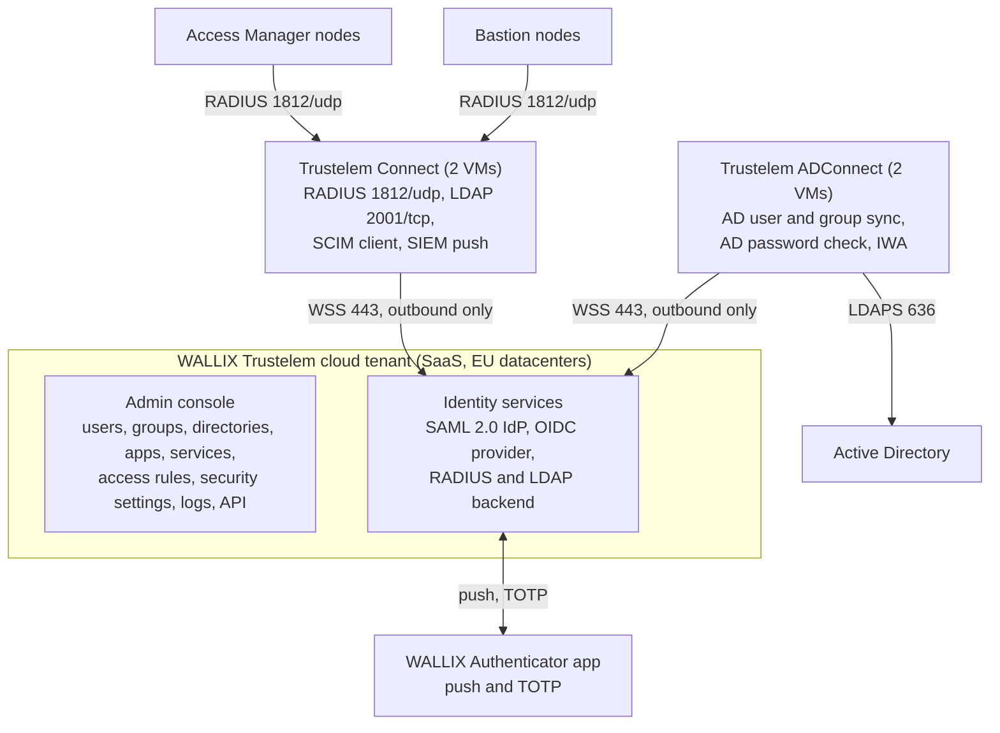
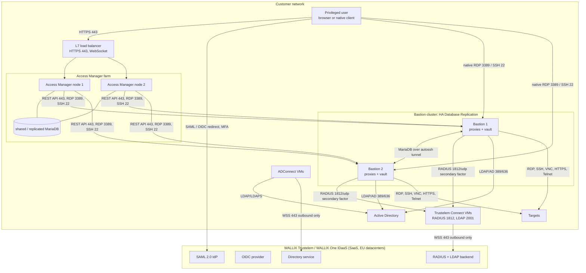
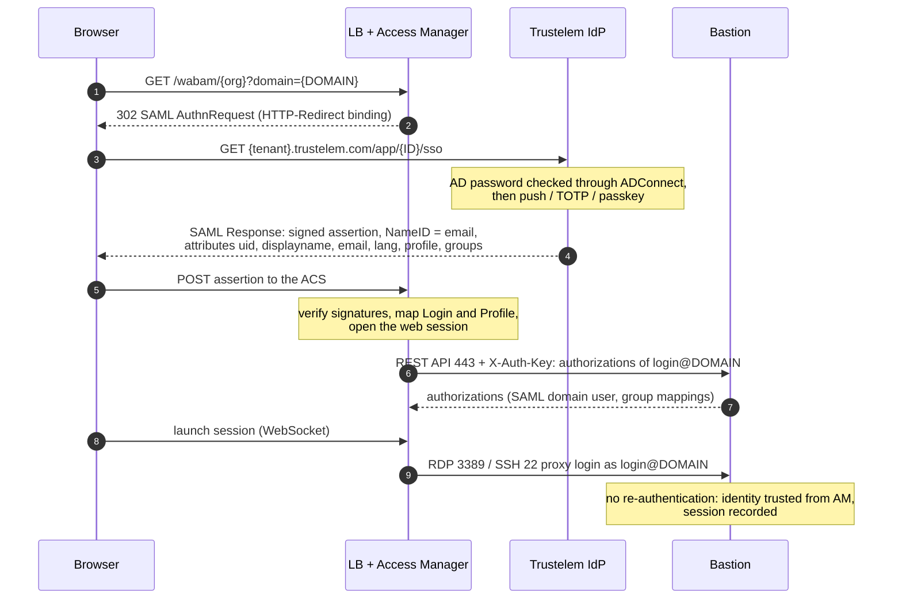
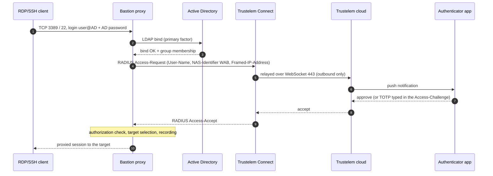
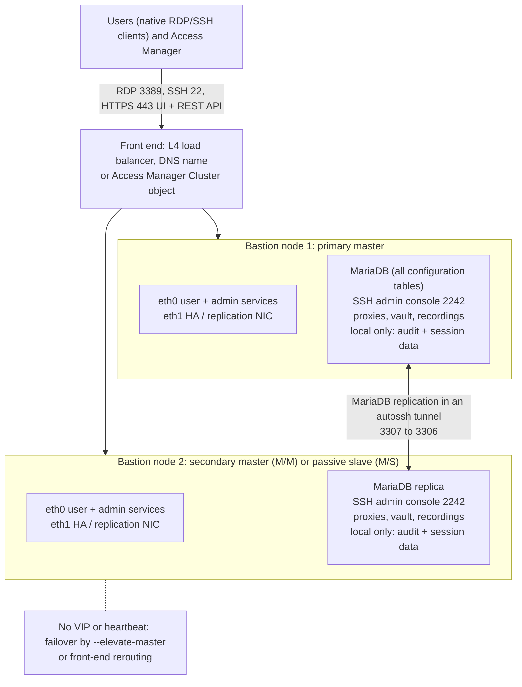
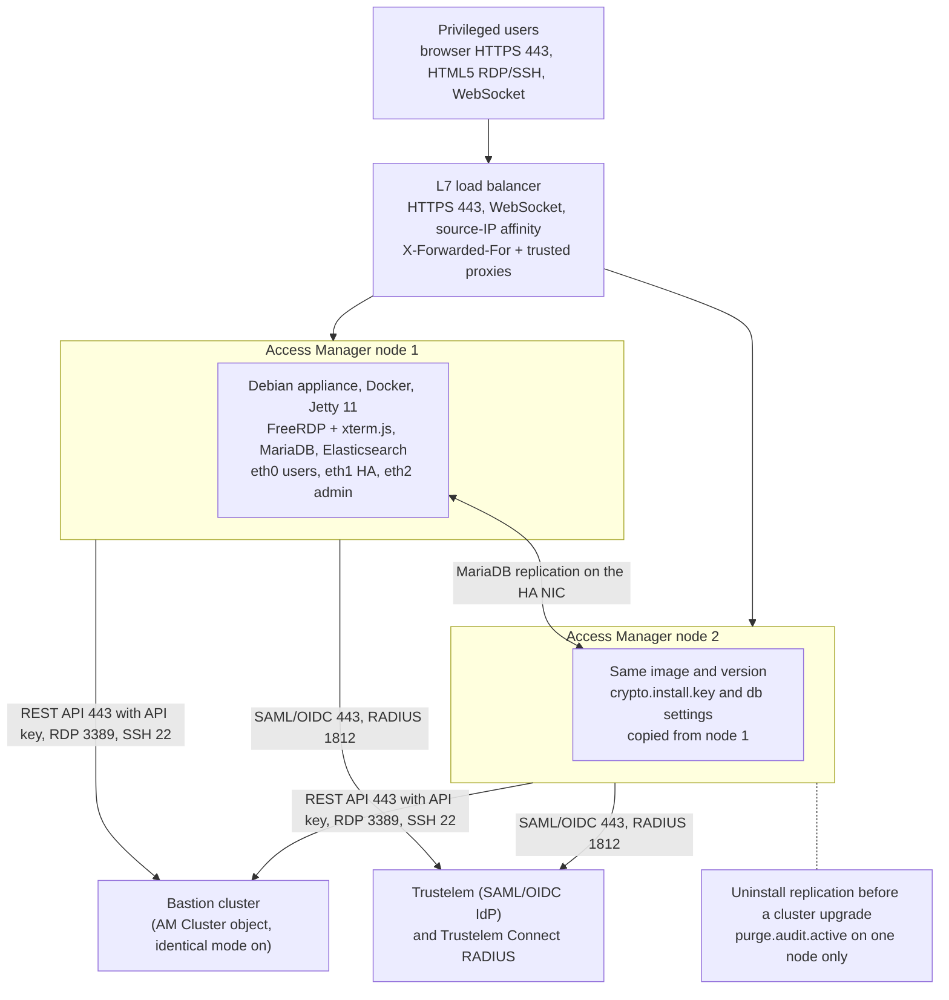
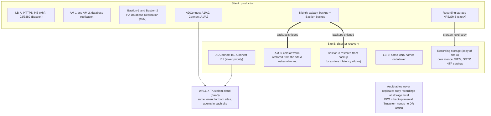

# WALLIX Trustelem MFA for a Bastion cluster and an Access Manager cluster

Architecture report for a PAM architect.
Date: 2026-09-22.
Verified against WALLIX Bastion 12.3.2 (Functional Administration Guide dated 2026-03-12),
WALLIX Access Manager 5.2.4.0 (Administration Guide dated 2026-03-12), the public release
notes of both products, and the WALLIX Trustelem documentation portal as read on the same day.
Newer builds exist (Bastion 12.4.3, Access Manager 5.2.7 and 6.0.x) whose release notes sit
behind the SSO-protected documentation site; where a newer build matters for security, the
report says so.

Revision 2 (same day): added access-path coverage, administrator access model, OIDC
alternative, disaster recovery, sizing, hardening, rollout plan, vendor questions and glossary,
and corrected the advisory scope after re-reading the advisories page.

Every factual statement links to its source. Statements marked *inference* are the author's
deduction from the sources; statements marked *gap* could not be confirmed publicly.

## 1. Executive summary

WALLIX sells three products that together give MFA-protected privileged access:

- **WALLIX Trustelem**, now marketed as **WALLIX One IDaaS**, is a French multi-tenant SaaS
  identity provider with SSO (SAML 2.0, OpenID Connect, OAuth 2.0) and MFA, plus two on-premise
  agents: **Trustelem ADConnect** (directory synchronisation and AD password validation) and
  **Trustelem Connect** (a local LDAP and RADIUS server that relays to the cloud).
  Sources: [Trustelem summary](https://trustelem-doc.wallix.com/books/trustelem-administration/page/summary),
  [WALLIX One IDaaS product page](https://www.wallix.com/products/idaas/).
- **WALLIX Bastion** is the PAM appliance (session proxies for RDP, SSH, VNC, Telnet and raw
  TCP, password vault, recording). It runs on Debian 12 with a MariaDB database and clusters
  through **HA Database Replication** (master/master or master/slaves).
  Sources: [Bastion Admin Guide 12.3.2](https://pam.wallix.one/documentation/admin-doc/bastion_en_administration_guide.pdf),
  [Bastion 12.0.2 Deployment Guide](https://marketplace-wallix.s3.amazonaws.com/bastion_12.0.2_en_deployment_guide.pdf).
- **WALLIX Access Manager** is the HTML5 web portal in front of one or more Bastions. It scales
  out as an active/active farm behind a load balancer sharing or replicating a MariaDB database.
  Source: [AM Admin Guide 5.2.4.0, chapter 20](https://pam.wallix.one/documentation/admin-doc/am-admin-guide_en.pdf).

The recommended design in this report:

1. **Active Directory stays the source of truth.** Trustelem ADConnect imports AD users and
   groups and validates AD passwords without storing them. Bastion and Access Manager keep
   their own LDAP/AD domains for authorization (group mapping).
2. **Web access goes through Access Manager with SAML 2.0 from Trustelem.** Trustelem enforces
   the second factor (push, TOTP, passkey). Access Manager and Bastion share the same SAML
   domain name and login attribute, so the Bastion trusts the Access Manager session and the
   user is never re-prompted. Only the "SAML Generic" variant of Bastion works with Access
   Manager, and once it is configured the Bastion web UI no longer accepts direct SAML logins.
3. **Native RDP and SSH clients that connect straight to the Bastion proxies get MFA through
   RADIUS** against Trustelem Connect, configured on the Bastion as the *secondary
   authentication* of the AD domain, with the "Use mobile device for two-factor authentication"
   option so the proxy waits for a push approval. SAML and OIDC are not fully integrated in
   the native client path.
4. **Two Trustelem Connect VMs and two ADConnect VMs** provide agent failover; the Bastion lists
   both RADIUS servers as primary and backup.
5. **Clusters:** a two-node Bastion HA Database Replication pair (master/master) fronted by a
   load balancer or by the Access Manager "Cluster" object, and a two-node Access Manager farm
   behind a Layer 7 load balancer with WebSocket support and source-IP affinity.

Three things a PAM architect must not miss:

- **Patch levels.** WSA-2026-07-0001, a CVSS 10 unauthenticated privilege escalation in the
  REST API, affects Bastion 12.3.0 to 12.3.6 and 12.4.0 (fixed in 12.3.7 and 12.4.1).
  WSA-2026-07-0002, a CVSS 8.7 unauthenticated bypass of the SAML service provider, affects every
  Access Manager with SAML configured before 5.1.10, 5.2.7 and 6.0.4. Both were published on
  2026-07-20. WSA-2026-02-0001 (passwords written to logs, fixed in 5.1.7 and 5.2.4) is the
  reason not to run TRACE logging in production.
  Source: [WALLIX security advisories](https://www.wallix.com/support-services/alerts/).
- **No cloud, no MFA.** Trustelem Connect only relays to the cloud, so RADIUS and LDAP through it
  stop working if the tenant is unreachable. Keep a local, IP-restricted Bastion administrator
  with a local password as break-glass. Trustelem publishes its availability history
  (above 99.99 % from 2016 to 2022, 99.94 % in 2023).
  Source: [Trustelem availability](https://trustelem-doc.wallix.com/books/trustelem-news/page/unavailability).
- **New Trustelem IP addresses.** 185.4.44.114 and 185.4.44.117 become active on 2026-09-29 and
  must be allowed on outbound firewalls now, alongside the existing ranges.
  Source: [Connectors network flows](https://trustelem-doc.wallix.com/books/trustelem-administration/page/connectors-network-flows).

## 2. Product naming and versions

| Product | Current public name | Version verified | Newer builds seen | Base |
|---------|--------------------|------------------|-------------------|------|
| Trustelem | WALLIX One IDaaS ("also known as Trustelem") | SaaS, no version | continuous | multi-tenant SaaS in EU datacenters |
| Bastion | WALLIX Bastion / WALLIX PAM | 12.3.2 (2026-03-12) | 12.3.7, 12.4.3 | Debian 12, MariaDB |
| Access Manager | WALLIX Access Manager | 5.2.4.0 (2026-03-12) | 5.2.7, 6.0.4 | Debian 10 (5.x), Debian 12 (6.0), Java 17 / Jetty 11, MariaDB |
| MFA bundle | WALLIX Authenticator | offer name | | Trustelem licence limited to Bastion and Access Manager |

Assurance: Bastion 12.0.14 holds BSI certificate BSZ-0020-2025 (2025-09-29, valid to
2027-09-28), recognised by ANSSI; the older ANSSI CSPN 2019/15 for Bastion 6.0 is listed as no
longer maintained; WALLIX holds ISO/IEC 27001:2022 with the WALLIX One SaaS platform in scope.
Sources: [BSI BSZ-0020-2025](https://www.bsi.bund.de/SharedDocs/Zertifikate_BSZ/Bestaetigt/BSZ-0020-2025.html),
[ANSSI catalogue](https://messervices.cyber.gouv.fr/visas/catalogue-produits-services-profils-de-protection-sites-certifies-qualifies-agrees-anssi.pdf),
[WALLIX ISO 27001 press release](https://www.wallix.com/wp-content/uploads/2025/01/250901_-WALLIX-ISO270012022_FINAL_VFR.pdf).

Sources: [Enterprise Vault quick start naming note](https://vault-doc.wallix.com/books/enterprise-vault-administration/page/quick-start-guide),
[Bastion release notes](https://pam.wallix.one/documentation/release-notes/bastion-rn-en.html),
[Access Manager release notes](https://pam.wallix.one/documentation/release-notes/am-rn-en.html),
[AWS Marketplace Bastion 12.4](https://aws.amazon.com/marketplace/pp/prodview-up3f6pn7fybfi),
[WALLIX advisories](https://www.wallix.com/support-services/alerts/),
[WALLIX Authenticator presentation](https://trustelem-doc.wallix.com/books/wallix-authenticator/page/presentation).

WALLIX One is the SaaS umbrella launched on 2023-12-14 (One IDaaS, One PAM, One Remote Access,
One Enterprise Vault). WALLIX One PAM bundles Bastion and Access Manager as a service, and the
WALLIX One Console announced in 2026 manages on-premise Bastion and Access Manager appliances
centrally. Nothing public suggests Access Manager is being merged into Bastion.
Sources: [WALLIX One launch](https://www.wallix.com/press/2023/introducing-wallix-one-the-cybersecurity-saas-platform-designed-to-meet-the-digital-and-economic-challenges-of-companies-aiming-to-safeguard-their-access-and-identities/),
[WALLIX One PAM 1.6.0 notes](https://pam.wallix.one/documentation/deployment/release-notes/1.6.0.html),
[WALLIX One Console](https://www.wallix.com/press/wallix-launches-wallix-one-console-to-boost-operational-efficiency-and-simplify-cybersecurity-for-enterprises-and-organizations/).

## 3. Component architecture

### 3.1 Trustelem / WALLIX One IDaaS

**Cloud tenant.** Each customer receives `https://<tenant>.trustelem.com` (user dashboard) and
`https://admin-<tenant>.trustelem.com` (admin console). The console holds Users, Groups,
Directories, Apps, Services, Access rules, Security settings (authentication factors, passkey
policy, application certificates, internal network zones), API scripts, Logs, Alerts and
Sessions. Source: [Trustelem summary](https://trustelem-doc.wallix.com/books/trustelem-administration/page/summary).

**Trustelem ADConnect.** A Windows service or Linux daemon on a customer VM that "opens a
websocket to admin.trustelem.com using port 443 ... encrypted by TLS protocol and with an
additional symmetric encryption". The cloud sends search and authentication requests down that
socket; the agent queries AD over LDAP or LDAPS with a read-only account. "Trustelem does not
store any password for Active Directory users." At least two VMs are recommended, listed in
priority order; upgrades are rolling. Source: [ADConnect](https://trustelem-doc.wallix.com/books/trustelem-administration/page/active-directory-users-trustelem-adconnect).

**Trustelem Connect.** A local LDAP server (TCP 2001) and RADIUS server (UDP 1812, or 2812)
that forwards LDAP search/bind and RADIUS Access-Request and Challenge to the cloud over the
same outbound websocket. It emulates an AD-like tree (`CN=<user>,DC=<tenant>,DC=trustelem,DC=com`,
groups under `OU=Groups`), supports LDAPS/StartTLS with a customer certificate, and also carries
outbound SCIM provisioning and SIEM log push. Two VMs recommended.
Source: [Trustelem Connect](https://trustelem-doc.wallix.com/books/trustelem-administration/page/ldap-radius-trustelem-connect).

**WALLIX Authenticator app.** iOS, Android and Windows desktop app: push notification when
online, TOTP otherwise; biometric unlock and backup on mobile.
Sources: [MFA methods](https://trustelem-doc.wallix.com/books/trustelem-administration/page/multi-factors-authentication),
[Android listing](https://play.google.com/store/apps/details?id=com.trustelem.auth),
[iOS listing](https://apps.apple.com/us/app/wallix-authenticator/id1122073235).

**Protocols offered.**

| Protocol | Details | Source |
|----------|---------|--------|
| SAML 2.0 IdP | per-app endpoints `/app/<ID>/metadata`, `/app/<ID>/sso`, `/app/<ID>/on_logout`; signing certificate per app; custom attribute scripts | [Applications export](https://trustelem-doc.wallix.com/books/trustelem-applications/export/html) |
| OpenID Connect | issuer `https://<tenant>.trustelem.com/app/<ID>`, discovery, `/auth`, `/token`, `/userinfo`, RS256 JWKS, authorization-code flow | [OIDC app](https://trustelem-doc.wallix.com/books/trustelem-applications/page/openid-connect) |
| RADIUS (via Connect) | PAP, Access-Challenge for OTP or push-wait, password+code concatenation, "2nd factor only" mode | [Bastion app](https://trustelem-doc.wallix.com/books/trustelem-applications/page/wallix-bastion) |
| LDAP/LDAPS (via Connect) | search and bind, MFA by push-wait or password+TOTP | [Trustelem Connect](https://trustelem-doc.wallix.com/books/trustelem-administration/page/ldap-radius-trustelem-connect) |
| Kerberos / IWA | internal zone, user portal only, needs ADConnect on a domain-joined host and an HTTP SPN | [IWA](https://trustelem-doc.wallix.com/books/trustelem-administration/page/integrated-windows-authentication) |
| Admin API | TypeScript handlers with IP-restricted bearer keys, enabled by support | [API](https://trustelem-doc.wallix.com/books/trustelem-administration/page/api) |

**MFA factors.** SMS (extra cost), TOTP, WALLIX Authenticator push, second-step passkeys
(FIDO2/WebAuthn including YubiKey, Windows Hello, Touch ID), email OTP (off by default).
Passkeys are checked against a configurable policy backed by the FIDO Alliance metadata
service. Passkeys cannot be used over LDAP or RADIUS. Lost factors are handled with a 24-hour
rescue code released by an administrator.
Sources: [MFA methods](https://trustelem-doc.wallix.com/books/trustelem-administration/page/multi-factors-authentication),
[Loss of a second factor](https://trustelem-doc.wallix.com/books/trustelem-administration/page/loss-of-a-second-factor).

**Access rules.** Per application, per user or group: web apps get *no rule*, *Default*,
*1 factor*, *2 factors* or *Forbidden*, split by internal and external network zone; LDAP gets
*1 factor*, *2 factors* or *Forbidden*; RADIUS gets *Always allow*, *2nd factor only*,
*2 factors* or *Forbidden*. A user rule beats a group rule, then the most restrictive wins.
Source: [Access rules](https://trustelem-doc.wallix.com/books/trustelem-administration/page/access-rules).

### 3.2 WALLIX Bastion

- **Placement.** "WALLIX Bastion is positioned between a low trust domain and a high trust
  domain"; all target access passes through it.
  Source: [Bastion Admin Guide 5.2](https://pam.wallix.one/documentation/admin-doc/bastion_en_administration_guide.pdf).
- **Services.** SSH/SFTP/SCP/Telnet/rlogin proxy on TCP 22; RDP/VNC proxy on TCP 3389; web UI
  and REST API on 443 (`/ui`, `/api`); SSH administration console on 2242; raw TCP through
  Universal Tunneling (WAMUT client). No HTML5 gateway inside Bastion; HTML5 comes from Access
  Manager. Sources: [Deployment Guide 2.2](https://marketplace-wallix.s3.amazonaws.com/bastion_12.0.2_en_deployment_guide.pdf),
  [Admin Guide 12.1 and 12.16.4](https://pam.wallix.one/documentation/admin-doc/bastion_en_administration_guide.pdf).
- **Authorization model.** Users belong to user groups, target accounts to target groups, and
  an authorization joins one user group to one target group with protocol flags, time frames,
  recording, criticality and approval workflow. Permission profiles gate administration.
  Source: [Admin Guide 5.3 and 13](https://pam.wallix.one/documentation/admin-doc/bastion_en_administration_guide.pdf).
- **Authentication matrix.** Login and password (LDAP/AD bind, local, RADIUS, TACACS+), Kerberos
  ticket, OIDC, SAML, PingID, SSH key/CA and X.509 are available on HTTPS. On SSH and RDP,
  OIDC and SAML are "supported, but the workflow is not fully integrated": the user copies a
  link into a browser, retrieves a token and adds it to the client. X.509 on the proxies
  requires a prior HTTPS login. A one-time password (default 30 s) embedded in downloaded
  session files lets an authenticated web user open a native client.
  Source: [Admin Guide 7.1.1 and 12.5](https://pam.wallix.one/documentation/admin-doc/bastion_en_administration_guide.pdf).
- **MFA model.** "you can setup a single-factor authentication (SFA) and a two-factor
  authentication (2FA). However, it is not possible to directly configure a multifactor
  authentication (MFA)." A primary authentication is set on the authentication domain and a
  *secondary authentication* (RADIUS, TACACS+, PingID, Kerberos-Password) is attached to it.
  WALLIX recommends putting richer MFA in the IdP.
  Source: [Admin Guide 7.1.3](https://pam.wallix.one/documentation/admin-doc/bastion_en_administration_guide.pdf).
- **RADIUS client.** RFC 2865 and RFC 8044, challenge-response supported, standard attributes
  only: User-Name, User-Password, State, NAS-Identifier (always `WAB`), Framed-IP-Address (the
  client IP). Default port 1812, default timeout 5 s.
  Source: [Admin Guide 7.2.5.4](https://pam.wallix.one/documentation/admin-doc/bastion_en_administration_guide.pdf).
- **Federation.** SAML 2.0 as SP with IdP- and SP-initiated flows, SP metadata download, SP
  entity ID changeable to a load balancer FQDN ("SAML dynamic flow"), NameID must be an e-mail
  whose domain equals the authentication domain name; OIDC Authorization Code Flow with
  discovery, cluster-aware ("allowing authentication via any FQDN assigned to any Bastion
  within the cluster"). Sources: [Admin Guide 7.3.1 and 7.3.2](https://pam.wallix.one/documentation/admin-doc/bastion_en_administration_guide.pdf).

### 3.3 WALLIX Access Manager

- **Role.** "provides connection services between web browsers and targets ... Target accesses
  are performed through Wallix Bastion appliances. The connections are done using HTML5
  clients; no browser plug-in is required." Multi-tenant through Organizations.
  Source: [AM Admin Guide chapter 3 and 8](https://pam.wallix.one/documentation/admin-doc/am-admin-guide_en.pdf).
- **Stack.** Java 17 on Jetty 11, FreeRDP 3 and xterm.js for HTML5, MariaDB 10.5 embedded
  (or external MySQL, Oracle, Azure), Elasticsearch 8.18 for session audit, delivered as a
  Debian appliance where the application runs in the Docker container
  `access-manager_access_manager_1` behind Apache. Configuration lives in
  `/var/wab/etc/wabam/wabam.properties`.
  Sources: [AM release notes](https://pam.wallix.one/documentation/release-notes/am-rn-en.html),
  [AM Admin Guide chapters 15 to 21](https://pam.wallix.one/documentation/admin-doc/am-admin-guide_en.pdf).
- **Link to Bastion.** Each Bastion object holds the user-interface IP, a Bastion REST API key
  (profile `wallix_access_manager_session_audit` recommended on Bastion 12.1 and later), pinned
  TLS certificate and SSH/RDP fingerprints, cluster membership, Strip Domain, and per-Bastion
  ports (SSH 22, RDP 3389, REST 443).
  Source: [AM Admin Guide 10.4.3 and 13](https://pam.wallix.one/documentation/admin-doc/am-admin-guide_en.pdf).
- **Traffic path.** Access Manager opens 22, 3389 and 443 towards the Bastion; the Bastion sees
  the Access Manager IP as the client. *Inference:* the HTML5 gateway therefore runs on Access
  Manager and session traffic does not bypass it.
  Sources: [AM Install Guide 2.4](https://marketplace-wallix.s3.amazonaws.com/am-install_en.pdf),
  [Bastion Admin Guide, Universal Tunneling auditing](https://pam.wallix.one/documentation/admin-doc/bastion_en_administration_guide.pdf).
- **Authentication domains.** Local, LDAP/AD, SAML, BASTION and OIDC domains; RADIUS servers
  attach as *authenticators* in an ordered factor chain with priority-based failover. There is
  no built-in TOTP; MFA is delegated to RADIUS or to the IdP. Kerberos is absent.
  Source: [AM Admin Guide chapters 10 and 11](https://pam.wallix.one/documentation/admin-doc/am-admin-guide_en.pdf).

## 4. High-level design

### 4.1 Design decisions

| Decision | Choice | Reason and source |
|----------|--------|-------------------|
| Identity source | Active Directory synced by ADConnect; Trustelem local users only for partners and backup admins | Vendor decision tree: AD users import via ADConnect, then RADIUS as 2nd factor on the Bastion AD domain; Trustelem local users for people outside AD is the author's choice so that factors and rules live in one place. [Setup instructions](https://trustelem-doc.wallix.com/books/wallix-authenticator/page/setup-instructions), [Local users](https://trustelem-doc.wallix.com/books/trustelem-administration/page/trustelem-local-users) |
| Web protocol | SAML 2.0 from Trustelem to Access Manager, generic SAML on Bastion | "Access Manager is compatible with SAML (recommanded), LDAP and Radius" [sic]. Dedicated Access Manager template exists in Trustelem. [WALLIX Authenticator](https://trustelem-doc.wallix.com/books/wallix-authenticator/page/presentation), [AM app](https://trustelem-doc.wallix.com/books/trustelem-applications/page/wallix-access-manager) |
| Why not OIDC | OIDC is supported on both products since Bastion 12.2 and AM 5.2.4.0, but Trustelem publishes no WALLIX OIDC template and no groups claim guidance | *gap*; [Bastion 7.3.2](https://pam.wallix.one/documentation/admin-doc/bastion_en_administration_guide.pdf), [AM 10.5](https://pam.wallix.one/documentation/admin-doc/am-admin-guide_en.pdf) |
| Native client MFA | RADIUS to Trustelem Connect as secondary authentication of the Bastion AD domain | Only transparent push/OTP path for RDP and SSH proxies. [Bastion 7.2.5.4](https://pam.wallix.one/documentation/admin-doc/bastion_en_administration_guide.pdf), [Bastion app](https://trustelem-doc.wallix.com/books/trustelem-applications/page/wallix-bastion) |
| Authorization | Bastion group mappings on the AD domain (native path) and on the SAML domain (web path) | RADIUS carries no groups. [Bastion 7.3.1.1.3](https://pam.wallix.one/documentation/admin-doc/bastion_en_administration_guide.pdf) |
| Bastion cluster | Two nodes, HA Database Replication master/master | Approvals replicate only in master/master. [Deployment Guide ch. 5](https://marketplace-wallix.s3.amazonaws.com/bastion_12.0.2_en_deployment_guide.pdf) |
| Access Manager cluster | Two nodes behind an L7 load balancer, appliance MariaDB replication | [AM 20.1](https://pam.wallix.one/documentation/admin-doc/am-admin-guide_en.pdf) |
| Agents | Two ADConnect and two Trustelem Connect VMs, on separate hosts from the Bastions | "The recommendation is 2 VM at least, to have a failover system". [Trustelem Connect](https://trustelem-doc.wallix.com/books/trustelem-administration/page/ldap-radius-trustelem-connect) |

### 4.2 Identity flow, web path

Key rules, all from the vendor guides:

- The Access Manager SAML domain name must equal the Bastion "Domain server name", and the
  Access Manager Login attribute must equal the Bastion Username claim.
  Source: [AM 10.3.2](https://pam.wallix.one/documentation/admin-doc/am-admin-guide_en.pdf),
  [Bastion 7.3.1.1](https://pam.wallix.one/documentation/admin-doc/bastion_en_administration_guide.pdf).
- "When configuring SAML to authenticate to WALLIX Bastion via WALLIX Access Manager, it is
  required to disabled the encryption of messages." Signed Response and Signed Assertion must
  stay enabled: "By disabling the attributes Signed Response and Signed Assertion, any user will
  be able to connect to Access Manager as an administrator."
  Source: [AM 10.3.2](https://pam.wallix.one/documentation/admin-doc/am-admin-guide_en.pdf).
- Disable Strip Domain on the Bastion object in Access Manager so `login@domain` is kept and
  matched to Bastion users in external authentication mode.
  Source: [AM 10.3.2](https://pam.wallix.one/documentation/admin-doc/am-admin-guide_en.pdf).
- The Bastion side must use the "SAML > Other IdPs" domain type; the Entra ID (Graph API)
  variant "is not compatible with WALLIX Access Manager".
  Source: [Bastion 7.3.1.2](https://pam.wallix.one/documentation/admin-doc/bastion_en_administration_guide.pdf).
- Trustelem sends `uid` (AD users) or `email` (local users) as Login, plus `displayname`,
  `email`, `lang` and an optional `profile` attribute computed by script.
  Source: [AM app in Trustelem](https://trustelem-doc.wallix.com/books/trustelem-applications/page/wallix-access-manager).

### 4.3 Identity flow, native client path

- On the Bastion, the RADIUS external authentication is linked as *Secondary authentication*
  of the AD authentication domain. With "Use mobile device for two-factor authentication
  (2FA)" enabled, the login page tells the user a push notification is coming; Trustelem
  describes this as skipping the password step by "automatically sending login and empty
  password". "Use primary domain name for two-factor authentication (2FA)" sends `user@domain` in the second step.
  Sources: [Bastion 7.2.5.4](https://pam.wallix.one/documentation/admin-doc/bastion_en_administration_guide.pdf),
  [Bastion app in Trustelem](https://trustelem-doc.wallix.com/books/trustelem-applications/page/wallix-bastion).
- The Trustelem access rule for the Bastion RADIUS application is *2nd factor only* for AD
  users (the password was already checked by the Bastion against AD).
  Source: [Bastion app in Trustelem](https://trustelem-doc.wallix.com/books/trustelem-applications/page/wallix-bastion).
- The RADIUS timeout must cover push latency: the Bastion default is 5 s; a WALLIX-published
  RADIUS guide recommends 45 to 50 s for push-based providers.
  Source: [HID RADIUS configuration guide](https://www.wallix.com/wp-content/uploads/2020/07/HID_ActivID_Appliance_Wallix_RADIUS_ConfigGuide_FINAL.pdf).
- Trustelem can suppress repeated prompts "for the duration defined on Trustelem and as long as
  he remains on the same network"; the Bastion supplies Framed-IP-Address for that purpose.
  Sources: [Trustelem new features](https://trustelem-doc.wallix.com/books/trustelem-news/page/new-features),
  [Bastion 7.2.5.4](https://pam.wallix.one/documentation/admin-doc/bastion_en_administration_guide.pdf).
- SSH clients receive the challenge as keyboard-interactive prompts; this breaks automation
  such as VS Code Remote-SSH. RDP clients see the Bastion RDP proxy login screen. When Kerberos
  is enabled on the RDP proxy, RADIUS and OTP users must set `enablecredsspsupport:i:0` and
  `authentication level:i:2` in the `.rdp` file (or `/sec:tls` with FreeRDP).
  Sources: [VS Code issue](https://github.com/microsoft/vscode-remote-release/issues/11461),
  [Bastion Users Guide](https://pam.wallix.one/documentation/user-doc/bastion_en_user_guide.pdf).

### 4.4 Alternative flows

- **Access Manager with RADIUS MFA instead of SAML.** Useful when Access Manager account
  mapping needs the user's AD password: the AD domain is factor 1 and Trustelem Connect
  (Protocol PAP, port 1812 or 2812, Login type "simple login", NAS Identifier empty) is factor
  2, with "Factor Used for Account Mapping" set to the AD factor. In the Trustelem Access
  Manager app the root URL, organization identifier and domain stay empty when only RADIUS is
  used. The user experience is a second prompt: "first provide the AD login and password then
  provide the Trustelem TOTP code, even if the name of the input is Password again". Push
  approval is documented for the Bastion RADIUS path, not for this one.
  Sources: [AM 10.4.1 and 11](https://pam.wallix.one/documentation/admin-doc/am-admin-guide_en.pdf),
  [AM app in Trustelem](https://trustelem-doc.wallix.com/books/trustelem-applications/page/wallix-access-manager).
- **Trustelem local users on the Bastion.** Bastion LDAP domain pointing at Trustelem Connect
  (port 2001, bind user `trustelem`, login attribute `mail`, group DN
  `CN=<Group>,OU=Groups,DC=<tenant>,DC=trustelem,DC=com`) with RADIUS as secondary
  authentication and access rule *2nd factor only*. Access rules with 1 or 2 factors must exist
  before the Bastion can even enumerate users.
  Source: [Bastion app in Trustelem](https://trustelem-doc.wallix.com/books/trustelem-applications/page/wallix-bastion).
- **Bastion local users with RADIUS only.** "Authentication and backup servers" set to RADIUS
  alone, user name recognisable by Trustelem (e-mail), access rule *2 factors*, and "Use
  mobile device" left off. These users have no local password fallback.
  Source: [Bastion app in Trustelem](https://trustelem-doc.wallix.com/books/trustelem-applications/page/wallix-bastion).

### 4.5 Access path coverage

Every way into the platform, and which factor protects it. "Push/TOTP" means the RADIUS
secondary authentication against Trustelem Connect; "SAML" means the full Trustelem factor set
including passkeys.

| Access path | Primary factor | Second factor | Notes and source |
|-------------|---------------|---------------|------------------|
| Access Manager portal (HTML5 RDP, SSH, WAMUT tunnels, password checkout, approvals) | Trustelem SAML (AD password via ADConnect) | Trustelem: push, TOTP, passkey | Bastion trusts the AM session; no second login ([AM 10.3.2](https://pam.wallix.one/documentation/admin-doc/am-admin-guide_en.pdf)) |
| Bastion web UI opened directly (administrators, auditors, approvers) | AD bind on the Bastion AD domain | Push/TOTP | SAML button is unusable once SAML is bound to Access Manager ([Bastion 7.3.1](https://pam.wallix.one/documentation/admin-doc/bastion_en_administration_guide.pdf)) |
| Native RDP client to the Bastion proxy | AD bind | Push/TOTP on the RDP proxy login screen | With Kerberos enabled on the proxy, clients need `enablecredsspsupport:i:0` and `authentication level:i:2`, or `/sec:tls` for FreeRDP ([Users Guide 8.5.2](https://pam.wallix.one/documentation/user-doc/bastion_en_user_guide.pdf)) |
| Native SSH, SFTP, SCP to the Bastion proxy | AD bind (or SSH key / SSH CA) | Push/TOTP via keyboard-interactive | Breaks non-interactive automation; scripted transfers should use a dedicated account without RADIUS ([VS Code issue](https://github.com/microsoft/vscode-remote-release/issues/11461)) |
| Universal Tunneling with WAMUT or WALLIX-PuTTY | same as SSH | same as SSH | The tunnel is an SSH session to the proxy; through Access Manager it inherits SAML ([Users Guide 8.6](https://pam.wallix.one/documentation/user-doc/bastion_en_user_guide.pdf)) |
| One-time-password session files ("instant access") | already authenticated in the web UI or Access Manager | inherited | Token valid 30 s by default ([Bastion 12.5](https://pam.wallix.one/documentation/admin-doc/bastion_en_administration_guide.pdf)) |
| Kerberos ticket SSO on the SSH proxy and RDP proxy (12.3.1) | Windows logon ticket | none from WALLIX | Single factor unless the workstation logon itself is MFA (smart card, Windows Hello for Business); *inference:* keep it for PAW-class workstations only ([Bastion 7.2.5.2](https://pam.wallix.one/documentation/admin-doc/bastion_en_administration_guide.pdf)) |
| Bastion REST API and SCIM API with API keys | API key bound to a profile, optional IP restriction | none | Treat keys as secrets; restrict to Access Manager, IAM and automation hosts ([Bastion 6.1.2](https://pam.wallix.one/documentation/admin-doc/bastion_en_administration_guide.pdf)) |
| Access Manager local and global administrators | local password (or Bastion domain) | RADIUS factor 2 on a local domain, or none | See 4.6 ([AM 10.1 and 12.2](https://pam.wallix.one/documentation/admin-doc/am-admin-guide_en.pdf)) |
| Bastion SSH administration console (2242) | `wabadmin` password | none | Firewall to the admin network and jump host only ([Deployment Guide 2.1](https://marketplace-wallix.s3.amazonaws.com/bastion_12.0.2_en_deployment_guide.pdf)) |
| Session Invite guest | time-limited link issued by the host | none | Guest has no account; host is already MFA-authenticated ([AM 14.6](https://pam.wallix.one/documentation/admin-doc/am-admin-guide_en.pdf)) |
| Web Session Manager (isolated browser for web targets) | launched from an authenticated Bastion or AM session | inherited | Separate server linked by JWS/JWE keys ([Bastion 12.2](https://pam.wallix.one/documentation/admin-doc/bastion_en_administration_guide.pdf)) |

### 4.6 Administrator access model

| Population | Where they log in | Authentication | Break-glass |
|------------|-------------------|----------------|-------------|
| Bastion product and operation administrators | Bastion web UI on the admin interface | AD domain user mapped to `product_administrator` or `operation_administrator`, RADIUS push as secondary factor, source IP restricted to the admin network | one local administrator with a local password, IP-restricted, password in a sealed envelope or offline vault; the default `admin` account deleted ([Bastion 6.1, 7.4](https://pam.wallix.one/documentation/admin-doc/bastion_en_administration_guide.pdf)) |
| Bastion auditors and approvers | Bastion web UI or Access Manager | same as users (SAML through AM, or AD plus RADIUS on the Bastion) | none needed |
| Bastion appliance operators | SSH console 2242 (`wabadmin`, `wabsuper`) and hypervisor console | passwords changed at initialisation, no MFA available | `wabbootadmin` GRUB user and hypervisor console; restrict 2242 to a jump host ([Deployment Guide 2.1](https://marketplace-wallix.s3.amazonaws.com/bastion_12.0.2_en_deployment_guide.pdf)) |
| Access Manager global organization administrator | `https://<am>/wabam/global?domain=local` | local password, optionally an X.509 certificate or RADIUS chained as factor 2 on the local domain; restricted source IPs per user | `wabam` command-line reset of the baseline organization password ([AM 8, 10.1, 12.2, 22.1](https://pam.wallix.one/documentation/admin-doc/am-admin-guide_en.pdf)) |
| Access Manager organization administrators | organization URL | SAML domain with a `profile` attribute of `Administrator`, or a Bastion domain | global administrator |
| Trustelem administrators | `https://admin-<tenant>.trustelem.com` | admin console access level set to 2 factors; delegated administrators through `groupManager` | one local Trustelem administrator not linked to AD; rescue codes ([Local users](https://trustelem-doc.wallix.com/books/trustelem-administration/page/trustelem-local-users), [Delegated administration](https://trustelem-doc.wallix.com/books/trustelem-administration/page/delegated-administration)) |
| Trustelem Connect and ADConnect hosts | OS administration | OS controls (not WALLIX) | *inference:* manage these VMs through the Bastion itself once it is live |

The Bastion administrators deliberately do not use the SAML path: binding SAML to Access
Manager removes direct SAML login to the Bastion, and an administrator must be able to reach the
Bastion when the Access Manager farm is down.
Source: [Bastion 7.3.1](https://pam.wallix.one/documentation/admin-doc/bastion_en_administration_guide.pdf).

### 4.7 OpenID Connect as the alternative to SAML

Both products accept Trustelem as an OIDC provider, and WALLIX recommends OIDC over SAML for
new applications on Trustelem. The mapping rules mirror SAML; the table gives the values.

| Setting | Trustelem OIDC app | Access Manager (5.2.4.0 and later) | Bastion (12.2 and later) |
|---------|-------------------|-----------------------------------|--------------------------|
| Issuer / discovery | `https://<tenant>.trustelem.com/app/<ID>` and `/.well-known/openid-configuration` | URL Discovery then "Match" | Discovery URL then "Match" |
| Flow | authorization code (implicit also offered) | Authorization Code Flow only | Authorization Code Flow only |
| Client | `trustelem.oidc.<id>` and secret | Client ID / Client Secret | Client ID / Client Secret |
| Redirect URI | must be declared, plus post-logout URI | "IdP Redirect URL" auto-filled; edit it to the load balancer hostname | Bastion callback; cluster-aware since 12.3.2 |
| Scope | at least `email` | must include `openid`; add `profile`, `email` | claims Username and Group mandatory |
| Signing | RS256 JWKS | verify HTTPS certificate on by default; CA must be in the organization CAs; 5 s timeout | |
| Domain rules | | OIDC domain name = Bastion "Domain server name"; Login attribute = Bastion Username claim; Strip Domain off | Authentication domains > OIDC; group mappings |

Sources: [Trustelem OIDC](https://trustelem-doc.wallix.com/books/trustelem-applications/page/openid-connect),
[AM 10.5](https://pam.wallix.one/documentation/admin-doc/am-admin-guide_en.pdf), [Bastion 7.3.2](https://pam.wallix.one/documentation/admin-doc/bastion_en_administration_guide.pdf).
Gap: Trustelem publishes no WALLIX-specific OIDC template and no example of a `groups` claim,
so the SAML path remains the documented one.

## 5. Cluster design

### 5.1 Bastion cluster

Facts from the [Bastion 12.0.2 Deployment Guide, chapter 5](https://marketplace-wallix.s3.amazonaws.com/bastion_12.0.2_en_deployment_guide.pdf)
and the [12.3.2 release notes](https://pam.wallix.one/documentation/release-notes/bastion-rn-en.html):

- DRBD and the shared virtual IP belong to the legacy hardware-only design; "legacy DRBD code"
  was removed in 12.3.2 and eth1 is now a standard interface.
- HA Database Replication is MariaDB replication carried inside an SSH tunnel maintained by
  autossh; slaves pull from local 3307 to the master's 3306, so the database port is never
  exposed on the network.
- Modes: Master/Slave(s) (one writable node) and Master/Master (two nodes, primary and
  secondary master). Approvals are replicated only in Master/Master; password operations and
  scheduled rotations run only from the primary master; simultaneous API provisioning on both
  masters is unsupported.
- Prerequisites: identical version and hotfix, encryption initialised on every node, IPv4 only,
  never clone a configured VM, same time zone, SMTP on the master.
- Not replicated: audit and session tables, recording options, configuration options,
  connection messages, licence, network, time, SNMP, SMTP, service control, SIEM integration,
  GPG fingerprints, device certificates. Each node must therefore receive its own licence,
  SIEM and recording-storage configuration.
- Operations use `bastion-replication` (`--prerequisite-check`, `--install`, `--status`,
  `--resync`, `--add-slave`, `--elevate-master`, `--stop`, `--start`, `--uninstall`) and mail
  templates ha_master_fault, ha_master_up and ha_slave_missing.
- There is no heartbeat or VIP: failover is `--elevate-master` plus rerouting at the front end.
  *Inference:* proxy sessions on a failed node drop because the proxies terminate TCP locally.

Front-end options, from the [Bastion Admin Guide](https://pam.wallix.one/documentation/admin-doc/bastion_en_administration_guide.pdf)
and the [AM Admin Guide 13 and 20.2](https://pam.wallix.one/documentation/admin-doc/am-admin-guide_en.pdf):

- Declare both nodes in an Access Manager "Cluster": each launch goes to the Bastion with the
  fewest open sessions; enable `bastion.cluster.identical.mode` when both nodes share proxy
  certificates and authorizations; keep `bastion.connection.timeout` low. Clusters are
  incompatible with password display in Access Manager (an external vault is fine).
- For native clients, publish a DNS name or L4 load balancer on 22 and 3389, and set the SAML
  SP Entity ID to the load balancer FQDN. OIDC already accepts any cluster FQDN.

### 5.2 Access Manager cluster

Facts from the [AM Admin Guide](https://pam.wallix.one/documentation/admin-doc/am-admin-guide_en.pdf)
and [AM release notes](https://pam.wallix.one/documentation/release-notes/am-rn-en.html):

- "In order to implement load-balancing, it is possible to deploy several Access Manager
  instances ... The load-balancing itself should be implemented in front of the instances."
  Additional nodes copy `crypto.install.key`, the `db.connections*` properties and the
  `user.admin*` credentials from node 1 into `wabam.properties` and restart the service.
- Database: either one shared external database or the appliance MySQL/MariaDB replication
  script introduced in 5.0.0, run over the dedicated HA interface with
  `/root/sqlreplication/servers_list`. "Before upgrading an Access Manager cluster to version
  5.2.3, replication must be uninstalled." Enable `purge.audit.active` on one node only.
- Load balancer: Access Manager expects a proxy (`web.proxy.activated=true`), reads
  `X-Forwarded-*` and RFC 7239 headers, and restricts them with `web.proxy.trusted-proxies`.
  Any proxy in front must support WebSocket. Citrix ADC cookie-based persistence is
  incompatible with Universal Tunneling for Access Manager clusters, so use source-IP affinity.
  *Inference:* TLS termination at the load balancer is supported because of
  `X-Forwarded-Proto`; pass-through also works since each node has its own certificate.
- Set per-node `rdp.clientName` if targets must distinguish the nodes. *Gap:* no published
  health-check URL; monitor 443 and Elasticsearch on 9200.
- Sizing: 5.2.4.0 asks for at least 4 GB RAM and 50 GB disk; the legacy sizing table gives
  1 vCPU/2 GB for 100 users and 10 sessions, 3 vCPU/3 GB for 500/50 and 6 vCPU/4 GB for
  1000/100. Source: [AM Install Guide 2.1.3 and 3.2](https://marketplace-wallix.s3.amazonaws.com/am-install_en.pdf).

### 5.3 Failure modes

| Failure | Effect | Mitigation |
|---------|--------|------------|
| Trustelem cloud unreachable | SAML/OIDC logins and RADIUS/LDAP through Connect fail; existing Bastion sessions continue | Local IP-restricted Bastion admin; Access Manager BASTION domain for local users; *gap:* no documented offline mode |
| One Trustelem Connect VM down | Bastion retries the backup RADIUS server; Access Manager uses next priority | Two RADIUS external authentications on Bastion, both listed under the user's or domain's servers ([TrustBuilder guide](https://docs.trustbuilder.com/mfa/wallix-bastion-radius-configuration)); Priority on AM authenticators |
| One ADConnect VM down | Cloud switches to the next connector in priority | Two connectors ([ADConnect](https://trustelem-doc.wallix.com/books/trustelem-administration/page/active-directory-users-trustelem-adconnect)) |
| Bastion master down | Web and native logins to that node fail; replication stops | `bastion-replication --elevate-master` on the survivor, reroute front end, disable the node in AM ([Deployment Guide ch. 5](https://marketplace-wallix.s3.amazonaws.com/bastion_12.0.2_en_deployment_guide.pdf), [AM WAB-17043](https://pam.wallix.one/documentation/release-notes/am-rn-en.html)) |
| One Access Manager node down | Sessions on that node drop; new sessions go to the other node | Load balancer health check; users re-login through the IdP session (no new MFA if the IdP SSO session is valid) |
| SAML signing certificate expires | All web logins fail | Certificate expiry alerts in Trustelem; rotation runbook in section 8 ([Certificate renewal](https://trustelem-doc.wallix.com/books/trustelem-administration/page/certificate-renewal)) |

### 5.4 Disaster recovery and multi-site

- Replication is designed for nodes "located in the same environment or hosted on virtual
  machines"; the guide gives no latency bound, and a remote slave in Master/Slaves mode is
  the only replicated cross-site option (no changes are allowed on slaves).
  Source: [Deployment Guide ch. 5](https://marketplace-wallix.s3.amazonaws.com/bastion_12.0.2_en_deployment_guide.pdf).
- A DR Bastion refreshed by backup and restore is the partner-documented pattern; recovery
  point equals the backup interval. Session recordings and audit tables are not in the
  replication and must be copied at storage level (NFS, SMB or S3-compatible remote storage).
  Source: [TECHDOC360 OT architecture](https://www.varnostne-resitve.si/wp-content/uploads/2025/03/TECHDOC360_Classic-WALLIX-Bastion-Architecture-OT.pdf).
- Access Manager: `wabam-backup -d -n -p` produces an encrypted archive with the database,
  keystore and `wabam.properties`; restore only onto the same schema version.
  Source: [AM 15.3](https://pam.wallix.one/documentation/admin-doc/am-admin-guide_en.pdf).
- Trustelem: nothing to fail over; deploy at least one ADConnect and one Trustelem Connect in
  the DR site with lower priority so the tenant keeps a path to AD and the RADIUS listeners
  exist locally. Sources: [ADConnect](https://trustelem-doc.wallix.com/books/trustelem-administration/page/active-directory-users-trustelem-adconnect),
  [Trustelem Connect](https://trustelem-doc.wallix.com/books/trustelem-administration/page/ldap-radius-trustelem-connect).
- Licences, SIEM, SMTP, NTP, SNMP and network settings are per node and must be pre-staged on
  the DR node. Source: [Deployment Guide ch. 5, exclusion list](https://marketplace-wallix.s3.amazonaws.com/bastion_12.0.2_en_deployment_guide.pdf).

## 6. Low-level design

### 6.1 Naming and mapping rules

| Item | Value in this design | Rule |
|------|---------------------|------|
| Bastion authentication domain (SAML) | `Domain server name` = `TRUSTELEM`, `Authentication domain name` = `TRUSTELEM` | Must equal the AM SAML Domain Name; WALLIX recommends both fields identical ([Bastion 7.3.1.1.2](https://pam.wallix.one/documentation/admin-doc/bastion_en_administration_guide.pdf)) |
| Trustelem SAML NameID | e-mail address | "select email address. The domain of the e-mail address must be the same as the authentication domain name" ([Bastion 7.3.1.1.2](https://pam.wallix.one/documentation/admin-doc/bastion_en_administration_guide.pdf)); in practice use the Default domain toggle and Default email domain to reconcile |
| Login attribute | `uid` for AD users, `email` for Trustelem local users | Trustelem AM template ([AM app](https://trustelem-doc.wallix.com/books/trustelem-applications/page/wallix-access-manager)) |
| Bastion Username claim | same attribute as the AM Login attribute | [Bastion 7.3.1.1.1](https://pam.wallix.one/documentation/admin-doc/bastion_en_administration_guide.pdf) |
| Group claim | `groups`, filled by the Trustelem script `for (let g in groups){ msg.addAttr("groups",g); }` | one value per Bastion mapping, case-insensitive ([Bastion 7.3.1.1.3](https://pam.wallix.one/documentation/admin-doc/bastion_en_administration_guide.pdf), [Bastion SAML app](https://trustelem-doc.wallix.com/books/trustelem-applications/page/wallix-bastion-saml)) |
| AM profile | `profile` attribute set by script, matched by name to AM profiles; Default Profile = User | [AM 10.3.1](https://pam.wallix.one/documentation/admin-doc/am-admin-guide_en.pdf) |
| AM Entity ID | `WALLIX-AM` (Trustelem template) or `https://<am-fqdn>/wabam/<org>?domain=TRUSTELEM` | [AM app](https://trustelem-doc.wallix.com/books/trustelem-applications/page/wallix-access-manager), [TrustBuilder guide](https://docs.trustbuilder.com/mfa/wallix-access-manager-saml-2-0-configuration) |
| Bastion SP Entity ID | load balancer FQDN when native SAML is used through an LB | [Bastion 7.3.1.1.1](https://pam.wallix.one/documentation/admin-doc/bastion_en_administration_guide.pdf) |
| Bastion API key for AM | profile `wallix_access_manager_session_audit`, IP-restricted to the AM nodes | [AM 13](https://pam.wallix.one/documentation/admin-doc/am-admin-guide_en.pdf) |
| RADIUS NAS-Identifier | `WAB` from Bastion; AM sets its own NAS Identifier field | [Bastion 7.2.5.4](https://pam.wallix.one/documentation/admin-doc/bastion_en_administration_guide.pdf), [AM 11](https://pam.wallix.one/documentation/admin-doc/am-admin-guide_en.pdf) |

### 6.2 Certificates, keys and secrets

| Object | Where it lives | Rotation impact |
|--------|---------------|-----------------|
| Trustelem SAML signing certificate | Security settings > Application certificates, one per app | Re-import IdP metadata in AM (and Bastion if native SAML); brief interruption ([Certificate renewal](https://trustelem-doc.wallix.com/books/trustelem-administration/page/certificate-renewal)) |
| AM SP signing key (optional) and metadata | SAML Identity Providers page, generated or pasted PEM | Sign Messages is off in the Trustelem template; a 5.2.x known issue drops `SigAlg` when it is on ([AM release notes](https://pam.wallix.one/documentation/release-notes/am-rn-en.html)) |
| AM portal TLS certificate | `wabam-certificate-update` since 5.2.0 | LB re-pins if pass-through ([AM release notes](https://pam.wallix.one/documentation/release-notes/am-rn-en.html)) |
| Bastion TLS certificate and proxy certificates | Bastion web UI | Toggle "Reset Bastion Certificate" and fingerprints in AM after change ([AM 13](https://pam.wallix.one/documentation/admin-doc/am-admin-guide_en.pdf)) |
| RADIUS shared secret | Trustelem Bastion app model; Bastion and AM RADIUS entries | Change on both ends at once; AM has a "Change Shared Secret" toggle ([AM 11](https://pam.wallix.one/documentation/admin-doc/am-admin-guide_en.pdf)) |
| Bastion API key | Bastion > Configuration > API keys; AM Bastion object | "Change API Key" toggle in AM ([AM 13](https://pam.wallix.one/documentation/admin-doc/am-admin-guide_en.pdf)) |
| Trustelem Connect and ADConnect sync IDs | Trustelem console (Services, Directories) and agent config | Re-register the agent if revoked ([Trustelem Connect](https://trustelem-doc.wallix.com/books/trustelem-administration/page/ldap-radius-trustelem-connect)) |
| AM `crypto.install.key` | `wabam.properties` on every node | Must be identical across the farm ([AM 20.1](https://pam.wallix.one/documentation/admin-doc/am-admin-guide_en.pdf)) |

### 6.3 Network flows and ports

| From | To | Port | Purpose | Source |
|------|----|------|---------|--------|
| Users | Load balancer / Access Manager | TCP 443 (80 redirect) | HTML5 portal, WebSocket sessions | [AM Install Guide 2.4](https://marketplace-wallix.s3.amazonaws.com/am-install_en.pdf) |
| Users | Bastion nodes or LB | TCP 22, 3389 | native SSH/RDP proxies | [Deployment Guide 2.2](https://marketplace-wallix.s3.amazonaws.com/bastion_12.0.2_en_deployment_guide.pdf) |
| Users | Trustelem | TCP 443 | SAML/OIDC login pages | [Applications export](https://trustelem-doc.wallix.com/books/trustelem-applications/export/html) |
| Access Manager | Bastion nodes | TCP 443, 22, 3389 | REST API, proxies | [AM 10.4.3](https://pam.wallix.one/documentation/admin-doc/am-admin-guide_en.pdf) |
| Access Manager | Trustelem Connect | UDP 1812 | RADIUS (alternative flow) | [AM 11](https://pam.wallix.one/documentation/admin-doc/am-admin-guide_en.pdf) |
| Access Manager | Domain controllers | TCP 389/636 | LDAP domains | [AM Install Guide 2.4](https://marketplace-wallix.s3.amazonaws.com/am-install_en.pdf) |
| AM node 1 <-> AM node 2 | | HA NIC, MariaDB replication (*gap:* port undocumented, 3306 assumed), 9300 Elasticsearch | cluster | [AM Install Guide 2.4 and 3.2](https://marketplace-wallix.s3.amazonaws.com/am-install_en.pdf) |
| Bastion node <-> Bastion node | | TCP 2242 SSH tunnel carrying 3306/3307 | HA Database Replication | [Deployment Guide ch. 5](https://marketplace-wallix.s3.amazonaws.com/bastion_12.0.2_en_deployment_guide.pdf) |
| Bastion nodes | Trustelem Connect | UDP 1812 | RADIUS secondary authentication | [Bastion 7.2.5.4](https://pam.wallix.one/documentation/admin-doc/bastion_en_administration_guide.pdf) |
| Bastion nodes | Domain controllers | TCP 389/636, 88 | LDAP/AD bind, Kerberos | [Deployment Guide 2.2](https://marketplace-wallix.s3.amazonaws.com/bastion_12.0.2_en_deployment_guide.pdf) |
| Bastion nodes | Targets | 22, 3389, 5900, 23, 443 and others | sessions | [Deployment Guide 2.2](https://marketplace-wallix.s3.amazonaws.com/bastion_12.0.2_en_deployment_guide.pdf) |
| Bastion nodes | SIEM, NTP, SMTP, DNS, NFS/CIFS | 514, 123, 25/465/587, 53, 2049/445 | operations | [Deployment Guide 2.2](https://marketplace-wallix.s3.amazonaws.com/bastion_12.0.2_en_deployment_guide.pdf) |
| ADConnect, Trustelem Connect | `*.trustelem.com`, `relay-fr-01/02.wallix.com`, IPs 185.4.44.22, 185.4.46.20-22, 185.4.44.114 and .117 (from 2026-09-29) | TCP 443 outbound only | websocket relay; certificate pinned, no TLS inspection; HTTP CONNECT proxy allowed | [Connectors network flows](https://trustelem-doc.wallix.com/books/trustelem-administration/page/connectors-network-flows) |
| ADConnect | Domain controllers | TCP 389/636 | sync and password validation | [ADConnect](https://trustelem-doc.wallix.com/books/trustelem-administration/page/active-directory-users-trustelem-adconnect) |
| Authenticator app | Trustelem, and WNS for the Windows app | TCP 443 | push | [MFA methods](https://trustelem-doc.wallix.com/books/trustelem-administration/page/multi-factors-authentication) |
| Admins | Bastion, Access Manager | TCP 2242, 443, SNMP 161 | administration | [Deployment Guide 2.2](https://marketplace-wallix.s3.amazonaws.com/bastion_12.0.2_en_deployment_guide.pdf), [AM Install Guide 3.2](https://marketplace-wallix.s3.amazonaws.com/am-install_en.pdf) |

### 6.4 Timeouts to align

| Setting | Default | Recommendation | Source |
|---------|---------|----------------|--------|
| Bastion RADIUS timeout | 5 s | 45 to 60 s so a push can be approved | [Bastion 7.2.5.4](https://pam.wallix.one/documentation/admin-doc/bastion_en_administration_guide.pdf), [HID guide](https://www.wallix.com/wp-content/uploads/2020/07/HID_ActivID_Appliance_Wallix_RADIUS_ConfigGuide_FINAL.pdf) |
| AM RADIUS Connection Timeout | field per server | same as Bastion | [AM 11](https://pam.wallix.one/documentation/admin-doc/am-admin-guide_en.pdf) |
| Bastion SAML/OIDC timeout | 900 s from clicking the IdP button | keep | [Bastion 7.3.1.1.1](https://pam.wallix.one/documentation/admin-doc/bastion_en_administration_guide.pdf) |
| AM "Authent. Expir. Delay" | minutes | align with the IdP assertion validity | [AM 10.3.2](https://pam.wallix.one/documentation/admin-doc/am-admin-guide_en.pdf) |
| AM `bastion.connection.timeout` | 10 s | as low as the network allows, to fail over fast in a Bastion cluster | [AM 15.1.1.1](https://pam.wallix.one/documentation/admin-doc/am-admin-guide_en.pdf) |
| Bastion one-time password TTL | 30 s | keep | [Bastion 12.5](https://pam.wallix.one/documentation/admin-doc/bastion_en_administration_guide.pdf) |
| Trustelem RADIUS MFA session | tenant setting | 8 h same network is a common choice (*inference*) | [Trustelem new features](https://trustelem-doc.wallix.com/books/trustelem-news/page/new-features) |
| Clock skew | not published | NTP on every node; Trustelem says time sync is essential for SAML | [AM app in Trustelem](https://trustelem-doc.wallix.com/books/trustelem-applications/page/wallix-access-manager) |

### 6.5 Sizing

Bastion (per node, from the vendor Quick Start; the 12.x sizing article is behind the support
login):

| Concurrent sessions RDP / SSH | SFTP/SCP throughput | vCPU | RAM to reserve |
|------------------------------:|--------------------:|-----:|---------------:|
| 25 / 110 | 1.6 Gbit/s | 4 | 8 GB |
| 25 / 240 | 1.6 Gbit/s | 4 | 16 GB |
| 40 / 240 | 3.2 Gbit/s | 8 | 16 GB |
| 50 / 480 | 3.2 Gbit/s | 8 | 32 GB |
| 75 / 480 | 5.0 Gbit/s | 16 | 32 GB |

Minimum 4 GB RAM and 50 GB disk; on vSphere use one socket, shares High and a CPU reservation,
because "The number of concurrent sessions can only be guaranteed if the appropriate numbers of
CPU Mhz and the appropriate memory size are reserved". Extend the disk or use remote storage
for recordings. Sources: [Quick Start 3.3](https://marketplace-wallix.s3.amazonaws.com/Bastion-quickstart-en.pdf),
[Deployment Guide 3.2.2](https://marketplace-wallix.s3.amazonaws.com/bastion_12.0.2_en_deployment_guide.pdf),
[Bastion sizing article (login)](https://support.wallix.com/s/article/Wallix-Bastion-sizing).

Access Manager: 2 vCPU, 4 GB RAM (raise the Java heap from the 2373 MB default when the farm
serves more than a few hundred users), 50 GB disk, three NICs; legacy table 6 vCPU / 4 GB for
1000 registered users and 100 concurrent sessions.
Sources: [AM Install Guide 2.1.3 and 3.2](https://marketplace-wallix.s3.amazonaws.com/am-install_en.pdf),
[AM 21.2](https://pam.wallix.one/documentation/admin-doc/am-admin-guide_en.pdf).

Agents: Trustelem documents "minimal resources" and two VMs each; *gap:* no throughput figures.
Size for the RADIUS timeout window: each pending push holds a request for up to the configured
timeout. Source: [Trustelem Connect](https://trustelem-doc.wallix.com/books/trustelem-administration/page/ldap-radius-trustelem-connect).

Both clusters are sized for one node carrying the full load, because failover in both products
is a node loss, not a capacity share.

### 6.6 Security hardening checklist

| Control | Where | Source |
|---------|-------|--------|
| Run Bastion 12.3.7 / 12.4.1 or later and Access Manager 5.2.7 / 6.0.4 or later | both clusters | [WALLIX advisories](https://www.wallix.com/support-services/alerts/) |
| Change all factory credentials (`admin`, `wabadmin`, `wabsuper`, `wabupgrade`, GRUB) and re-encrypt the LUKS disk passphrase | Bastion | [Deployment Guide 2.1 and 3](https://marketplace-wallix.s3.amazonaws.com/bastion_12.0.2_en_deployment_guide.pdf) |
| Keep Signed Response and Signed Assertion on; Encrypt Messages off; import only the Trustelem signing certificate | Access Manager SAML | [AM 10.3.2](https://pam.wallix.one/documentation/admin-doc/am-admin-guide_en.pdf) |
| Restrict API keys by profile and source IP; one key per consumer | Bastion | [Bastion 6.1.2](https://pam.wallix.one/documentation/admin-doc/bastion_en_administration_guide.pdf) |
| Enable `web.proxy.trusted-proxies` so only the load balancer may set forwarded headers | Access Manager | [AM 21.6](https://pam.wallix.one/documentation/admin-doc/am-admin-guide_en.pdf) |
| Keep the DoS filter (`web.max.requests.perSec=60`) and SNI host check enabled | Access Manager | [AM 21.4 and 21.5](https://pam.wallix.one/documentation/admin-doc/am-admin-guide_en.pdf) |
| Never enable TRACE or ALL log levels in production | Access Manager | [AM 15.2](https://pam.wallix.one/documentation/admin-doc/am-admin-guide_en.pdf) |
| Restrict 2242 and the admin interface to the administration network; use the dedicated admin NIC | both | [AM Install Guide 3.2](https://marketplace-wallix.s3.amazonaws.com/am-install_en.pdf), [Deployment Guide 2.2](https://marketplace-wallix.s3.amazonaws.com/bastion_12.0.2_en_deployment_guide.pdf) |
| Use StartTLS or LDAPS towards AD and towards Trustelem Connect (Trustelem: "The best way to encrypt the LDAP flows is simply to check startTLS on the Bastion") | Bastion, Access Manager | [Bastion app in Trustelem](https://trustelem-doc.wallix.com/books/trustelem-applications/page/wallix-bastion) |
| Exclude Trustelem FQDNs from TLS inspection (certificate pinning) | egress proxy | [Connectors network flows](https://trustelem-doc.wallix.com/books/trustelem-administration/page/connectors-network-flows) |
| Passkey policy Strict or Custom with attestation for administrator groups | Trustelem | [MFA methods](https://trustelem-doc.wallix.com/books/trustelem-administration/page/multi-factors-authentication) |
| Require 2 factors on the Trustelem admin console; keep SMS and e-mail OTP disabled | Trustelem | [Access rules](https://trustelem-doc.wallix.com/books/trustelem-administration/page/access-rules) |
| Keep Session Probe enabled in RDP connection policies (process, clipboard and jump detection) | Bastion | [Bastion 12.16.1.4](https://pam.wallix.one/documentation/admin-doc/bastion_en_administration_guide.pdf) |
| Forward Bastion syslog, Access Manager logs and Trustelem JSON logs to the SIEM with alerts on `wabauth` failures and RADIUS timeouts | all | section 8.1 |

## 7. Setup runbook

Order matters: directory first, then agents, then Bastion cluster, then Access Manager farm,
then federation, then MFA enforcement. Test after each block.

### 7.1 Prerequisites

1. AD read-only service account for ADConnect (UPN format) and, if self-service password reset
   is wanted, the "Reset user password" delegation.
   Source: [ADConnect](https://trustelem-doc.wallix.com/books/trustelem-administration/page/active-directory-users-trustelem-adconnect).
2. Four small VMs (two ADConnect, two Trustelem Connect), Windows Server or Linux, with
   outbound TCP 443 to the Trustelem FQDNs and IPs, TLS inspection excluded.
   Source: [Connectors network flows](https://trustelem-doc.wallix.com/books/trustelem-administration/page/connectors-network-flows).
3. Two Bastion appliances at a patched 12.3.7 or 12.4.1 and later, identical version and hotfix,
   IPv4 addresses, encryption initialised, licences for both nodes, SMTP and NTP.
   Sources: [WALLIX advisories](https://www.wallix.com/support-services/alerts/),
   [Deployment Guide ch. 5](https://marketplace-wallix.s3.amazonaws.com/bastion_12.0.2_en_deployment_guide.pdf).
4. Two Access Manager appliances at 5.2.7 or 6.0.4 and later (SAML forgery fix), three NICs
   (users, HA, admin), 4 GB RAM and 50 GB disk minimum, one Access Manager licence file.
   Sources: [WALLIX advisories](https://www.wallix.com/support-services/alerts/),
   [AM Install Guide 3.2](https://marketplace-wallix.s3.amazonaws.com/am-install_en.pdf),
   [AM release notes 5.2.4.0](https://pam.wallix.one/documentation/release-notes/am-rn-en.html).
5. A load balancer with WebSocket support in front of Access Manager and, optionally, an L4
   balancer or DNS name for the Bastion proxies.
   Source: [AM release notes header](https://pam.wallix.one/documentation/release-notes/am-rn-en.html).

### 7.2 Trustelem tenant

1. **Directories > Create > Active Directory**, choose "Use a connector", note the
   synchronization ID, install ADConnect on both VMs from https://dl.trustelem.com/adconnect/,
   select the AD groups to import, set the frequency.
   Source: [AD synchronization](https://trustelem-doc.wallix.com/books/trustelem-administration/page/active-directory-synchronization).
2. **Security settings > Authentication factors**: enable WALLIX Authenticator push, TOTP and
   second-step passkeys; set the passkey policy; leave SMS and e-mail OTP off unless needed.
   Launch an enrollment campaign for the PAM user groups.
   Source: [MFA methods](https://trustelem-doc.wallix.com/books/trustelem-administration/page/multi-factors-authentication).
3. **Apps > Add > "Access Manager"** template: Root URL `https://<am-fqdn>/wabam`,
   Organization identifier, Domain `TRUSTELEM`, enable SAML, add the profile script if
   Access Manager profiles must follow AD groups, download the IdP metadata. Enable RADIUS on
   the same app if the alternative flow is used.
   Source: [AM app](https://trustelem-doc.wallix.com/books/trustelem-applications/page/wallix-access-manager).
4. **Apps > Add > "WALLIX Bastion"** template: enable RADIUS, note the shared secret. Add the
   generic SAML2 app for the Bastion only if native SAML on the Bastion web UI is wanted
   without Access Manager.
   Sources: [Bastion app](https://trustelem-doc.wallix.com/books/trustelem-applications/page/wallix-bastion),
   [Bastion SAML app](https://trustelem-doc.wallix.com/books/trustelem-applications/page/wallix-bastion-saml).
5. **Services > Add application > Bastion**: choose the listen address for RADIUS (1812) and,
   if Trustelem local users are needed, LDAP (2001). Install Trustelem Connect on both VMs from
   https://dl.trustelem.com/connect/ and run `./connect check <sync_id>`.
   Source: [Trustelem Connect](https://trustelem-doc.wallix.com/books/trustelem-administration/page/ldap-radius-trustelem-connect).
6. **Access rules**: Access Manager app = *2 factors* for the PAM groups (external and internal
   zones); Bastion RADIUS app = *2nd factor only* for AD users; admin console = *2 factors*.
   Source: [Access rules](https://trustelem-doc.wallix.com/books/trustelem-administration/page/access-rules).
7. Create one local Trustelem backup administrator not linked to AD.
   Source: [Local users](https://trustelem-doc.wallix.com/books/trustelem-administration/page/trustelem-local-users).

### 7.3 Bastion cluster

1. Initialise both appliances (change `wabadmin` and `wabsuper` passwords on 2242, initialise
   encryption, apply licences on each node, configure NTP, SMTP, SNMP, SIEM and recording
   storage on each node since these are not replicated).
   Source: [Deployment Guide ch. 2 and 5](https://marketplace-wallix.s3.amazonaws.com/bastion_12.0.2_en_deployment_guide.pdf).
2. On the primary master run `bastion-replication --create-conf-file`, edit
   `/etc/sqlreplication`, then `--prerequisite-check`, `--install`, `--install-monitoring`,
   `--install-notification`, and verify with `--status`.
   Source: [Deployment Guide ch. 5](https://marketplace-wallix.s3.amazonaws.com/bastion_12.0.2_en_deployment_guide.pdf).
3. **Configuration > External authentication > Add > AD**: domain controllers, service account,
   TLS options. **Configuration > Authentication domains**: create the AD domain, import user
   groups and mappings (Users > Groups > Mappings) to AD group DNs.
   Source: [Bastion 7.2](https://pam.wallix.one/documentation/admin-doc/bastion_en_administration_guide.pdf).
4. **Configuration > External authentication > Add > RADIUS** twice (Connect VM 1 and VM 2):
   port 1812, timeout 45 to 60 s, shared secret from the Trustelem app, enable "Use mobile
   device for two-factor authentication (2FA)" and "Use primary domain name for two-factor
   authentication (2FA)".
   Source: [Bastion 7.2.5.4](https://pam.wallix.one/documentation/admin-doc/bastion_en_administration_guide.pdf).
5. Edit the AD authentication domain and set **Secondary authentication** to the RADIUS
   method (both servers as primary and backup).
   Source: [Bastion 7.2.5.4](https://pam.wallix.one/documentation/admin-doc/bastion_en_administration_guide.pdf),
   [TrustBuilder RADIUS guide](https://docs.trustbuilder.com/mfa/wallix-bastion-radius-configuration).
6. **Configuration > External authentication > Add > SAML**: upload the Trustelem IdP metadata,
   set Username to the same attribute as the AM Login attribute, Display name, Email, Group =
   `groups`; set the SP Entity ID to the load balancer FQDN if native SAML through an LB is
   used; download the SP metadata.
   Source: [Bastion 7.3.1.1.1](https://pam.wallix.one/documentation/admin-doc/bastion_en_administration_guide.pdf).
7. **Configuration > Authentication domains > Add > SAML > Other IdPs**: Domain server name
   `TRUSTELEM`, Authentication domain name `TRUSTELEM`, select the SAML method, set Default
   email domain, optionally Force authentication; then Mappings tab: one mapping per AD group
   value to a Bastion user group and profile, plus a default group.
   Source: [Bastion 7.3.1.1.2 and 7.3.1.1.3](https://pam.wallix.one/documentation/admin-doc/bastion_en_administration_guide.pdf).
8. Create the API key for Access Manager with profile `wallix_access_manager_session_audit`
   and restrict it to the Access Manager IPs; create the auditor login used by Access Manager
   session search.
   Source: [Bastion 6.1.2](https://pam.wallix.one/documentation/admin-doc/bastion_en_administration_guide.pdf),
   [AM 13](https://pam.wallix.one/documentation/admin-doc/am-admin-guide_en.pdf).
9. Keep one local administrator with a local password, IP-restricted to the admin network, as
   break-glass; delete the default `admin` account.
   Source: [Bastion 7.4](https://pam.wallix.one/documentation/admin-doc/bastion_en_administration_guide.pdf).

### 7.4 Access Manager farm

1. Install node 1 from the appliance image, set the three interfaces, install the licence.
   Source: [AM Install Guide ch. 3](https://marketplace-wallix.s3.amazonaws.com/am-install_en.pdf).
2. Install node 2; copy `crypto.install.key`, `db.connections*` and `user.admin*` from node 1
   into `/var/wab/etc/wabam/wabam.properties`; set up MariaDB replication on the HA NIC with
   the appliance script (`--prerequisite-check` first); restart the service.
   Source: [AM 20.1](https://pam.wallix.one/documentation/admin-doc/am-admin-guide_en.pdf),
   [AM release notes WAB-6124, WAB-11782](https://pam.wallix.one/documentation/release-notes/am-rn-en.html).
3. Configure `web.proxy.trusted-proxies` with the load balancer addresses and keep
   `web.proxy.trusted-proxies.enabled` on.
   Source: [AM 21.6](https://pam.wallix.one/documentation/admin-doc/am-admin-guide_en.pdf).
4. **Configuration > Organizations**: create the organization.
   **Configuration > Bastions**: add both Bastion nodes with host, API key, ports, Strip
   Domain off, Allow Session Search with the auditor login; put both in a Cluster and enable
   `bastion.cluster.identical.mode` in Settings > Application Settings.
   Source: [AM 13, 15.1.1.1, 20.2](https://pam.wallix.one/documentation/admin-doc/am-admin-guide_en.pdf).
5. **Configuration > SAML Identity Providers > Add**: SP tab Entity ID `WALLIX-AM`, Sign
   Messages off, Encrypt Messages off, Signed Response on, Signed Assertion on; IdP tab import
   the Trustelem metadata and set the logout URI to the SSO URI with `sso` replaced by
   `on_logout`; Domain tab name `TRUSTELEM`, Login = `uid` (or `email`), Display Name =
   `displayname`, Email = `email`, Language = `lang`, Profile = `profile`, Default Profile
   User. Download the SP metadata and register it in Trustelem if it is not already derived
   from the template.
   Sources: [AM 10.3.2](https://pam.wallix.one/documentation/admin-doc/am-admin-guide_en.pdf),
   [AM app in Trustelem](https://trustelem-doc.wallix.com/books/trustelem-applications/page/wallix-access-manager).
6. Optional alternative flow: **Configuration > RADIUS Servers** (both Connect VMs, PAP,
   1812, timeout aligned) and an LDAP domain with the RADIUS servers as factor 2.
   Source: [AM 10.4.1 and 11](https://pam.wallix.one/documentation/admin-doc/am-admin-guide_en.pdf).
7. Set the organization default domain to `TRUSTELEM` so users reach
   `https://<am-fqdn>/wabam/<org>` without typing the domain.
   Source: [AM chapter 8 and 10](https://pam.wallix.one/documentation/admin-doc/am-admin-guide_en.pdf).

### 7.5 Acceptance tests

| Test | Expected result |
|------|-----------------|
| AD user opens Access Manager | redirect to Trustelem, AD password, push approval, portal shows Bastion authorizations of `user@TRUSTELEM` |
| Launch RDP and SSH from the portal | session opens with no Bastion prompt; Bastion audit shows the AM node IP as client |
| Same user with `mstsc` to the Bastion proxy | AD password, push prompt on the phone, session opens; second connection within the MFA session window is not re-prompted |
| SSH client with keyboard-interactive | challenge received; approve push or type TOTP |
| Stop Trustelem Connect VM 1 | Bastion falls back to VM 2 within the RADIUS timeout |
| Stop AM node 1 | load balancer drains, new logins land on node 2 |
| `bastion-replication --status` on both nodes | replication healthy; create a test authorization on the master and see it on the other node |
| SAML tracer on the browser | assertion signed by the current Trustelem certificate, `groups` and `profile` attributes present |
| Break-glass | local Bastion admin logs in from the admin network with Trustelem Connect stopped |

Tools: Bastion "Test authentication" on LDAP domains, Access Manager "Test Connection" on
Bastions and RADIUS servers, `./connect check`, and a SAML tracer browser extension.
Sources: [AM 11 and 13](https://pam.wallix.one/documentation/admin-doc/am-admin-guide_en.pdf),
[AM app in Trustelem](https://trustelem-doc.wallix.com/books/trustelem-applications/page/wallix-access-manager).

### 7.6 Rollout and rollback

| Phase | Scope | Exit criteria | Rollback |
|-------|-------|---------------|----------|
| 0. Build | clusters, agents, federation on a pilot organization | all acceptance tests in 7.5 pass on the pilot | none needed |
| 1. Pilot | one AD group of administrators; Trustelem access rule *2 factors* for the Access Manager app on that group only, RADIUS rule *2nd factor only* on the same group, *Always allow* for everyone else | two weeks without authentication incidents; SIEM dashboards populated | set the group rule back to *Default* / *Always allow* |
| 2. Native clients | enable RADIUS secondary authentication on the AD domain for all groups; automation accounts moved to a separate AD domain object without secondary authentication | no failed scripted transfers; push timeout tuned | remove the secondary authentication from the domain (one field) |
| 3. Everyone on the web path | Access Manager access rule *2 factors* for all PAM groups | help-desk volume normal; rescue-code process exercised | rule back to *1 factor* |
| 4. Hardening | delete default accounts, close direct SAML to the Bastion, restrict 2242, passkey policy Strict for admins | hardening checklist complete | re-enable individual controls |

Trustelem access rules apply per group, and "user rule beats group rule", so the pilot and the
rollback stay within the Trustelem console without touching the Bastion or Access Manager.
Source: [Access rules](https://trustelem-doc.wallix.com/books/trustelem-administration/page/access-rules).
The MFA session (same network, tenant-defined duration, example given as one hour) softens the
prompt frequency for native clients during phase 2.
Source: [Trustelem new features](https://trustelem-doc.wallix.com/books/trustelem-news/page/new-features).

## 8. Operations

### 8.1 Monitoring and logging

| Component | What to collect | How | Source |
|-----------|-----------------|-----|--------|
| Trustelem | authentication success/failure, factor enrollments, connector health, admin changes | Logs page, API (30 days), on-premise SIEM push through Trustelem Connect every 30 s in JSON | [On-premise SIEM](https://trustelem-doc.wallix.com/books/trustelem-administration/page/on-premise-siem), [API](https://trustelem-doc.wallix.com/books/trustelem-administration/page/api) |
| Bastion | `wabauth` events, session start/stop, approvals, replication mails, SNMP | System > SIEM integration (syslog UDP/TCP 514); parsers for Splunk, Google SecOps, FortiSIEM, Sekoia | [Splunk add-on](https://github.com/wallix/Splunk-add-on), [Sekoia](https://docs.sekoia.com/integration/categories/iam/wallix/) |
| Access Manager | `access.log`, `error.log`, `tech.log` in `/var/log/wallix/wabam`, audit log per organization, SNMP traps | Settings > Logs (DEBUG for SAML troubleshooting; never TRACE in production); *gap:* no native syslog forwarder | [AM 15.2, 18, ch. 5](https://pam.wallix.one/documentation/admin-doc/am-admin-guide_en.pdf) |

### 8.2 Rotation and lifecycle

- **SAML certificate**: create the new certificate in Security settings > Application
  certificates, assign it to the Access Manager (and Bastion) app, re-import the IdP metadata
  on the SP side, test, then retire the old certificate.
  Source: [Certificate renewal](https://trustelem-doc.wallix.com/books/trustelem-administration/page/certificate-renewal).
- **RADIUS secret and API key**: change in Trustelem (or Bastion) and immediately in the
  Bastion RADIUS entries and the AM Bastion object using the "Change Shared Secret" and
  "Change API Key" toggles.
  Source: [AM 11 and 13](https://pam.wallix.one/documentation/admin-doc/am-admin-guide_en.pdf).
- **Agents**: install the new ADConnect or Connect version on a second path and switch
  priority for zero-downtime upgrades.
  Source: [ADConnect](https://trustelem-doc.wallix.com/books/trustelem-administration/page/active-directory-users-trustelem-adconnect).
- **Users**: joiners and leavers flow from AD through ADConnect; Bastion and Access Manager
  resolve groups at login, so removing the AD group removes access at the next login. Active
  sessions are not cut by mapping changes.
  Source: [Bastion 7.3.1.1.3](https://pam.wallix.one/documentation/admin-doc/bastion_en_administration_guide.pdf).
- **Lost phone**: user requests a rescue code, an administrator releases it from Alerts, the
  user re-enrols.
  Source: [Loss of a second factor](https://trustelem-doc.wallix.com/books/trustelem-administration/page/loss-of-a-second-factor).

### 8.3 Upgrades and backups

- **Bastion HA**: snapshot both nodes; use the "controlled deployment" approach (clone the
  cluster, upgrade and test the clone, then deploy) or the direct approach; minor upgrades with
  `wabupgrade` starting with the slaves in master/slave mode; `bastion-replication --stop`
  and `--start` around the upgrade.
  Source: [Deployment Guide ch. 6 and 7](https://marketplace-wallix.s3.amazonaws.com/bastion_12.0.2_en_deployment_guide.pdf),
  [Bastion glossary](https://pam.wallix.one/documentation/admin-doc/bastion_en_administration_guide.pdf).
- **Access Manager farm**: uninstall database replication, upgrade node by node with the ISO
  and `./access-manager-upgrade.sh`, reinstall replication; back up with `wabam-backup` before.
  Source: [AM release notes WAB-17588](https://pam.wallix.one/documentation/release-notes/am-rn-en.html),
  [AM 15.3](https://pam.wallix.one/documentation/admin-doc/am-admin-guide_en.pdf).
- **Compatibility**: check the Bastion and Access Manager compatibility matrix before any
  upgrade (support login required).
  Source: [Compatibility article](https://support.wallix.com/hc/en-us/articles/24928252714013-Compatibility-Between-Bastion-and-Access-Manager).

## 9. Caveats and gaps

- SAML and OIDC to the Bastion are complete only in the web UI; native clients rely on RADIUS
  or the one-time-password session files.
  Source: [Bastion 7.1.1](https://pam.wallix.one/documentation/admin-doc/bastion_en_administration_guide.pdf).
- Configuring SAML on the Bastion for Access Manager makes direct SAML login to the Bastion
  impossible; administrators use LDAP/AD with RADIUS, or local accounts.
  Source: [Bastion 7.3.1](https://pam.wallix.one/documentation/admin-doc/bastion_en_administration_guide.pdf).
- IPv6 is unsupported for SAML and RADIUS on Access Manager; Bastion replication needs IPv4.
  Sources: [AM 10.3 and 11](https://pam.wallix.one/documentation/admin-doc/am-admin-guide_en.pdf),
  [Deployment Guide ch. 5](https://marketplace-wallix.s3.amazonaws.com/bastion_12.0.2_en_deployment_guide.pdf).
- Passkeys and FIDO2 are unavailable over RADIUS and LDAP, so native-client MFA is push or TOTP.
  Source: [MFA methods](https://trustelem-doc.wallix.com/books/trustelem-administration/page/multi-factors-authentication).
- Access Manager clusters of Bastions cannot display target passwords (use an external vault).
  Source: [AM 13](https://pam.wallix.one/documentation/admin-doc/am-admin-guide_en.pdf).
- Trustelem does not document geolocation, device posture, risk scoring or a browser
  "remember this device"; adaptive access is limited to internal/external zones and the RADIUS
  MFA session. Source: [Access rules](https://trustelem-doc.wallix.com/books/trustelem-administration/page/access-rules).
- Gaps confirmed on 2026-09-22: contractual SLA, SAML clock-skew tolerance, RADIUS attributes
  returned by Trustelem, CHAP support on Trustelem RADIUS, Access Manager replication port and
  health-check URL, Bastion 12.4 and Access Manager 6.0 release notes (behind SSO), and public
  pricing for the Bastion plus Trustelem bundle.

### 9.1 Questions to put to WALLIX before sign-off

1. Contractual SLA and support hours for WALLIX One IDaaS, and the incident notification
   channel (the public pages give history, not commitments).
2. Maximum tolerated clock skew for SAML assertions on Access Manager and Bastion, and the
   assertion validity Trustelem issues.
3. RADIUS: does Trustelem Connect answer CHAP as well as PAP, does it return any attributes in
   Access-Accept, and what happens to a pending push when the Bastion timeout expires first.
4. Whether push approval (not only TOTP) is supported in the Access Manager RADIUS factor chain.
5. Access Manager farm: replication port on the HA NIC, recommended health-check URL, and the
   supported maximum number of nodes.
6. Bastion 12.4 and Access Manager 6.0 release notes and compatibility matrix (login required),
   and the end-of-support dates for 12.3 and 5.2.
7. Latency limits for a cross-site Master/Slaves replication and the supported DR procedure.
8. Trustelem Connect and ADConnect sizing for the expected RADIUS request rate.
9. Whether a Trustelem "remember this browser" or device trust option exists beyond the RADIUS
   MFA session and the internal network zone.
10. Licensing: Access Manager concurrent-user count, Bastion licence per replicated node, and
    the WALLIX Authenticator per-user model for administrators who also need other apps.
11. RADIUS security: Message-Authenticator on the Bastion client and Trustelem Connect, a
    statement on CVE-2024-3596 (BlastRADIUS), and any RadSec roadmap.
12. PKCE on the Bastion and Access Manager OIDC clients and the Trustelem provider; number
    matching or push rate limiting in WALLIX Authenticator; certification coverage of Bastion
    12.3 and 12.4 versus the BSI-certified 12.0.14 (see the
    [standards and compliance reference](reference/standards-and-compliance.md)).
13. SCIM provisioning from Trustelem into the Bastion: supported pairing, payload, deprovisioning
    semantics and cluster behaviour (see [SCIM assessment](trustelem/12-scim-provisioning.md)).

## 10. Glossary

| Term | Meaning |
|------|---------|
| ADConnect | Trustelem agent that synchronises AD users and validates AD passwords over an outbound websocket |
| Trustelem Connect | Trustelem agent exposing local LDAP (2001) and RADIUS (1812) listeners that relay to the cloud |
| WALLIX Authenticator | the mobile and desktop push/TOTP app, and also the name of the Trustelem licence limited to Bastion and Access Manager |
| Authentication domain | Bastion object binding a user population (AD, SAML, OIDC) to primary and secondary authentication methods and group mappings |
| Domain server name | Bastion field that must equal the Access Manager SAML or OIDC domain name |
| Strip Domain | Access Manager per-Bastion switch removing `@domain` from logins; must be off for federated users |
| HA Database Replication | Bastion 12 MariaDB replication over an autossh tunnel, Master/Master or Master/Slaves |
| Cluster (Access Manager) | group of Bastions with identical authorizations among which Access Manager balances sessions |
| Account mapping | Bastion secondary connection mode reusing the user's own credentials on the target |
| WAMUT | WALLIX Universal Tunneling client for raw TCP through the SSH proxy |
| Session Probe | agent injected into RDP sessions for process, clipboard and jump detection |
| Access rule | Trustelem per-application policy: number of factors required by zone (web), LDAP or RADIUS |
| MFA session | Trustelem option suppressing repeated RADIUS second factors for a duration on the same network |

## 11. Sources

Vendor documentation:

- Bastion 12.3.2 Functional Administration Guide: https://pam.wallix.one/documentation/admin-doc/bastion_en_administration_guide.pdf
- Bastion 12.0.2 Deployment Guide: https://marketplace-wallix.s3.amazonaws.com/bastion_12.0.2_en_deployment_guide.pdf
- Bastion 12.3.2 Users and Approvers Guide: https://pam.wallix.one/documentation/user-doc/bastion_en_user_guide.pdf
- Bastion release notes: https://pam.wallix.one/documentation/release-notes/bastion-rn-en.html
- Access Manager 5.2.4.0 Administration Guide: https://pam.wallix.one/documentation/admin-doc/am-admin-guide_en.pdf
- Access Manager 4.0.6.1 Installation Guide: https://marketplace-wallix.s3.amazonaws.com/am-install_en.pdf
- Access Manager release notes: https://pam.wallix.one/documentation/release-notes/am-rn-en.html
- WALLIX security advisories: https://www.wallix.com/support-services/alerts/
- Bastion 10.0.6 Quick Start (sizing table): https://marketplace-wallix.s3.amazonaws.com/Bastion-quickstart-en.pdf
- Trustelem administration book: https://trustelem-doc.wallix.com/books/trustelem-administration/export/html
- Trustelem applications book: https://trustelem-doc.wallix.com/books/trustelem-applications/export/html
- WALLIX Authenticator book: https://trustelem-doc.wallix.com/books/wallix-authenticator/export/html
- Trustelem news (features, availability, incidents): https://trustelem-doc.wallix.com/books/trustelem-news/page/new-features
- WALLIX One IDaaS product page: https://www.wallix.com/products/idaas/
- WALLIX IDaaS datasheet 2024: https://www.wallix.com/wp-content/uploads/2024/01/DATASHEET_2024_WALLIX_IDaaS_EN67.pdf
- WALLIX One SaaS datasheet 2025: https://www.wallix.com/wp-content/uploads/2024/09/DATASHEET_052025_WALLIX_ONE_SaaS_EN.pdf

Third-party and community:

- TrustBuilder, Access Manager SAML: https://docs.trustbuilder.com/mfa/wallix-access-manager-saml-2-0-configuration
- TrustBuilder, Bastion RADIUS: https://docs.trustbuilder.com/mfa/wallix-bastion-radius-configuration
- HID RADIUS configuration guide for Bastion: https://www.wallix.com/wp-content/uploads/2020/07/HID_ActivID_Appliance_Wallix_RADIUS_ConfigGuide_FINAL.pdf
- Terraform provider for Bastion (SAML resource): https://github.com/wallix/terraform-provider-wallix-bastion/blob/main/docs/resources/externalauth_saml.md
- WALLIX Splunk add-on: https://github.com/wallix/Splunk-add-on
- Sekoia Bastion integration: https://docs.sekoia.com/integration/categories/iam/wallix/
- VS Code Remote-SSH keyboard-interactive issue: https://github.com/microsoft/vscode-remote-release/issues/11461
- Partner OT architecture note (TECHDOC360): https://www.varnostne-resitve.si/wp-content/uploads/2025/03/TECHDOC360_Classic-WALLIX-Bastion-Architecture-OT.pdf

The archived research notes behind this report are in `docs/archive/research-notes/`.
