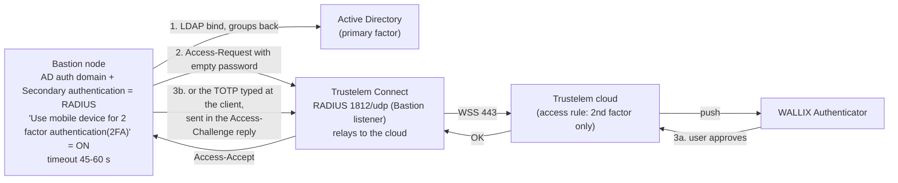

# Trustelem integration with WALLIX Bastion

Date: 2026-09-24. Sources: the Trustelem application pages
[WALLIX Bastion](https://trustelem-doc.wallix.com/books/trustelem-applications/page/wallix-bastion)
and [WALLIX Bastion SAML](https://trustelem-doc.wallix.com/books/trustelem-applications/page/wallix-bastion-saml),
the [Bastion 12.3.2 Functional Administration Guide](https://pam.wallix.one/documentation/admin-doc/bastion_en_administration_guide.pdf)
and the [Trustelem access rules page](https://trustelem-doc.wallix.com/books/trustelem-administration/page/access-rules).
Verified against Bastion 12.4.3: the Functional Administration Guide, the Deployment Guide and the
System Operations Guide (customer documentation behind the [doc.wallix.com](https://doc.wallix.com/)
login). The Administration Guide sections cited here have the same numbers and text in 12.3.2 and
12.4.3; "Admin Guide 7.2.5.4" below means both versions.
Quotes are verbatim from those pages; everything else is the author's structuring.

## 1. Which integration for which population

Trustelem offers three mechanisms towards a Bastion. They can coexist on one Bastion.

| Mechanism | What it gives | Who it is for | Trustelem access rule |
|-----------|---------------|---------------|-----------------------|
| RADIUS as secondary authentication on the AD domain | push or TOTP second factor for the web UI and for native RDP/SSH clients | AD users (the main population) | RADIUS: *2nd factor only* (or *Always allow* to exempt a user) |
| RADIUS as the only method of a local Bastion user | password and second factor both checked by Trustelem | a few Bastion-local accounts that must not have a local password | RADIUS: *2 factors* |
| Trustelem LDAP (port 2001) as an AD-type domain, plus RADIUS as secondary | users who exist only in Trustelem (partners, contractors) authenticate with the Trustelem password and a second factor | Trustelem local users | LDAP: *1 factor*; RADIUS: *2nd factor only* |
| SAML 2.0 generic app | federated web login to the Bastion UI, and to Access Manager when both share the domain | web-only users; mandatory when Access Manager fronts the Bastion | web internal and external: *2 factors* |

Vendor guidance on which to pick: "Usually Trustelem LDAP is used to provision local Trustelem
users on the Bastion, and they can be authenticated only with the login attribute mail. If for
some reason you want to authenticate synchronized Trustelem AD users instead, you can use
sAMAccountName for those attributes."
Source: [WALLIX Bastion page](https://trustelem-doc.wallix.com/books/trustelem-applications/page/wallix-bastion).

The SAML page is explicitly transitional: "This page is temporary, until we have a dedicated
template on Trustelem and integration into the 'setup intructions' page dedicated to Bastion
and AM." Source: [WALLIX Bastion SAML page](https://trustelem-doc.wallix.com/books/trustelem-applications/page/wallix-bastion-saml).

## 2. Common prerequisite: the Bastion application and Trustelem Connect

1. In the Trustelem admin console go to **Apps** and create a **Bastion** application. Enable
   the **LDAP** and/or **Radius** protocol on it. The app model shows the values you will need
   on the Bastion side: the LDAP service account (default `trustelem`), its password, the LDAP
   base DN, and the RADIUS secret.
2. Install Trustelem Connect on one or two VMs (see `03-trustelem-connect.md`).
3. In **Service** (the Trustelem Connect setup page) click **Add an application +**, select
   **Bastion**, and enable the protocol buttons. "the listen address can be localhost, all
   existing IP address on the machine = *, or a specific IP ... if you have a dedicated VM for
   the connector, choose *". Default ports: LDAP 2001, RADIUS 1812 ("but if you don't know if it
   is already used on the machine running the connector, choose 2812 instead").
4. Define access rules for the users before testing: "Trustelem users will not be found by the
   Bastion before having an access rule (1 or 2 factors)".

Source for all four steps: [WALLIX Bastion page](https://trustelem-doc.wallix.com/books/trustelem-applications/page/wallix-bastion).

## 3. Scenario A: AD users with RADIUS push as second factor (recommended)



Bastion side, verbatim from the vendor page:

1. **Configuration > External authentication**, create a **Radius authentication** named for
   example "Trustelem Radius".
2. **Server / Port**: the Trustelem Connect host and "the port defined on the Trustelem Service
   previously setup (should be 1812 or 2812)".
3. **Timeout**: "let the default value, unless you have latency on your network". The Bastion
   default is 5 s; raise it to cover push approval (see section 8). "The RADIUS external
   authentications inherited from an earlier version of WALLIX Bastion keep the former timeout
   value defined" (Admin Guide 7.2.5.4), so check entries after an upgrade.
4. **New secret / Confirm secret**: "This secret can be found in the Trustelem Bastion app model."
5. **Check** "Use mobile device for 2 factor authentication(2FA)". The page explains the real
   effect: "This option has be designed for MFA with push authentication. But the real effect
   is to skip the login + password step for the Radius authentication by automatically sending
   the login and an empty password ... Here we want to use Active Directory for the login +
   password step, so we don't want to ask for the Radius password = we need to activate this
   option."
6. **Configuration > Authentication domains**, open the existing **Active Directory**
   domain and set **Secondary authentication** to the RADIUS method. Apply.

Trustelem side: RADIUS access rule **2nd factor only** for the groups that must use MFA.
"If you want to skip the 2nd factor step for some users, you can select for them the rule
Always allow instead on Trustelem."

Bastion behaviour to know:

- Only PAP is supported: "Only the PAP protocol is supported for RADIUS authentication" (known
  limitation WAB-16237 in the [release notes](https://pam.wallix.one/documentation/release-notes/bastion-rn-en.html)).
  The Administration Guide itself (12.0.25, 12.3.2 and 12.4.3) does not name PAP, CHAP or
  Message-Authenticator.
- Challenge-response is supported; attributes sent are User-Name, User-Password, State,
  NAS-Identifier `WAB` and Framed-IP-Address; no vendor-specific attributes
  ([Admin Guide 7.2.5.4](https://pam.wallix.one/documentation/admin-doc/bastion_en_administration_guide.pdf),
  12.3.2 and 12.4.3).
- "Use primary domain name for two-factor authentication (2FA)" "forces the domain name to be
  mentioned in the login (for example, user@domain) during the second authentication" (Admin
  Guide 7.2.5.4). The guide does not say which domain is appended. *Inference:* it is the
  Bastion Authentication domain name, so the option gives the Trustelem UPN only when that name
  equals the UPN suffix; check the RADIUS User-Name in the Trustelem Logs during the pilot.
- Bastion 12.3 fixed the two RADIUS 2FA options interfering with each other
  ([release notes WAB-16173](https://pam.wallix.one/documentation/release-notes/bastion-rn-en.html):
  "Fix the 2FA options in the RADIUS form so that each option is independent and applied
  correctly"); on older builds test both options.
- Ports: the Bastion port table lists RADIUS as "1812/TCP and 1812/UDP", "Configurable per
  authentication method" ([Bastion 12.4.3 Deployment Guide](https://doc.wallix.com/) 2.2). The
  Trustelem Connect listener in this design is UDP; open 1812/udp from the Bastion nodes, and
  1812/tcp only if a test shows it is used.
- Framed-IP-Address carries the client address, and the guide explains why: "RADIUS servers can
  use the Framed-IP-Address attribute in their configuration. For example, to allow users to
  reconnect from the same IP address without re-entering their credentials if they authenticated
  recently" (Admin Guide 7.2.5.4). Bastion 12.4.3 adds a warning for load balancers: "when a
  load balancer sits in front of WALLIX Bastion, the address displayed is not the user's own"
  ([Bastion 12.4.3 Administration Guide](https://doc.wallix.com/) 12.16.1.6). *Inference:* if the
  L4 load balancer in front of the proxies rewrites the source address, the Framed-IP-Address
  sent to Trustelem is the load balancer's address, and the Trustelem "same network" MFA session
  (section 8) can no longer tell users' networks apart. Keep the client address (no source NAT
  on the balancer) or test the MFA session through the balancer before relying on it.

## 4. Scenario B: Bastion local users authenticated only by Trustelem RADIUS

Same RADIUS external authentication as scenario A, except:

- "Don't check the option Use mobile device for 2 factor authentication(2FA)". Reason given:
  "Here we want to verify login + password + 2nd factor with Radius, because a local Bastion
  user can't have the authentication local password + Radius."
- **Accounts**, open the user: "Verify if his login (UserName) is something known by
  Trustelem : should be an email if the associated Trustelem user is a local one." In
  **Authentication and backup servers** "select only the previous Radius external
  authentication. As mentioned before, this user can't have a local password + Radius. If you
  select both, the Bastion will try the first method (local password)."
- Trustelem RADIUS access rule **2 factors**.
- "if the login of the local user is unknown by Trustelem the authentication won't work, but
  you'll have some logs".

Use this only for a handful of accounts; these users have no password fallback if Trustelem is
unreachable.

## 5. Scenario C: Trustelem local users through Trustelem LDAP plus RADIUS

Bastion side, verbatim field values:

| Field | Value |
|-------|-------|
| External authentication type | **Active Directory authentication** (not "LDAP") |
| Authentication name | for example "Trustelem AD" |
| Server / Port | Trustelem Connect host, port 2001 |
| Timeout | default |
| Bind method | simple |
| User | `trustelem` ("default value, but can be changed on the Trustelem Bastion app model") |
| Password | from the Trustelem Bastion app model |
| Base DN | from the Trustelem Bastion app model (pattern `DC=<tenant>,DC=trustelem,DC=com`) |
| Login attribute and User name attribute | `mail` (or `sAMAccountName` for AD-synchronised users) |

Then **Test authentication** must show "Authentication success".

Authentication domain: create an **Active Directory authentication domain**; "Server domain
name --> no impact on the setup"; "Authentication domain name --> used for the Bastion/AM login
(sAMAccountName@domain_name, email@domain_name...)"; select the directory; the Default email
domain "should not be used for this kind of authentication where the login is usually not the
sAMAccountName".

Mappings: select a Bastion user group and profile and enter the Trustelem group DN
`CN=[Trustelem Group Name],OU=Groups,DC=[Trustelem Domain],DC=trustelem,DC=com`, with the
warning "if you don't respect the case, the authentication won't work". The Bastion guide says
the opposite for the mapping field: "In Group, enter the Distinguished Name (DN) for the Active
Directory group that you want to match. The input is case insensitive"
([Admin Guide 7.2.1.3](https://pam.wallix.one/documentation/admin-doc/bastion_en_administration_guide.pdf),
12.3.2 and 12.4.3). *Inference:* the case may matter on the Trustelem LDAP side rather than in
the Bastion comparison. Copy the DN with its exact case anyway and observe the result in the
pilot.

Access rules: "you need a LDAP access rule set to 1 factor if it will be conbined with a Radius
authentication or 2 factors if not." Then add the RADIUS secondary authentication on this
domain exactly as in scenario A (with "Use mobile device" checked) and a RADIUS rule
**2nd factor only**.

Encryption: "The best way to encrypt the LDAP flows is simply to check startTLS on the Bastion.
As Trustelem is compatible, flows are automatically encrypted." The LDAPS alternative needs a
`config.ini` on the connector with `tls_cert` and `tls_cert_key`, LDAPS enabled on the
Trustelem service, SSL enabled on the Bastion and optionally the CA added to the Bastion.

The LDAP tree exposed by Trustelem Connect (from the OpenVPN example on the same site):
bind DN `cn=trustelem,DC=<tenant>,DC=trustelem,DC=com`, base DN
`DC=<tenant>,DC=trustelem,DC=com`, user search filter `(mail=%u)`.
Source: [Trustelem applications export, OpenVPN chapter](https://trustelem-doc.wallix.com/books/trustelem-applications/export/html).

## 6. Scenario D: SAML 2.0 to the Bastion (with or without Access Manager)

The Bastion lists Trustelem among its supported SAML identity providers: "WALLIX IDaaS (ex
Trustelem)" ([Bastion 12.4.3 Deployment Guide](https://doc.wallix.com/) 8.1, "Supported SAML
identity providers"; same entry in 12.0.25). The Administration Guide gives "WALLIX IDaaS" as an
example provider for "SAML Generic with any Identity Provider" (Admin Guide 7.3.1.1).

Step 1, Trustelem: create an application from the **generic SAML2 model**, save it unchanged,
download the metadata file.

Step 2, Bastion, **Configuration > External authentications > SAML**: upload the metadata in
**IdP metadata**; claims customization Username `email`, Display name `displayname`, Email
`email`, Language empty, Group `groups`; apply; copy the **SP entity ID** and the
**SP assertion consumer service**.

Step 3, Bastion, **Configuration > Authentication domains > Other IdPs**: Domain server name;
Authentication domain name ("This value will be used to authenticate on the proxy if this
Authentication domain is not the default one" and "will be used in the Access Manager setup");
the SAML protocol from step 2; the login button label; a default email domain; a default
language; save; copy the **IdP initiated URL**.

Step 4, Trustelem, edit the application: EntityID = SP entity ID; Assertion Consumer Service =
SP ACS; NameID Format and NameID Attribute at default; Attributes List `email,displayname`;
Custom login URL = the IdP initiated URL; custom script:

```javascript
for (let g in groups){
  msg.addAttr("groups",g);
}
```

Step 5: create Trustelem permissions (access rules) for the users, and on the Bastion
authentication domain create the mappings between Bastion user groups and the Trustelem group
names sent in `groups`.

With Access Manager: "the Access Manager should be > 5.0", "AM Domain Name = Bastion
Authentication domain name" (the Bastion and Access Manager guides name the *Domain server
name* instead; set both fields to the same value, gap B7), "AM Login = Bastion Username", and the same `groups` script on the
Access Manager application.

Behind Access Manager (chapter 05) the Bastion imports the Access Manager app metadata instead
of a Bastion SAML app, and the Username claim equals the Access Manager Login attribute (`uid`
for AD users, per "AM Login = Bastion Username"); the `email` claim above belongs to the native
SAML procedure. Skipping the Bastion SAML app in the Access Manager design is an inference from
the flow (the Bastion never receives the assertion); question 6.6 of the vendor meeting
script and gap B7 cover it.

Bastion-side constraints from the [Admin Guide 7.3.1](https://pam.wallix.one/documentation/admin-doc/bastion_en_administration_guide.pdf)
(12.3.2 and 12.4.3): only "SAML Generic" is compatible with
Access Manager; once SAML is configured with Access Manager, direct SAML login to the Bastion
is impossible; the IdP NameID format should be e-mail and its domain should equal the
authentication domain name; the SP entity ID can be changed to a load balancer FQDN.

## 7. Configuration worksheet

Fill this in before the change window; every value appears in one of the scenarios above.

| Item | Where it comes from | Value |
|------|--------------------|-------|
| Tenant | Trustelem | `<tenant>.trustelem.com` |
| Bastion app: LDAP service account and password | Trustelem app model | |
| Bastion app: LDAP base DN | Trustelem app model | `DC=<tenant>,DC=trustelem,DC=com` |
| Bastion app: RADIUS secret | Trustelem app model | |
| Trustelem Connect hosts and listen address | Service page | VM1, VM2, `*` |
| RADIUS port | Service page | 1812 or 2812 |
| LDAP port | Service page | 2001 |
| Bastion RADIUS timeout | Bastion | 45 to 60 s |
| "Use mobile device for 2 factor authentication(2FA)" | Bastion | ON for scenarios A and C, OFF for B |
| "Use primary domain name for two-factor authentication (2FA)" | Bastion | ON if Trustelem logins are UPNs and the appended domain matches the UPN suffix (check in the pilot, section 3) |
| AD domain with secondary authentication | Bastion | |
| Trustelem group DNs for mappings | Trustelem Groups | `CN=...,OU=Groups,DC=<tenant>,DC=trustelem,DC=com` |
| SAML SP entity ID and ACS | Bastion SAML external auth | |
| SAML Domain server name and Authentication domain name | Bastion | both equal to the Access Manager domain name |
| IdP initiated URL | Bastion authentication domain | |
| Access rules | Trustelem | per group: RADIUS *2nd factor only*, LDAP *1 factor*, web *2 factors* |

## 8. Timeouts, sessions and user experience

- Bastion RADIUS timeout defaults to 5 s; a push needs time to reach the phone and be approved.
  The Trustelem Bastion page says to "let the default value, unless you have latency on your
  network"; an HID guide hosted by WALLIX (2019) says "increase the Timeout to at least 45-50
  seconds" for HID Approve push. This design uses 45 to 60 s after testing the push round trip.
  Sources: [Bastion 7.2.5.4](https://pam.wallix.one/documentation/admin-doc/bastion_en_administration_guide.pdf), [HID RADIUS guide](https://www.wallix.com/wp-content/uploads/2020/07/HID_ActivID_Appliance_Wallix_RADIUS_ConfigGuide_FINAL.pdf).
- MFA session: "for the duration defined on Trustelem and as long as he remains on the same
  network, he will not be asked to provide his 2nd factor again"; the example given is a user
  logging in to the Bastion GUI then SSH within one hour; it requires the "Use mobile device"
  option. Source: [Trustelem new features](https://trustelem-doc.wallix.com/books/trustelem-news/page/new-features).
  The Bastion side of this mechanism is the Framed-IP-Address attribute, which the Bastion guide
  says RADIUS servers can use "to allow users to reconnect from the same IP address without
  re-entering their credentials if they authenticated recently" ([Admin Guide 7.2.5.4](https://pam.wallix.one/documentation/admin-doc/bastion_en_administration_guide.pdf),
  12.3.2 and 12.4.3). *Inference:* Trustelem's "same network" test uses that address; behind a
  load balancer that rewrites the source address it becomes the balancer's address (see the
  load-balancer note in section 3), so test the MFA session through the production front end.
- Native RDP clients see the Bastion RDP proxy login screen; SSH clients get keyboard-interactive
  prompts. With Kerberos enabled on the RDP proxy, non-Kerberos users need
  `enablecredsspsupport:i:0` and `authentication level:i:2` in the `.rdp` file or `/sec:tls`
  with FreeRDP, and NLA enabled. Sources: [Bastion Users Guide 9.3](https://pam.wallix.one/documentation/user-doc/bastion_en_user_guide.pdf),
  [Bastion Admin Guide 7.2.5.2](https://pam.wallix.one/documentation/admin-doc/bastion_en_administration_guide.pdf)
  (12.3.2 and 12.4.3).
- Passkeys cannot be used over RADIUS or LDAP; the Trustelem second factor on the native path is
  the WALLIX Authenticator app or a TOTP. Source: [MFA methods](https://trustelem-doc.wallix.com/books/trustelem-administration/page/multi-factors-authentication).
- A phishing-resistant option exists for native SSH outside Trustelem: "WALLIX Bastion supports
  user authentication via SSH using a hardware key (such as a Yubikey) that uses the FIDO2
  secure authentication standard" ([Bastion 12.4.3 Administration Guide](https://doc.wallix.com/)
  2.5; the feature exists since Bastion 12.2, WAB-13752 in the
  [release notes](https://pam.wallix.one/documentation/release-notes/bastion-rn-en.html)). The
  administrator allows the SK key types ("SK ED25519 (FIDO2)", "SK ECDSA NIST p256 (FIDO2)") in
  Configuration > Local password policy; for AD users the public key is stored in the directory,
  in `altSecurityIdentities` with the `sshKey:` prefix (Admin Guide 7.2.5.6). The key is a
  primary authentication method. *Gap:* the guides do not say whether the RADIUS secondary
  authentication of the domain still runs after an SSH key login, so whether a key login also
  triggers the Trustelem push must be tested before this path is offered to administrators.

## 9. Verification checklist

1. `./connect check <sync_id>` on each Trustelem Connect VM shows the network, TLS and
   communication checks OK.
2. Bastion **Test authentication** on the Trustelem AD (LDAP) domain returns
   "Authentication success" (scenario C).
3. A pilot AD user logs in to the Bastion web UI: AD password accepted, push received, session
   opened; Trustelem Logs show the RADIUS authentication with the second factor.
4. The same user connects with `mstsc` and with an SSH client to the proxies and receives the
   push; a second connection inside the MFA session window is not prompted.
5. A user with the *Always allow* rule is not prompted; a user with *Forbidden* is refused.
6. Stop Trustelem Connect VM 1; the Bastion falls back to VM 2 within the timeout.
7. A user in a mapped Trustelem group sees the expected authorizations; a user in no mapped
   group gets the default group or nothing, as designed.

## 10. Common mistakes (vendor debug guidance)

- "Trustelem users will not be found by the Bastion before having an access rule (1 or 2
  factors)".
- Group DN case: "if you don't respect the case, the authentication won't work" (Trustelem
  page; the Bastion guide calls the mapping input case-insensitive, see section 5).
- "Use mobile device" must be ON for AD users (scenario A) and OFF for RADIUS-only local users
  (scenario B); both mistakes produce a password prompt loop or an immediate failure.
- A local user in scenario B with both a local password and RADIUS selected authenticates with
  the password alone.
- If the login is unknown to Trustelem the RADIUS request fails; check the Trustelem Logs page.
- For anything else, "Read the debug chapter of LDAP-Radius Trustelem Connect"
  (see `08-troubleshooting.md`).

Sources: [WALLIX Bastion page](https://trustelem-doc.wallix.com/books/trustelem-applications/page/wallix-bastion).

## 11. Bastion 12.0 branch (BSI-certified 12.0.14)

The 12.0.25 Administration and System Operations guides lack four features this chapter and the
architecture report rely on. Everything else used here (RADIUS 7.2.5.4, the SAML rules for
Access Manager in 7.3.1, the MFA model in 7.1.3, group mappings) reads the same in 12.0.25 and
12.4.3. Sources: the 12.0.25 and 12.4.3 customer guides on [doc.wallix.com](https://doc.wallix.com/).

| Feature | 12.4.3 | 12.0.25 |
|---------|--------|---------|
| Generic OpenID Connect | Admin Guide 7.3.2 | no 7.3.2 section and no OIDC row in the 7.1.1 matrix: the OIDC alternative is unavailable |
| SAML dynamic flow (SP entity ID changed to a load balancer FQDN) | Admin Guide 7.3.1.1.1 step 9 | absent: the SP entity ID points at the Bastion itself |
| API keys bound to a profile (`wallix_access_manager_session_audit`) | Admin Guide 6.1 and 6.1.2; System Operations Guide 12.1 | absent: no profile on the key and no Access Manager profiles; the Operation Guide 12.1 procedure has only a name and the allowed IP addresses, so restrict the key by IP |
| Kerberos on the RDP proxy (TERMSRV, NLA, `.rdp` parameters) | Admin Guide 7.2.5.2 | absent (RDP Kerberos arrived in 12.3.1, WAB-208 in the [release notes](https://pam.wallix.one/documentation/release-notes/bastion-rn-en.html)); Kerberos covers the web UI and the SSH proxy only |

*Inference:* a deployment on the certified branch keeps the SAML and RADIUS design of this
chapter but must drop the OIDC alternative, the load-balancer SP entity ID and the profile-scoped
Access Manager API key.
