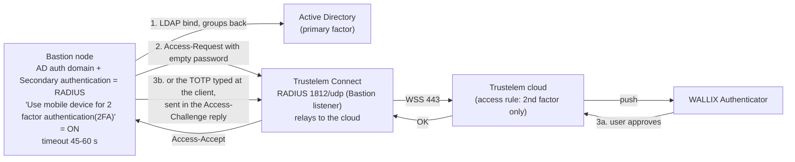

# Trustelem integration with WALLIX Bastion

> - **Purpose:** configure the Bastion and Trustelem for each of the four integration scenarios
>   (RADIUS, RADIUS-only, Trustelem LDAP plus RADIUS, SAML), with exact field values.
> - **Audience:** Bastion administrator, Trustelem administrator, PAM architect.
> - **Verified:** 2026-09-24, against the Trustelem documentation books as read on 2026-09-24,
>   the Bastion 12.3.2 Functional Administration Guide and the Bastion 12.4.3 Functional
>   Administration and System Operations Guides; section 11 also against the 12.0.25 guides.
> - **Sources:** Trustelem application pages
>   [WALLIX Bastion](https://trustelem-doc.wallix.com/books/trustelem-applications/page/wallix-bastion)
>   and [WALLIX Bastion SAML](https://trustelem-doc.wallix.com/books/trustelem-applications/page/wallix-bastion-saml),
>   [Bastion 12.3.2 Functional Administration Guide](https://pam.wallix.one/documentation/admin-doc/bastion_en_administration_guide.pdf),
>   Bastion 12.4.3 customer guides on [doc.wallix.com](https://doc.wallix.com/) (login required),
>   [Trustelem access rules](https://trustelem-doc.wallix.com/books/trustelem-administration/page/access-rules).

Citation convention: the Administration Guide sections cited here have the same numbers and
text in 12.3.2 and 12.4.3, so "Admin Guide 7.2.5.4" means both versions. Quotes without another
source are from the two Trustelem Bastion pages.

## 1. Which integration for which population

Use scenario A for Active Directory users, scenario C for users who exist only in Trustelem,
and scenario D whenever Access Manager fronts the Bastion. Trustelem offers these mechanisms
towards a Bastion, and they can coexist on one Bastion.

| Scenario | Mechanism | What it gives | Who it is for | Trustelem access rule |
|----------|-----------|---------------|---------------|-----------------------|
| A (section 3) | RADIUS as secondary authentication on the AD domain | push or TOTP second factor for the web UI and for native RDP/SSH clients | AD users (the main population) | RADIUS: *2nd factor only* (or *Always allow* to exempt a user) |
| B (section 4) | RADIUS as the only method of a local Bastion user | password and second factor both checked by Trustelem | a few Bastion-local accounts that must not have a local password | RADIUS: *2 factors* |
| C (section 5) | Trustelem LDAP (port 2001) as an AD-type domain, plus RADIUS as secondary | users who exist only in Trustelem (partners, contractors) authenticate with the Trustelem password and a second factor | Trustelem local users | LDAP: *1 factor*; RADIUS: *2nd factor only* |
| D (section 6) | SAML 2.0 generic app | federated web login to the Bastion UI, and to Access Manager when both share the domain | web-only users; mandatory when Access Manager fronts the Bastion | web internal and external: *2 factors* |

Vendor guidance on LDAP: "Usually Trustelem LDAP is used to provision local Trustelem users on
the Bastion, and they can be authenticated only with the login attribute mail. If for some
reason you want to authenticate synchronized Trustelem AD users instead, you can use
sAMAccountName for those attributes."
Source: [WALLIX Bastion page](https://trustelem-doc.wallix.com/books/trustelem-applications/page/wallix-bastion).

The SAML page is explicitly transitional: "This page is temporary, until we have a dedicated
template on Trustelem and integration into the 'setup intructions' page dedicated to Bastion
and AM." Source: [WALLIX Bastion SAML page](https://trustelem-doc.wallix.com/books/trustelem-applications/page/wallix-bastion-saml).

## 2. Common prerequisite: the Bastion application and Trustelem Connect

Scenarios A, B and C need a Trustelem **Bastion** application served by Trustelem Connect, and
an access rule for every user before the first test.

1. In the Trustelem admin console go to **Apps** and create a **Bastion** application. Enable
   the **LDAP** and/or **Radius** protocol on it. The app model shows the values needed on the
   Bastion side: the LDAP service account (default `trustelem`), its password, the LDAP base DN,
   and the RADIUS secret.
2. Install Trustelem Connect on one or two VMs ([chapter 03](03-trustelem-connect.md)).
3. In **Service** (the Trustelem Connect setup page) click **Add an application +**, select
   **Bastion**, and enable the protocol buttons. Set the listen address and the ports as
   described in [chapter 03, section 1](03-trustelem-connect.md#1-role-and-listeners) (ports)
   and [section 5](03-trustelem-connect.md#5-add-the-applications-listeners) (listen address).
4. Define access rules for the users before testing: "Trustelem users will not be found by the
   Bastion before having an access rule (1 or 2 factors)".

Source for all four steps: [WALLIX Bastion page](https://trustelem-doc.wallix.com/books/trustelem-applications/page/wallix-bastion).

## 3. Scenario A: AD users with RADIUS push as second factor (recommended)

Active Directory checks the password; Trustelem adds a push or TOTP second factor through a
RADIUS secondary authentication on the AD domain.



### Prerequisite: AD external authentication and domain

Scenario A adds RADIUS to an existing Active Directory domain on the Bastion. Create it first if
it does not exist:

1. **Configuration > External authentication > Add > AD**: one domain controller address per
   external authentication (create one per controller if needed), service account, TLS options.
2. **Configuration > Authentication domains**: create the AD domain, then on its **Mappings** tab
   map AD group DNs to Bastion user groups.

Source: [Bastion 7.2.1.1, 7.2.1.2 and 7.2.1.3](https://pam.wallix.one/documentation/admin-doc/bastion_en_administration_guide.pdf).

### Bastion settings for scenario A

From the [WALLIX Bastion page](https://trustelem-doc.wallix.com/books/trustelem-applications/page/wallix-bastion),
with the Admin Guide where cited:

1. **Configuration > External authentication**: create a **Radius authentication**, named for
   example "Trustelem Radius". Create it twice, one entry per Trustelem Connect VM (Connect VM 1
   and VM 2), with the same values except the server.
2. **Server / Port**: the Trustelem Connect host and "the port defined on the Trustelem Service
   previously setup (should be 1812 or 2812)".
3. **Timeout**: 45 to 60 s in this design, to cover push approval (section 8). The Bastion
   default, the Trustelem page's advice and the upgrade caveat are in the
   [low-level design, section 4](../architecture/05-low-level-design.md#4-timeouts-to-align).
4. **New secret / Confirm secret**: "This secret can be found in the Trustelem Bastion app model."
5. **Check** "Use mobile device for 2 factor authentication(2FA)". The page explains the real
   effect: "This option has be designed for MFA with push authentication. But the real effect
   is to skip the login + password step for the Radius authentication by automatically sending
   the login and an empty password ... Here we want to use Active Directory for the login +
   password step, so we don't want to ask for the Radius password = we need to activate this
   option."
6. **Configuration > Authentication domains**: open the existing **Active Directory** domain and
   set **Secondary authentication** to the RADIUS methods of both servers. Apply. "If you select
   several authentication methods, they are used one after the other, according to the defined
   order" ([Admin Guide 7.2.1.2](https://pam.wallix.one/documentation/admin-doc/bastion_en_administration_guide.pdf)). Whether that is failover or chaining is checked by test
   B-09 of the [test plan](10-test-plan.md#3-bastion-radius-native-path). A third-party MFA
   vendor guide also lists a server pair tried in order
   ([TrustBuilder RADIUS guide](https://docs.trustbuilder.com/mfa/wallix-bastion-radius-configuration)).

### Trustelem settings for scenario A

Set the RADIUS access rule to **2nd factor only** for the groups that must use MFA. "If you want
to skip the 2nd factor step for some users, you can select for them the rule Always allow
instead on Trustelem."

### Bastion RADIUS client behaviour

- **PAP only.** "Only the PAP protocol is supported for RADIUS authentication" (known limitation
  WAB-16237 in the [release notes](https://pam.wallix.one/documentation/release-notes/bastion-rn-en.html)).
  The Administration Guide itself (12.0.25, 12.3.2 and 12.4.3) does not name PAP, CHAP or
  Message-Authenticator.
- **Attributes.** Challenge-response is supported. The attributes sent are User-Name,
  User-Password, State, NAS-Identifier `WAB` and Framed-IP-Address; there are no
  vendor-specific attributes
  ([Admin Guide 7.2.5.4](https://pam.wallix.one/documentation/admin-doc/bastion_en_administration_guide.pdf),
  12.3.2 and 12.4.3).
- **Domain in the RADIUS login.** "Use primary domain name for two-factor authentication (2FA)"
  "forces the domain name to be mentioned in the login (for example, user@domain) during the
  second authentication" (Admin Guide 7.2.5.4). The guide does not say which domain is
  appended. *Inference:* it is the Bastion Authentication domain name, so the option gives the
  Trustelem UPN only when that name equals the UPN suffix. Check the RADIUS User-Name in the
  Trustelem Logs during the pilot.
- **Option interference fixed in 12.3.** Bastion 12.3 fixed the two RADIUS 2FA options
  interfering with each other
  ([release notes WAB-16173](https://pam.wallix.one/documentation/release-notes/bastion-rn-en.html):
  "Fix the 2FA options in the RADIUS form so that each option is independent and applied
  correctly"). On older builds, test both options.
- **Ports.** The Trustelem Connect listener in this design is 1812/udp. The Bastion port table
  entry for RADIUS and the full flow matrix are in the
  [low-level design, section 3](../architecture/05-low-level-design.md#3-network-flows-and-ports).
- **Framed-IP-Address and load balancers.** Framed-IP-Address carries the client address. The
  guide explains why: "RADIUS servers can use the Framed-IP-Address attribute in their
  configuration. For example, to allow users to reconnect from the same IP address without
  re-entering their credentials if they authenticated recently" (Admin Guide 7.2.5.4).
  Bastion 12.4.3 adds a warning for load balancers: "when a load balancer sits in front of
  WALLIX Bastion, the address displayed is not the user's own"
  ([Bastion 12.4.3 Administration Guide](https://doc.wallix.com/) 12.16.1.6). *Inference:* if the
  L4 load balancer in front of the proxies rewrites the source address, the Framed-IP-Address
  sent to Trustelem is the load balancer's address. The Trustelem "same network" MFA session
  ([chapter 06, section 8](06-mfa-and-access-rules.md#8-mfa-session-on-radius)) can then no
  longer tell users' networks apart. Keep the client address (no source NAT on the balancer), or
  test the MFA session through the balancer before relying on it.

## 4. Scenario B: Bastion local users authenticated only by Trustelem RADIUS

Trustelem checks both the password and the second factor of a few Bastion-local accounts. Use
the RADIUS external authentication of scenario A, with these differences:

- "Don't check the option Use mobile device for 2 factor authentication(2FA)". Reason given:
  "Here we want to verify login + password + 2nd factor with Radius, because a local Bastion
  user can't have the authentication local password + Radius."
- **Accounts**, open the user: "Verify if his login (UserName) is something known by
  Trustelem : should be an email if the associated Trustelem user is a local one."
- In **Authentication and backup servers**, "select only the previous Radius external
  authentication. As mentioned before, this user can't have a local password + Radius. If you
  select both, the Bastion will try the first method (local password)."
- Trustelem RADIUS access rule: **2 factors**.
- "if the login of the local user is unknown by Trustelem the authentication won't work, but
  you'll have some logs".

Use this only for a handful of accounts. These users have no password fallback if Trustelem is
unreachable.

## 5. Scenario C: Trustelem local users through Trustelem LDAP plus RADIUS

The Bastion reads Trustelem local users through the Trustelem LDAP listener as if it were an
Active Directory, then adds the RADIUS second factor of scenario A.

### Trustelem LDAP as an external authentication

Bastion field values, verbatim:

| Field | Value |
|-------|-------|
| External authentication type | **Active Directory authentication** (not "LDAP") |
| Authentication name | for example "Trustelem AD" |
| Server / Port | Trustelem Connect host, port 2001 |
| Timeout | default |
| Bind method | simple |
| User | `trustelem` ("default value, but can be changed on the Trustelem Bastion app model") |
| Password | from the Trustelem Bastion app model |
| Base DN | from the Trustelem Bastion app model (pattern `DC=<tenant>,DC=trustelem,DC=com`) |
| Login attribute and User name attribute | `mail` (or `sAMAccountName` for AD-synchronised users) |

Then **Test authentication** must show "Authentication success". The LDAP tree behind these
values (bind DN, base DN, search filter) is described in
[chapter 03, section 6](03-trustelem-connect.md#6-what-the-ldap-listener-exposes).

### Authentication domain and group mappings

1. Create an **Active Directory authentication domain**:
   - "Server domain name --> no impact on the setup".
   - "Authentication domain name --> used for the Bastion/AM login (sAMAccountName@domain_name,
     email@domain_name...)".
   - Select the directory.
   - The Default email domain "should not be used for this kind of authentication where the
     login is usually not the sAMAccountName".
2. Add the mappings: select a Bastion user group and profile, and enter the Trustelem group DN
   `CN=[Trustelem Group Name],OU=Groups,DC=[Trustelem Domain],DC=trustelem,DC=com`. The
   Trustelem page warns: "if you don't respect the case, the authentication won't work".

The Bastion guide says the opposite for the mapping field: "In Group, enter the Distinguished
Name (DN) for the Active Directory group that you want to match. The input is case insensitive"
([Admin Guide 7.2.1.3](https://pam.wallix.one/documentation/admin-doc/bastion_en_administration_guide.pdf),
12.3.2 and 12.4.3). *Inference:* the case may matter on the Trustelem LDAP side rather than in
the Bastion comparison. Copy the DN with its exact case anyway and observe the result in the
pilot.

### Access rules and second factor for scenario C

- "you need a LDAP access rule set to 1 factor if it will be conbined with a Radius
  authentication or 2 factors if not."
- Add the RADIUS secondary authentication on this domain exactly as in scenario A (with "Use
  mobile device" checked), and a RADIUS rule **2nd factor only**.

### LDAP encryption

"The best way to encrypt the LDAP flows is simply to check startTLS on the Bastion. As Trustelem
is compatible, flows are automatically encrypted." The LDAPS alternative needs four changes:

- a `config.ini` on the connector with `tls_cert` and `tls_cert_key`
  ([chapter 03, sections 3 and 4](03-trustelem-connect.md#3-install-on-windows));
- LDAPS enabled on the Trustelem service;
- SSL enabled on the Bastion;
- optionally, the CA added to the Bastion.

## 6. Scenario D: SAML 2.0 to the Bastion (with or without Access Manager)

The Bastion accepts Trustelem as a generic SAML identity provider; behind Access Manager, this
scenario is what lets the portal open Bastion sessions without a second login.

The Bastion guides list Trustelem, under the name WALLIX IDaaS, among the supported SAML identity
providers ([architecture overview, section 2](../architecture/01-overview.md#2-product-naming-and-versions)).

### Standalone SAML procedure

1. **Trustelem:** create an application from the **generic SAML2 model**, save it unchanged,
   and download the metadata file.
2. **Bastion, Configuration > External authentications > SAML:** upload the metadata in
   **IdP metadata**. Set the claims customization: Username `email`, Display name
   `displayname`, Email `email`, Language empty, Group `groups`. Apply. Then:
   - if authentication requests pass through a load balancer, change the **SP entity ID** to the
     load balancer FQDN and Apply again (not available in 12.0.25, section 11);
   - download the SP metadata (**Download SP metadata**) and copy the **SP entity ID** and the
     **SP assertion consumer service**.

   Source: [Admin Guide 7.3.1.1.1](https://pam.wallix.one/documentation/admin-doc/bastion_en_administration_guide.pdf).
3. **Bastion, Configuration > Authentication domains > Other IdPs:**
   - Domain server name.
   - Authentication domain name: "This value will be used to authenticate on the proxy if this
     Authentication domain is not the default one" and "will be used in the Access Manager
     setup".
   - The SAML protocol from step 2, the login button label, a default email domain and a
     default language.
   - Optionally **Force authentication**: users must re-authenticate at the identity provider even with an
     active session; "This feature natively supports SAML with Entra ID and Okta. However, other
     IdPs may require further configuration on their side", so test it with Trustelem first
     ([Admin Guide 7.3.1.1.2](https://pam.wallix.one/documentation/admin-doc/bastion_en_administration_guide.pdf)).
   - Save, then copy the **IdP initiated URL**.
4. **Trustelem, edit the application:** EntityID = SP entity ID; Assertion Consumer Service =
   SP ACS; NameID Format and NameID Attribute at default; Attributes List `email,displayname`;
   Custom login URL = the IdP initiated URL; custom script:

   ```javascript
   for (let g in groups){
     msg.addAttr("groups",g);
   }
   ```

5. **Access rules and mappings:** create Trustelem permissions (access rules) for the users. On
   the **Mappings** tab of the Bastion authentication domain, add one mapping per group value
   sent in `groups` (the Group field takes one value), each with a Bastion user group and
   profile, plus a default group for users who match no mapping if everyone needs access
   ([Admin Guide 7.3.1.1.3](https://pam.wallix.one/documentation/admin-doc/bastion_en_administration_guide.pdf)).

### Behind Access Manager

Set the Bastion **Domain server name** and **Authentication domain name** both to the Access
Manager domain name (`TRUSTELEM`), and the Username claim to the Access Manager Login attribute.
The Trustelem and product rules behind these values are in
[SAML assertion and naming, section 1.1](../reference/saml-assertion-and-naming.md#11-which-bastion-field-carries-the-domain-name).
The Trustelem SAML page also requires that "the Access Manager should be > 5.0". The Access
Manager application gets the same `groups` script. Access Manager reaches the Bastion with an API
key created on the Bastion as in the
[Access Manager farm runbook, section 10](../runbooks/access-manager-farm.md#10-bastion-objects-and-the-trustelem-saml-domain).

Two steps differ from the standalone procedure
([chapter 05](05-access-manager-integration.md)):

- The Bastion imports the Access Manager app metadata instead of a Bastion SAML app.
- The Username claim equals the Access Manager Login attribute (`uid` for AD users). The
  `email` claim of step 2 belongs to the standalone procedure.

Skipping the Bastion SAML app in the Access Manager design is an *inference* from the flow (the
Bastion never receives the assertion); confirm it in the pilot and with WALLIX (gap B12, meeting
question 6.7).

### Bastion SAML constraints

From the [Admin Guide 7.3.1](https://pam.wallix.one/documentation/admin-doc/bastion_en_administration_guide.pdf)
(12.3.2 and 12.4.3):

- Only "SAML Generic" is compatible with Access Manager.
- Once SAML is configured with Access Manager, direct SAML login to the Bastion is impossible.
- The IdP NameID format should be e-mail, and its domain should equal the authentication domain
  name.
- The SP entity ID can be changed to a load balancer FQDN.

## 7. Configuration worksheet

Fill this in before the change window; every value appears in one of the scenarios above.

| Item | Where it comes from | Value |
|------|--------------------|-------|
| Tenant | Trustelem | `<tenant>.trustelem.com` |
| Bastion app: LDAP service account and password | Trustelem app model | |
| Bastion app: LDAP base DN | Trustelem app model | `DC=<tenant>,DC=trustelem,DC=com` |
| Bastion app: RADIUS secret | Trustelem app model | |
| Trustelem Connect hosts and listen address | Service page | VM1, VM2, `*` |
| RADIUS port | Service page | 1812 or 2812 |
| LDAP port | Service page | 2001 |
| Bastion RADIUS timeout | Bastion | 45 to 60 s |
| "Use mobile device for 2 factor authentication(2FA)" | Bastion | ON for scenarios A and C, OFF for B |
| "Use primary domain name for two-factor authentication (2FA)" | Bastion | ON if Trustelem logins are UPNs and the appended domain matches the UPN suffix (check in the pilot, section 3) |
| AD domain with secondary authentication | Bastion | |
| Trustelem group DNs for mappings | Trustelem Groups | `CN=...,OU=Groups,DC=<tenant>,DC=trustelem,DC=com` |
| SAML SP entity ID and ACS | Bastion SAML external auth | |
| SAML Domain server name and Authentication domain name | Bastion | both equal to the Access Manager domain name |
| IdP initiated URL | Bastion authentication domain | |
| Access rules | Trustelem | per group, as in [chapter 06, section 7](06-mfa-and-access-rules.md#7-rule-set-for-the-pam-design) |

## 8. Timeouts, sessions and user experience

Raise the RADIUS timeout to 45 to 60 s for push, and offer native users WALLIX Authenticator or
TOTP: passkeys do not work on the native path.

- **RADIUS timeout.** A push needs time to reach the phone and be approved, so this design uses
  45 to 60 s after testing the push round trip. The defaults, the vendor advice and their
  sources are in the
  [low-level design, section 4](../architecture/05-low-level-design.md#4-timeouts-to-align).
- **MFA session.** Trustelem can skip the second factor for a set duration while the user stays
  on the same network; it requires the "Use mobile device" option
  ([chapter 06, section 8](06-mfa-and-access-rules.md#8-mfa-session-on-radius)). The Bastion
  side of this mechanism is the Framed-IP-Address attribute. *Inference:* Trustelem's "same
  network" test uses that address; the load-balancer caveat is in section 3, so test the MFA
  session through the production front end.
- **Native clients.** Native RDP clients see the Bastion RDP proxy login screen; SSH clients get
  keyboard-interactive prompts. With Kerberos enabled on the RDP proxy, non-Kerberos users need
  `enablecredsspsupport:i:0` and `authentication level:i:2` in the `.rdp` file, or `/sec:tls`
  with FreeRDP, and NLA enabled. Sources: [Bastion Users Guide 9.3](https://pam.wallix.one/documentation/user-doc/bastion_en_user_guide.pdf),
  [Bastion Admin Guide 7.2.5.2](https://pam.wallix.one/documentation/admin-doc/bastion_en_administration_guide.pdf)
  (12.3.2 and 12.4.3).
- **Factors on the native path.** Passkeys cannot be used over RADIUS or LDAP, so the Trustelem
  second factor on the native path is the WALLIX Authenticator app or a TOTP
  ([chapter 06, section 1](06-mfa-and-access-rules.md#1-factors-available)).
- **FIDO2 keys for SSH.** A phishing-resistant option exists for native SSH outside Trustelem:
  "WALLIX Bastion supports user authentication via SSH using a hardware key (such as a Yubikey)
  that uses the FIDO2 secure authentication standard"
  ([Bastion 12.4.3 Administration Guide](https://doc.wallix.com/) 2.5; the feature exists since
  Bastion 12.2, WAB-13752 in the
  [release notes](https://pam.wallix.one/documentation/release-notes/bastion-rn-en.html)). The
  administrator allows the SK key types ("SK ED25519 (FIDO2)", "SK ECDSA NIST p256 (FIDO2)") in
  **Configuration > Local password policy**. For AD users the public key is stored in the
  directory, in `altSecurityIdentities` with the `sshKey:` prefix (Admin Guide 7.2.5.6). The key
  is a primary authentication method. *Gap:* the guides do not say whether the RADIUS secondary
  authentication of the domain still runs after an SSH key login. Test whether a key login also
  triggers the Trustelem push before this path is offered to administrators.

## 9. Verification checklist

Run these checks at the end of the change window, in this order.

1. `./connect check <sync_id>` on each Trustelem Connect VM shows the network, TLS and
   communication checks OK ([chapter 03, section 8](03-trustelem-connect.md#8-connectivity-test)).
2. Bastion **Test authentication** on the Trustelem AD (LDAP) domain returns
   "Authentication success" (scenario C).
3. A pilot AD user logs in to the Bastion web UI: AD password accepted, push received, session
   opened. The Trustelem Logs show the RADIUS authentication with the second factor.
4. The same user connects with `mstsc` and with an SSH client to the proxies and receives the
   push. A second connection inside the MFA session window is not prompted.
5. A user with the *Always allow* rule is not prompted; a user with *Forbidden* is refused.
6. Stop Trustelem Connect VM 1: the Bastion falls back to VM 2 within the timeout.
7. A user in a mapped Trustelem group sees the expected authorizations. A user in no mapped
   group gets the default group or nothing, as designed.

## 10. Common mistakes (vendor debug guidance)

Most failures come from a missing access rule, a wrong "Use mobile device" setting or a login
unknown to Trustelem.

- No access rule yet: Trustelem users are not found by the Bastion (section 2, step 4).
- Group DN case: the Trustelem page requires the exact case; the Bastion guide calls the mapping
  input case-insensitive (section 5).
- "Use mobile device" must be ON for AD users (scenario A) and OFF for RADIUS-only local users
  (scenario B). Either mistake produces a password prompt loop or an immediate failure.
- A local user in scenario B with both a local password and RADIUS selected authenticates with
  the password alone.
- If the login is unknown to Trustelem the RADIUS request fails; check the Trustelem **Logs**
  page.
- For anything else, "Read the debug chapter of LDAP-Radius Trustelem Connect"
  ([chapter 08](08-troubleshooting.md)).

Source: [WALLIX Bastion page](https://trustelem-doc.wallix.com/books/trustelem-applications/page/wallix-bastion).

## 11. Bastion 12.0 branch (BSI-certified 12.0.14)

The 12.0.25 Administration and System Operations guides lack four features this chapter and the
[architecture set](../architecture/README.md) rely on. Everything else used here (RADIUS 7.2.5.4, the SAML rules for
Access Manager in 7.3.1, the MFA model in 7.1.3, group mappings) reads the same in 12.0.25 and
12.4.3. Sources: the 12.0.25 and 12.4.3 customer guides on [doc.wallix.com](https://doc.wallix.com/).

| Feature | 12.4.3 | 12.0.25 |
|---------|--------|---------|
| Generic OpenID Connect | Admin Guide 7.3.2 | no 7.3.2 section and no OIDC row in the 7.1.1 matrix: the OIDC alternative is unavailable |
| SAML dynamic flow (SP entity ID changed to a load balancer FQDN) | Admin Guide 7.3.1.1.1 step 9 | absent: the SP entity ID points at the Bastion itself |
| API keys bound to a profile (`wallix_access_manager_session_audit`) | Admin Guide 6.1 and 6.1.2; System Operations Guide 12.1 | absent: no profile on the key and no Access Manager profiles; the Operation Guide 12.1 procedure has only a name and the allowed IP addresses, so restrict the key by IP |
| Kerberos on the RDP proxy (TERMSRV, NLA, `.rdp` parameters) | Admin Guide 7.2.5.2 | absent (RDP Kerberos arrived in 12.3.1, WAB-208 in the [release notes](https://pam.wallix.one/documentation/release-notes/bastion-rn-en.html)); Kerberos covers the web UI and the SSH proxy only |

*Inference:* a deployment on the certified branch keeps the SAML and RADIUS design of this
chapter but must drop the OIDC alternative, the load-balancer SP entity ID and the profile-scoped
Access Manager API key.
